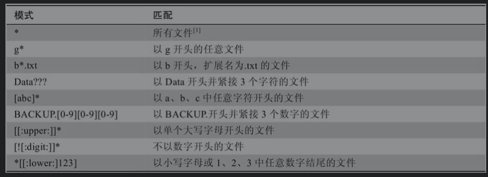

# Linux
## Linux常用命令

[Linux 命令大全 | 菜鸟教程](runoob.com)

### unbuntu配置IP

```SHELL
ifconfig eth0 10.182.80.36 mask 255.255.255.0   #配置IP
route add -net 10.182.80.0 netmask 255.255.255.0 gw 10.182.243.1 #添加路由
sudo passwd root     #修改用户密码
#添加DNS 和永久修改接口IP
vim /etc/network/interfaces    #然后在其中添加
dns-nameservers 10.88.7.10    #添加DNS
#在对应的接口下添加相应的配置
auto eth0 
iface eht0 inet static
address 10.182.80.36
netmask 255.255.255.0
network 10.182.80.0
broadcast 10.182.80.255
gw 10.182.80.1

centos
/etc/sysconfig/static-routes

```

### cd便捷用法

```shell
cd           切换为当前用户的家目录
cd -         切换为上一个目录
cd ~username 切换为username的家目录
```

### ls

```shell
-a  列出所有文件，包括隐藏文件
-l  列出文件的详细信息，包括文件的权限、所有者、大小等
-h  以人类可读的形式显示文件的大小
-r  以降序的方式显示文件
-S  按照文件的大小排序
-t  按照修改日期排序
-i  显示文件的inode
```

### mkdir

```shell
mkdir dir1 dir2 dir3 可以创建多个文件目录
```

### cp

```shell
cp item1 item2 directory  #将item1和item2复制到目录directory中
-a 复制文件和目录以及其所有的权和权限的所有内容
-p 复制文件的所有者以及文件的权限
-i 在覆盖文件前提醒用户是否确认，若没有此选项则默认直接覆盖
-r 递归的复制文件夹中的内容
-u 更新，只复制另一个目录中不存在的内容
-v 显示复制时显示相关信息
```

### mv

```shell
mv item1 item2 
#如果item2存在，且为文件夹，则是移动文件item1到item2中；
#如果item2存在但是是文件，则覆盖此文件；
#如果item2不存在，则是修改item1的文件名为item2
-i 覆盖文件时提示用户
-u 更新，只移动item2中不存在的内容
-v 显示移动时的相关信息
```

### rm

```shell
rm item... 删除文件
-i 删除时提示用户确认
-r 递归的删除文件
-f 强制删除文件且不提示，屏蔽-i的作用
-v 显示文件删除时的信息
```

### 通配符

```shell
*                匹配任意多个字符
？               匹配任意单个字符
[characters]     匹配属于字符合集characters中的任意单个字符
[!characters]    匹配不属于字符合集characters中的任意单个字符

[:alnum:]        匹配任意单个字母数字字符
[:alpha:]        匹配任意单个字母
[:digit:]        匹配任意单个数字
[:lower:]        匹配任意单个小写字母
[:upper:]        匹配任意单个大写字母
```




### ln

Linux 把每个文件的权限、属性以及文件的真是数据地址记录在 inode中，而且每个文件占用一个独立的 inode 表格，该表格的默认大小为 128 字节，inode 号才是文件的唯一标识而非文件名。文件的实际内容则保存在 block 中

```shell
ln file link-name  给文件file建立硬链接，链接名为link-name
硬链接的文件和链接一定要在同一个磁盘空间中
无法为目录创建硬链接，因为目录中有隐藏的当前目录.和父目录..
硬链接的inode号都是一样的
删除硬链接文件或者删除源文件任意之一，文件实体并未被删除，只有删除所有对应的硬链接文件，文件实体才会被删除
ln -s file link-name 给文件file建立符号链接，链接名为link-name
删除软链接文件，源文件不受影响。而删除原文件，软链接文件将找不到实际的数据，从而显示文件不存在。
软链接会新建自己的 inode 信息和 block，只是在 block 中不存储实际文件数据，而存储的是源文件的文件名及 inode 号。
软连接中一定要使用文件的绝对路径
原始文件的位置发生变化，软链接就失效了
```

[Linux硬链接和软链接详解](biancheng.net)
https://www.zhihu.com/question/50223526/answer/864874726

### type

```shell
type command 显示命令类型
```

### which

```shell
which executable_file 显示可执行文件的位置
只适用于在目录/bin中的命令
```

### apropos

```shell
apropos string 显示适合的命令清单，想不起命令的时候可以用下
```

### whatis

```shell
whatis command 显示命令的手册页和单行描述
```

### info

```shell
info 程序名  显示info信息，就是帮助信息
```

info页中常用的命令


### alias

```shell
alias name='string'     自定义命令 其中string为命令行，可以为多个应用结合，使用;间隔
alias foo='cd /usr;ls;cd -'
root@ubuntu:/bin# type foo
foo is aliased to `cd /usr;ls;cd -'
unalias foo             删除别名
alias 查看别名

别名永久生效,将别名写入~/.bashrc文件中，并使用 source ~ /.bashrc让其生效
vim ~/.bashrc
source ~ /.bashrc
```

### 重定向

0、1、2分别表示标准输入、标准输出、标准错误输出

```shell
标准输出重定向   >和>>
root@ubuntu:/home/yushun/rwx# ls ./ > ls-output
root@ubuntu:/home/yushun/rwx# cat ls-output
hhh.py
ls-output
test
try

小技巧：创建新的空文件
> new_file.txt
>操作符会覆盖原始文件中的内容 >>操作符是属于追加
标准错误输出  2>

将标准错误输出和标准输出重定向到同一文件中
老版本方法
ls -l adfasdfsad > output  2>&1   
执行了两次重定向。先将标准输出重定向到ls-output.txt，然后使用2>&1将文件描述符2（标准错误）重定向到文件描述符1（标准输出）
标准错误的重定向操作必须在标准输出重定向之后执行，否则无法奏效
ls -l adfasdfsad 2>&1  > output   错误信息会被重定向到屏幕
新版本方法
ls -l adfasdfsad &> output 

重定向标准输入
yushun@ubuntu:~/rwx$ cat < aaa
total 48
-rw-r--r-- 1 root   root      0 Aug 12 18:08 aaa
-r-------- 1 yushun yushun   33 Aug 12 10:51 hhh.py
-rw-r--r-- 1 root   root     26 Aug 12 17:52 ls-output
-rwxrwxrwx 1 root   root      7 Aug 12 09:42 test
dr-x------ 3 yushun yushun 4096 Aug 12 11:27 try
#将aaa中的文件作为标准输入，输入到cat中

cat 可以用来拼接文件，并输出其内容
yushun@ubuntu:~/rwx$ cat txt1 txt2 txt3    #cat txt*也可以得到同样的效果
this is txt1
this is txt2
this is txt3
yushun@ubuntu:~/rwx$ cat txt* > txt

cat    可以从标准输入获取信息，使用CTRL+D的组合键告诉cat命令已经到达了标准输入的文件末尾（End Of File，EOF）
```

### cat

```shell
查看文件内容并输入到标准输出
-A  显示文本中的非输出字符，空格、回车、换行等
-n  显示文件行号
-b  显示行号，但是对空白行不编号
-s  将连续两行以上的空白行替换为一行空白
-E  每行结束处显示$
```

### 管道

```shell
command1 | command2   将command1的标准输出作为command2的标准输入
```

### sort

```shell
针对文本内容，以行为单位来排序
-b  忽略每行开头的空格字符
-u  去除重复行
-r  降序排序
-o newfile 将排序后的结果输出到newfile文件
-f  排序时，将小写字母看成大写字母
-n  按照数值的大小排序
```

### uniq

```shell
忽略重复行，只能处理在一起的重复的行，当重复行不在一起时uniq不起作用，可以搭配sort使用
-d  仅显示重复的行
-c  在每列旁边显示该行出现的次数
-u  仅显示出现一次的行
```

###  wc

```shell
统计文件中换行符、单词以及字节的数量，如果没有文件输入，则为标准输入；
-l  统计行数
-w  统计单词数
-c  统计字节数
root@ubuntu:/home/yushun/rwx# wc txt
 15  15 174 txt
如果没有选项，则分别为行数、单词数和字节数
```

### grep

```shell
输出于模式匹配的行
-i  忽略大小写的差距
-n  显示匹配到的文本的行号
-v  显示不包含匹配文本的所有行
-c  统计匹配到了多少行
```

### head

```shell
默认输出文件的前10行
-n 显示前n行
-c 显示前c个字节
```

### tail

```shell
默认显示后10行
-n 显示后n行
-c 显示后c个字节
-f 循环读取
-s 休眠s秒，和-f配合使用
--pid 和-f配合使用，在对应进程死亡后结束
```

### tee

```shell
tee 文件名
从标准输入设备读取数据，将其内容输出到标准输出设备，同时保存成文件
-a  追加到文件后面，而不是覆盖
```

### 扩展

```shell
echo *     输出当前文件夹所有文件 等效ls
echo .*    显示当前文件夹中的隐藏文件和. ..
echo .[!.]*  显示当前文件夹中的隐藏文件
echo /usr/*/share   输出为/usr/local/share

~     在Linux中可以用来替代当前用户目录
cd  和cd ~ 都可以快速切换到当前用户的目录
cd ~username  快速切换到username用户的目录
cd ~yushun_ftp  切换到/home/yushun_ftp目录
cd ~/hillstone  切换到/home/yushun/hillstone目录
```

### 算数扩展

```shell
echo $((2+2))   输出4
$((算数表达式))
$(($((2+5))*5))  和 $(((2+5)*5)) 等效
```

### 花括号表达式{}

```shell
echo asd{1,2,3}dsa 和echo asd{'1','2','3'}dsa等效 输出结果为asd1dsa asd2dsa asd3dsa
echo number{1..5}   输出结果number1 number2 number3 number4 number5
echo number{0..05} 和echo number{00..5}等效  输出结果为  number00 number01 number02 number03 number04 number05
echo number{a..d}   输出结果为numbera numberb numberc numberd
echo a{A{1..5},B{6..7}}b    可以嵌套输出结果为aA1b aA2b aA3b aA4b aA5b aB6b aB7b
```

### 参数扩展$

```shell
echo $USER  
printenv | less   查看所有的环境变量
如果参数拼写错误，就会替换为空格
```

### 命令替换

```shell
ls -l $(which cp) 将which cp的输出结果作为ls命令的参数，因而得以在无须知道完整路径的情况下获得cp命令的详细信息。
ls -l `which cp`  可以使用反引号`实现相同的功能，是旧版的功能
```

### 双引号

```shell
如果把文本放入双引号中，那么Shell使用的所有特殊字符都将丧失其特殊含义，
而被视为普通字符。$（美元符号）、\（反斜线）、`（反引号）除外，
ls -l "two words.txt"     双引号可以阻止单词分割
但是参数扩展、算术扩展、命令替换仍然可用。
echo "$USER $((2+2)) $(cal)"
yushun 4     October 2021
Su Mo Tu We Th Fr Sa
                1  2
 3  4  5  6  7  8  9
10 11 12 13 14 15 16
17 18 19 20 21 22 23
24 25 26 27 28 29 30
31

yushun@ubuntu:~$ echo $(cal)
October 2021 Su Mo Tu We Th Fr Sa 1 2 3 4 5 6 7 8 9 10 11 12 13 14 15 16 17 18 19 20 21 22 23 24 25 26 27 28 29 30 31
yushun@ubuntu:~$ echo "$(cal)"
    October 2021
Su Mo Tu We Th Fr Sa
                1  2
 3  4  5  6  7  8  9
10 11 12 13 14 15 16
17 18 19 20 21 22 23
24 25 26 27 28 29 30
31
 在第一个例子中，产生的空格、换行符作为分隔符使用
 而在第二个例子中，产生的命令行只包含一个参数，该参数中既有空格，也有换行符。
```

### 单引号

```shell
单引号禁止一切的扩展
yushun@ubuntu:~$  echo text ~ /*.txt {a,b} $(echo foo) $((2+2)) $USER
text /home/yushun /*.txt a b foo 4 yushun
yushun@ubuntu:~$ echo "text ~ /*.txt {a,b} $(echo foo) $((2+2)) $USER"
text ~ /*.txt {a,b} foo 4 yushun
yushun@ubuntu:~$  echo 'text ~ /*.txt {a,b} $(echo foo) $((2+2)) $USER'
text ~ /*.txt {a,b} $(echo foo) $((2+2)) $USER
```

### 转义字符

```shell
使用转义功能消除某个字符的特殊含义，如果要加入反斜线，可以使用\\将其转义。
yushun@ubuntu:~$ echo "The balance for user $USER is:\$5.00"
The balance for user yushun is:$5.00

echo -e 可以识别转义字符 \n  \r  \t
echo -e "Time's up\t1"
```

### 快捷键操作

[linux常用的28个快捷键 - 知乎]([heng.net)](http://c.biancheng.net/view/6314.html) https://www.zhihu.com/question/50223526/answer/864874726)

```shell
ctrl+A     光标移动到行首
ctrl+E     光标移动到行末
ctrl+F     光标向前移动一个字符
ctrl+B     光标向后移动一个字符
ctrl+L     清楚屏幕
```

### history

```shell
查看历史命令
history | less
!88        重新执行历史记录为88的命令
!!         重复上一条命令
!string    重复最后一条string开头的命令
!?string   重最后一条其中包string的命令
```

### id

```shell
查看用户的身份信息
id [user]
user 可以省略，若省略则代表查看当前用户的身份用户信息
```

### 文件权限

```shell
hillstone@ubuntu:~$ ls -l

-rw-rw-r-- 1 hillstone hillstone 29 Nov 14 15:47 test.txt
列表项的前10个字符是文件属性
其中第一个字符代表文件类型
-     代表普通文件
d     代表目录
l     代表符号链接文件，符合链接文件的权限设置是不起作用的，只有他真正指向的文件才起作用
c     代表字符文件设备
b     代表块文件设备

2-4：所有者的权限   5-7：所在组的权限   8-10：其他用户的权限
                     文件                            目录
r 代表可读      允许打开并读取文件   允许读取目录中有哪些文件（前提是有可执行权限）
w 代表可写         允许写入文件       允许向目录中写入文件（前提是有可执行权限）
x 代表可执行       允许执行文件                    允许进入该目录
```

注意事项：

文件

- 只有w权限时，不可以用vim编辑，但是可以使用echo修改

- 重命名/移动文件和文件的权限没有关系，和文件所在的目录的写权限有关

- 执行脚本文件，不仅仅需要x权限，还需要r权限

- 复制文件需要文件的r权限

目录

| 权限设置 | 列出目录中文件 | 列出目录内详情 | 进入目录 | 创建/删除/重命名目录中文件 |
| - | - | - | - | - |
| r-- | ✔ | × | × | × |
| -w- | × | × | × | × |
| --x | × | × | ✔ | × |
| r-x | ✔ | ✔ | ✔ | × |
| -wx | × | × | ✔ | ✔ |


### chmod

```shell
八进制表示法
r=4,w=2,x=1
7（rwx）、6（rw-）、5（r-x）、4（r--）、0（---）
[shunyu@centos7 ~]$ touch 111.txt
[shunyu@centos7 ~]$ ls -l 111.txt
-rw-rw-r-- 1 shunyu shunyu 0 11月 25 22:17 111.txt
[shunyu@centos7 ~]$ chmod 777 111.txt
[shunyu@centos7 ~]$ ls -l 111.txt
-rwxrwxrwx 1 shunyu shunyu 0 11月 25 22:17 111.txt

符合表示法
u:表示文件或目录的属主
g:表示属组
o:表示其他用户
a:表示所有用户
省略:等效于a
u+x：为属主添加执行权限
u-r：去除属主的可读权限
+w：为所有用户加上可读权限
u+x,o-x：为属主加上可执行权限，其他用户去除可执行权限
ug=rw：为属主和属组设置权限为可读可写
```

### umask

```shell
umask命令设置文件创建时的默认权限。该命令使用八进制表示法描述了从文件模式属性中去除权限的位掩码
hillstone@ubuntu:~$ umask 0000               #将掩码设置为0000时（实际上是关闭掩码）
hillstone@ubuntu:~$ touch 111.txt            #新建一个文件
hillstone@ubuntu:~$ ls -l                    #查看他的权限

-rw-rw-rw- 1 hillstone hillstone 0 Nov 27 12:18 111.txt
#默认的新建一个文件的权限是666，所有用户都可读可写

hillstone@ubuntu:~$ umask 0002               #将掩码设置为0002
hillstone@ubuntu:~$ touch 222.txt            
hillstone@ubuntu:~$ ls -l 222.txt           
-rw-rw-r-- 1 hillstone hillstone 0 Nov 27 12:24 222.txt
hillstone@ubuntu:~$ umask 0022               #将掩码设置为0022
hillstone@ubuntu:~$ touch 333.txt
hillstone@ubuntu:~$ ls -l 333.txt
-rw-r--r-- 1 hillstone hillstone 0 Nov 27 12:25 333.txt
#可以看出umask的后面三位分别对应文件权限文件属主的权限、文件属组的权限和其他人的权限
#被置一就代表创建这个文件时所对应的权限被去除了
#在centos中umask默认为0022，在ubuntu中默认为0002

例
hillstone@ubuntu:~$ umask 0777
hillstone@ubuntu:~$ touch 444.txt
hillstone@ubuntu:~$ sudo ls -l 444.txt
[sudo] password for hillstone:
---------- 1 hillstone hillstone 0 Nov 27 12:49 444.txt
```

### chown和chgrp

```shell
chown命令可用于更改文件属主和属组。该命令需要超级用户权限。
chown [owner][:[group]] file...
chown shunyu 111.txt   #将文件属主改为shunyu
chown shunyu:shunyu1 111.txt  #将文件的属主改为shunyu，文件的属组改为shunyu1
chown shunyu: 111.txt    #将文件的属主改为shunyu，文件的属组改为shunyu的属组
chown :shunyu 111.txt    #将文件的属组改为shunyu
chgrp命令可以更改文件属组
```

### 特殊的权限

第一个是setuid位（八进制表示为4000）。

如果将其应用于可执行文件，会将有效用户ID（effective user ID）从真实用户（实际执行程序的用户）ID更改为程序属主的有效用户ID(人话就任何用户执行这个文件时，就和文件属主执行这个文件一样)。大多数情况下，少数超级用户的程序才会做此设置。当普通用户执行setuid root程序时，该程序将以超级用户的权限来执行，可以访问普通用户通常被禁止访问的文件和目录。这显然会带来安全隐患，因此允许设置setuid位的程序数量必须控制在最小范围内。

```shell
root@ubuntu:/home/hillstone# chmod 4777 222.txt #或者chmod u+s 222.txt
root@ubuntu:/home/hillstone# ls -l 222.txt
-rwsrwxrwx 1 hillstone hillstone 0 Nov 27 12:24 222.txt
```

第二个是setgid位（八进制表示为2000）。

类似于setuid位，它会将有效组ID（effective group ID）从真实用户的真实组ID（real group ID）更改为文件属主的有效组ID。如果对目录设置setgid位，那么在该目录下新创建的文件将由该目录的属组所有，而非文件创建者的属组所有。这在共享目录中非常有用，当一个共同属组的成员需要访问目录中的所有文件时，不用管文件属主的属组是什么。

```shell
root@ubuntu:/home/hillstone# chmod 2777 222.txt #或者chmod g+s 222.txt

root@ubuntu:/home/hillstone# ls -l 222.txt
-rwxrwsrwx 1 hillstone hillstone 0 Nov 27 12:24 222.txt
```

第三个是粘滞（sticky）位（八进制表示为1000）。

将可执行文件标记为“不可交换”。Linux会忽略文件上设置的粘滞位，在目录上设置粘滞位，如此以来，只有目录内文件的所有者或者root才可以删除或移动该文件。如果不为目录设置粘滞位，任何具有该目录写和执行权限的用户都可以删除和移动其中的文件。在我们系统中，粘滞位一般用于/tmp目录，以防止普通用户删除或移动其他用户的文件。

> 备注：如果文件或者目录没有可执行权限，查看权限时就会显示大写的S或者大写的T，这表示setuid或setgid或粘滞位没有设置成功

### su和sudo

```shell
su命令能够以其他用户的身份启动Shell，root用户切换到其他用户时不需要密码，但是其他用户相互切换
或者切换到root用户时，需要被切换到的用户的密码
su [-[l]] [user]
-l:可省略为-,启动的Shell会话将作为指定用户的登录Shell,这意味着会加载用户环境并将工作目录更改为该用户的主目录,
[user]:指定的用户，若省略表示为超级用户
#使用结束时可以使用exit，返回之前的用户

su [-l user] -c 'command' #使用su命令执行单个命令，如果省略-l user 则默认为root用户
hillstone@ubuntu:~$ su -c 'ls -l ~/'
Password:

-rwxr-xr-x 1 root root 8605581 Apr 16  2021 CloudDisAgent-5.0.36.4426.sh
 
sudo命令允许超级用户设置名为/etc/sudoer的配置文件，定义允许特定用户在假定的身份下执行特定的命令
sudo命令无须输入超级用户密码，用户只需输入自己的密码来进行认证即可
sudo -i 等效于su -
sudo -l 查看sudo命令授予了哪些权限
```

### ps

```shell
用于显示当前进程的状态
-a 显示现行终端机下的所有进程
-u 以用户为主的进程状态 
-x 通常与a这个参数一起使用，可列出较完整信息
-A 所有的进程均显示出来，与 -e 具有同样的效用；
```

[Linux ps 命令 | 菜鸟教程 (runoob.com)](https://www.runoob.com/linux/linux-comm-ps.html)

### top

```shell
ps提供的只是在运行ps命令那一刻的服务器状态信息。要想动态查看服务器的活动，需要使用top命令
top命令会依据进程活动顺序显示持续更新（默认每3s更新一次）的系统进程列表
参数
-d 秒数：指定 top 命令每隔几秒更新。默认是 3 秒
-p 进程PID：仅仅查看指定ID的进程
-u 用户名：查看指定用户进程

命令
? 或 h：显示交互模式的帮助；
P：按照 CPU 的使用率排序，默认就是此选项；
M：按照内存的使用率排序；
N：按照 PID 排序；
T：按照 CPU 的累积运算时间排序，也就是按照 TIME+ 项排序；
k：按照 PID 给予某个进程一个信号。一般用于中止某个进程，信号 9 是强制中止的信号；
r：按照 PID 给某个进程重设优先级（Nice）值；
q：退出 top 命令；

[root@centos7 ~]# top
top - 12:56:52 up 5 days, 22:27,  5 users,  load average: 0.00, 0.03, 0.05
Tasks: 215 total,   2 running, 213 sleeping,   0 stopped,   0 zombie
%Cpu(s):  0.8 us,  1.2 sy,  0.0 ni, 98.0 id,  0.0 wa,  0.0 hi,  0.0 si,  0.0 st
KiB Mem :  3880500 total,  1550400 free,   369116 used,  1960984 buff/cache
KiB Swap:  4194300 total,  4194300 free,        0 used.  3158496 avail Mem

  PID USER      PR  NI    VIRT    RES    SHR S  %CPU %MEM     TIME+ COMMAND
  771 root      20   0  163488   6568   4828 S   0.3  0.2   2:53.35 sshd
10174 root      20   0  113536   1992   1312 S   0.3  0.1  10:11.74 bash
10315 root      20   0  113536   1992   1312 S   0.3  0.1  10:09.36 bash
11670 root      20   0  113536   1924   1312 S   0.3  0.0   0:04.74 bash
19065 root      20   0  161928   2312   1564 R   0.3  0.1   0:00.24 top
    1 root      20   0  191280   4320   2616 S   0.0  0.1   1:13.28 systemd
    2 root      20   0       0      0      0 S   0.0  0.0   0:00.07 kthreadd
    4 root       0 -20       0      0      0 S   0.0  0.0   0:00.00 kworker/0:0H
    6 root      20   0       0      0      0 S   0.0  0.0   0:04.85 ksoftirqd/0
    7 root      rt   0       0      0      0 S   0.0  0.0   0:06.99 migration/0
    8 root      20   0       0      0      0 S   0.0  0.0   0:00.00 rcu_bh
    9 root      20   0       0      0      0 S   0.0  0.0   1:23.89 rcu_sched
   10 root       0 -20       0      0      0 S   0.0  0.0   0:00.00 lru-add-drain
   11 root      rt   0       0      0      0 S   0.0  0.0   0:02.32 watchdog/0
   12 root      rt   0       0      0      0 S   0.0  0.0   0:02.21 watchdog/1
   13 root      rt   0       0      0      0 S   0.0  0.0   0:07.60 migration/1
第一行 
top 程序名称；
12:56:52 当前时间，5 days, 22:27 运行时间；
load average: 0.00, 0.03, 0.05 系统在之前 1 分钟、5 分钟、15 分钟的平均负载。
第二行
Tasks: 215 total 系统中的进程总书
2 running 正在运行的进程数
213 sleeping 睡眠的进程数
0 stopped  停止的进程数
0 zombie 僵尸进程数
第三行
 0.8 us   用户进程占用的 CPU 百分比
 1.2 sy   系统进程占用的 CPU 百分比
 0.0 ni   低优先级进程占用的 CPU 百分比
 98.0 id  CPU空闲时间百分比
 0.0 wa   等待输入/输出的进程占用的 CPU 百分比
 0.0 hi   硬中断请求服务占用的 CPU 百分比
 0.0 si   硬中断请求服务占用的 CPU 百分比
 0.0 st   st（steal time）意为虚拟时间百分比，就是当有虚拟机时，虚拟 CPU 等待实际 CPU 的时间百分比
第四行 物理内存信息
第五行 交换分区信息
第二部分
PID：进程的 ID。
USER：该进程所属的用户。
PR：优先级，数值越小优先级越高。
NI：优先级，数值越小、优先级越高。
VIRT：该进程使用的虚拟内存的大小，单位为 KB。
RES：该进程使用的物理内存的大小，单位为 KB。
SHR：共享内存大小，单位为 KB。
S：进程状态。
%CPU：该进程占用 CPU 的百分比。
%MEM：该进程占用内存的百分比。
TIME+：该进程共占用的 CPU 时间。
COMMAND：进程的命令名。
```

### bg，fg和&

```shell
command &  #将命令置于后台运行
[me@linuxbox ~]$ xlogo &
[1] 28236
[1]表示启动了一个编号1的作业，其PID为28236

jobs 查看当前有多少在后台运行的命令，以及后台运行程序的作业编号

ctrl+z 可以将一个正在前台执行的命令放到后台，并且暂停

fg %1 使进程返回前台，fg命令后面加上百分号和作业号。如果只有一个后台作业，作业参数可省略

bg %1 使进程在后台运行，bbg命令后面加上百分号和作业号。如果只有一个后台作业，作业参数可省略
```

### kill和killall

```shell
kill -编号 PID
killall name  杀死名称为name的进程
-e   进程需要和名称完全相同
-I   忽略大小写
-i   结束进程前先询问
-l   列出所有的信号名称
```


### 查看环境变量

[linux查看、添加、删除环境变量_linux删除环境变量-CSDN博客](https://blog.csdn.net/mayue_web/article/details/97023615)

```shell
printenv 显示环境变量
set 显示shell变量和环境变量

[root@centos7 ~]# printenv USER
root
[root@centos7 ~]# echo $USER
root
```

### 软件包安装/卸载命令

```shell
ubuntu
apt-get update      #apt-get升级
apt-cache search package   #安装前先查询仓库是否存在
apt-get install package_name  #安装package，直接从仓库下载，需要联网
dpkg -i package_file  #安装package，通过安装包，安装.deb后缀的文件
apt-get remove package_name #删除package

centos
yum search package #安装前先查询仓库是否存在
yum install package #安装package，直接从仓库下载，需要联网
rpm -i package_file  #安装package，通过安装包，安装.rpm后缀的文件
yum erase/remove  package_name #删除package
yum list   #显示所有的程序包
```

[CentOS下yum命令详解 - Vathe - 博客园 (cnblogs.com)](https://www.cnblogs.com/vathe/p/6736094.html)

### ip

[Linux 中如何使用 IP 命令 - Linux开发那些事儿 - 博客园 (cnblogs.com)](https://www.cnblogs.com/wanng/p/ip-command.html)

```shell
ip addr 或者ip a 显示所有的网络接口信息
ip -4 a 只输出IPv4相关的接口信息
ip -6 a 只输出IPv6相关的接口信息
ip a show eth0 只输出eth0的接口信息
```

### netstat

[Linux 中如何使用 IP 命令 - Linux开发那些事儿 - 博客园 (cnblogs.com)](https://www.cnblogs.com/wanng/p/ip-command.html)

```shell
netstat -a  列出所有的端口
netstat -at 列出所有的tcp协议的端口
netstat -au 列出所有的udp协议的端口
netstat -ap 列出和进程相关的PID
netstat -n  将域名解析为IP地址
netstat -l  只显示监听的端口
netstat -r  显示路由表的信息
netstat -i  显示接口信息
```

### ftp

[Linux 中如何使用 IP 命令 - Linux开发那些事儿 - 博客园 (cnblogs.com)](https://www.cnblogs.com/wanng/p/ip-command.html)

[Linux FTP 命令全集_rstatus-CSDN博客](https://blog.csdn.net/z1164072826/article/details/80382084)

```shell
ftp [IP]       # 登陆ftp服务器，本机登陆可以不写IP
close/disconnect #结束与远程服务器的 FTP 会话并返回命令解释程序，没有跳出ftp子程序，可以用open命令重新登录
open IP/hostname #与指定的ftp服务器建立连接
bye/!/quit      #推出ftp
ascii           #将文件传送类型设置为默认的 ASCII
binary/bi       #将文件传送类型设置为二进制
cd              #切换ftp服务器上的目录
cdup            #切换到ftp服务器当前目录的父目录
lcd             #更改本地的目录
dir/ls          #显示ftp服务器当前目录的文件列表
pwd             #显示ftp服务器上的当前目录的路径
mkdir/rmdir     #创建/删除ftp服务器中的文件夹      
```

### wget

[wget命令详解 - 玩转大数据 - 博客园 (cnblogs.com)](https://www.cnblogs.com/sx66/p/11887022.html)

```shell

```

### ssh

```shell
-o StrictHostKeyChecking=no
#最不安全的级别，当然也没有那么多烦人的提示了(比如是否确认连接，确认输入yes)
#相对安全的内网测试时建议使用。如果连接server的key在本地不存在，那么就自动添加到文件中（默认是known_hosts），并且给出一个警告。    
-o StrictHostKeyChecking=ask
#默认的级别，就是出现刚才的提示了。如果连接和key不匹配，给出提示，并拒绝登录。
-o StrictHostKeyChecking=yes
#最安全的级别，如果连接与key不匹配，就拒绝连接，不会提示详细信息。  
-o "UserKnownHostsFile=/dev/null"
#跳过密钥的校验
```

### vi/vim使用技巧


### 光标移动

| h 或 向左箭头键(←) | 光标向左移动一个字符 |
| - | - |
| j 或 向下箭头键(↓) | 光标向下移动一个字符 |
| k 或 向上箭头键(↑) | 光标向上移动一个字符 |
| l 或 向右箭头键(→) | 光标向右移动一个字符 |


如果想要进行多次移动的话，如向下移动 30 行，可以使用 "30j" 或 "30↓" 的组合按键

| [Ctrl] + [f] | 屏幕『向下』移动一页，相当于 [Page Down]按键 |
| - | - |
| [Ctrl] + [b] | 屏幕『向上』移动一页，相当于 [Page Up] 按键 |
| 0 | 移动到这一行的最前面字符处  |
| $ | 移动到这一行的最后面字符处 |
| G | 移动到这个档案的最后一行 |
| nG | n 为数字，移动到指定行 |
| gg | 移动到第一行，相当于 1G  |
| w | 移动到下一个单词的开头 |
| b | 移动到上一个单词的开头 |


### 命令模式下的编辑、删除、剪切、复制和粘贴

| i | 在光标位置开始插入 |
| - | - |
| a | 追加 |
| A | 将光标移动至当前行行尾并进行追加 |
| o | 在当前行之下新建一行 |
| O | 在当前行之上新建一行 |
| x | 删除当前字符 |
| nx | 3x，删除当前字符和接下来的两个字符 |
| dd | 删除当前行 |
| ndd | 删除当前行和接下来的n-1行 |
| d$ | 删除光标所在处到行尾 |
| d0 | 删除光标所在处到行首 |
| dG | 删除光标所在处到文件尾 |
| dnG | d20G，删除当前行到第20行 |
| yy | 复制当前行 |
| 5yy | 复制当前行和接下来的4行 |
| p和P | 粘贴 |
| u | 撤销上次操作 |


### 搜索和替换

| /word | 向光标之下寻找一个名称为 word 的字符串 |
| - | - |
| ?word | 向光标之上寻找一个字符串名称为 word 的字符串 |
| n和N | n重复前一个搜寻动作，N重复上一个搜索动作的反向操作 |
| :1,$s/word1/word2/g 或 :%s/word1/word2/g | 从第一行到最后一行寻找 word1 字符串，并将该字符串取代为 word2 <br>1,$:搜索的开始行和结束行，%表示第一行到最后一行<br>s:表示替换操作<br>/word1/word2/:将word1，替换为word2<br>g:对所有匹配的字符串进行替换<br>gc:替换前进行确认 |


### 编辑多个文件

```shell
vim file1 file2 file3

:bn 切换到下一个文件
:bp 切换到上一个文件
:buffers 查看被编辑的文件
:buffers
  1 %a  "file1"             line 1
  2     "file2"             line 0
  3     "file3"             line 0
```

### 配置文件

```shell
vim会读取 /etc/vimrc 和 ~/.vimrc,可以在上面两个文件中写入配置,并使用source ~/.vimrc使配置生效
set number   #显示行号
set background=dark  #背景使用黑色
syntax on  #语法高亮度显示
set autoindent   #自动对齐
set tabstop=4  #设置tab键为4个空格
set showmatch   #设置匹配模式，当输入一个左括号时会匹配相应的那个右括号
```

## shell脚本

