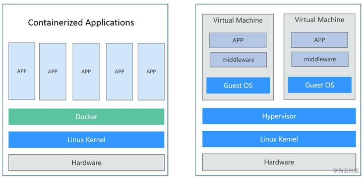

# docker基本概念

## 什么是容器

容器是一种轻量级、可移植、自包含的软件打包技术，使应用程序可以在几乎任何地方以相同的方式运行。

## docker和虚拟机的区别

https://www.zhihu.com/question/48174633/answer/229253704

虚拟机： 我们传统的虚拟机需要模拟整台机器包括硬件，每台虚拟机都需要有自己的操作系统，虚拟机一旦被开启，预分配给他的资源将全部被占用。每一个虚拟机包括应用，必要的二进制和库，以及一个完整的用户操作系统。

Docker： 容器技术是和我们的宿主机共享硬件资源及操作系统可以实现资源的动态分配。 容器包含应用和其所有的依赖包，但是与其他容器共享内核。容器在宿主机操作系统中，在用户空间以分离的进程运行。

## 为什么使用容器

- 软件更新发布及部署低效，过程繁琐且需要人工介入
- 环境一致性难以保证
- 不同环境之间迁移成本太高

