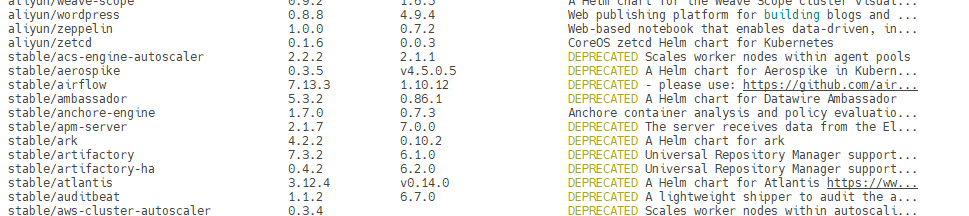
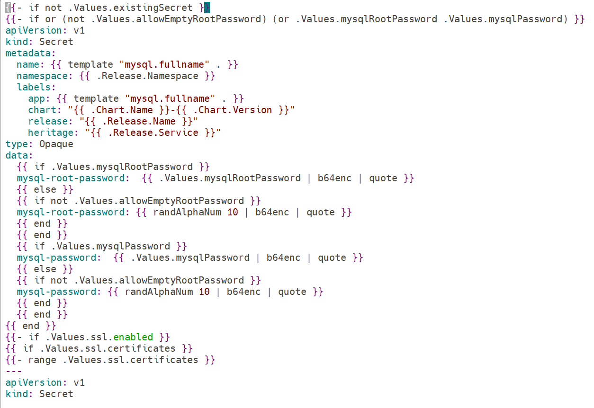
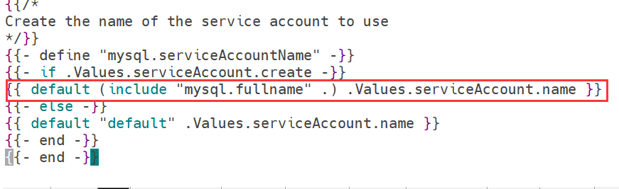

# Helm— Kubernetes的包管理器

## Why Helm

Kubernetes能够很好地组织和编排容器，但它缺少一个更高层次的应用打包工具，而Helm解决了这个问题

比如对于一个MySQL服务，Kubernetes需要部署下面这些对象：

- Service，让外界能够访问到MySQL
- Secret，定义MySQL的密码
- PersistentVolumeClaim，为MySQL申请持久化存储空间
- Deployment，部署MySQL Pod，并使用上面的这些支持对象
- 上面这些配置保存到对象各自的文件中，或者集中写进一个配置文件，然后通过kubectl apply -f部署

但是，如果我们需要的应用多达十个甚至几十上百个，这种组织和管理应用的方式就会有一下缺点：

- 很难管理、编辑和维护如此多的服务，每个服务都有若干配置，缺乏一个更高层次的工具将这些配置组织起来。
- 不容易将这些服务作为一个整体统一发布，部署人员需要首先理解应用都包含哪些服务，然后按照逻辑顺序依次执行kubectl apply，即缺少一种工具来定义应用与服务，以及服务与服务之间的依赖关系。
- 不能高效地共享和重用服务，比如两个应用都要用到MySQL服务，但配置的参数不一样，这两个应用只能分别复制一套标准的MySQL配置文件，修改后通过kubectl apply部署。
- 不支持应用级别的版本管理，虽然可以通过kubectl rollout undo进行回滚，但这只能针对单个Deployment，不支持整个应用的回滚
- 不支持对部署的应用状态进行验证，比如是否能通过预定义的账号访问MySQL。虽然Kubernetes有健康检查，但那是针对单个容器，我们需要应用（服务）级别的健康检查

## Helm架构

Helm有两个重要的概念：chart和release。

**chart**是创建一个应用的信息集合，包括各种Kubernetes对象的配置模板、参数定义、依赖关系、文档说明等。chart是应用部署的自包含逻辑单元。可以将chart想象成apt、yum中的软件安装包。

**release**是chart的运行实例，代表了一个正在运行的应用。当chart被安装到Kubernetes集群，就生成一个release。chart能够多次安装到同一个集群，每次安装都是一个release。

Helm是包管理工具，这里的包就是指的chart。

Helm能够：

- 从零创建新chart
- 与存储chart的仓库交互，拉取、保存和更新chart
- 在Kubernetes集群中安装和卸载release
- 更新、回滚和测试release。

Helm包含两个组件：Helm客户端和Tiller服务器


Helm客户端是终端用户使用的命令行工具，用户可以：

- 在本地开发chart
- 管理chart仓库
- 与Tiller服务器交互
- 在远程Kubernetes集群上安装chart
- 查看release信息
- 升级或卸载已有的release

Tiller服务器运行在Kubernetes集群中，它会处理Helm客户端的请求，与Kubernetes API Server交互。Tiller服务器负责：

- 监听来自Helm客户端的请求
- 通过chart构建release
- 在Kubernetes中安装chart，并跟踪release的状态
- 通过API Server升级或卸载已有的release

简单地讲，Helm客户端负责管理chart，Tiller服务器负责管理release。

## 安装Helm

### 安装Helm客户端

```shell
curl -fsSL -o get_helm.sh https://raw.githubusercontent.com/helm/helm/main/scripts/get-helm-3
chmod 700 get_helm.sh
./get_helm.sh
# 或者直接使用以下命令
curl https://raw.githubusercontent.com/helm/helm/main/scripts/get-helm-3 | bash
```

执行helm version验证

```shell
root@host3:~# helm version
version.BuildInfo{Version:"v3.10.2", GitCommit:"50f003e5ee8704ec937a756c646870227d7c8b58", GitTreeState:"clean", GoVersion:"go1.18.8"}
```

helm有很多子命令和参数，为了提高使用命令行的效率，通常建议安装helm的bash命令补全脚本

```shell
helm completion bash > .helmrc
echo "source .helmrc" >> .bashrc
source .bashrc
```

重新登录后就可以通过Tab键补全helm子命令和参数了

**helm3删除了Tiller，但是需要添加Chart仓库**

添加存储库

```shell
helm repo add stable http://mirror.azure.cn/kubernetes/charts
helm repo add aliyun https://kubernetes.oss-cn-hangzhou.aliyuncs.com/charts
helm repo update
```

查看仓库

```shell
root@host3:~# helm repo list
NAME    URL
stable  http://mirror.azure.cn/kubernetes/charts
aliyun  https://kubernetes.oss-cn-hangzhou.aliyuncs.com/charts
```

## 使用helm

查看当前可安装的chart

```shell
helm search repo
```



其中aliyun/zetcd是阿里云的仓库

其中stable/aerospike是安装的微软的仓库

与apt和yum一样，helm也支持关键字搜索

```shell
root@host3:~# helm search repo  mysql
NAME                                    CHART VERSION   APP VERSION     DESCRIPTION
aliyun/mysql                            0.3.5                           Fast, reliable, scalable, and easy to use open-...
stable/mysql                            1.6.9           5.7.30          DEPRECATED - Fast, reliable, scalable, and easy...
stable/mysqldump                        2.6.2           2.4.1           DEPRECATED! - A Helm chart to help backup MySQL...
stable/prometheus-mysql-exporter        0.7.1           v0.11.0         DEPRECATED A Helm chart for prometheus mysql ex...
aliyun/percona                          0.3.0                           free, fully compatible, enhanced, open source d...
aliyun/percona-xtradb-cluster           0.0.2           5.7.19          free, fully compatible, enhanced, open source d...
stable/percona                          1.2.3           5.7.26          DEPRECATED - free, fully compatible, enhanced, ...
stable/percona-xtradb-cluster           1.0.8           5.7.19          DEPRECATED - free, fully compatible, enhanced, ...
stable/phpmyadmin                       4.3.5           5.0.1           DEPRECATED phpMyAdmin is an mysql administratio...
aliyun/gcloud-sqlproxy                  0.2.3                           Google Cloud SQL Proxy
aliyun/mariadb                          2.1.6           10.1.31         Fast, reliable, scalable, and easy to use open-...
stable/gcloud-sqlproxy                  0.6.1           1.11            DEPRECATED Google Cloud SQL Proxy
stable/mariadb                          7.3.14          10.3.22         DEPRECATED Fast, reliable, scalable, and easy t...
```

安装chart

```shell
root@host3:~# helm install my-mysql stable/mysql
```


输出分为两部分：

1. 本次部署的描述信息。NAME是release的名字，NAMESPACE是release部署的namespace，默认是default，也可以通过--namespace指定。STATUS为DEPLOYED，表示已经将chart部署到集群
2. NOTES部分显示的是release的使用方法，比如如何访问Service、如何获取数据库密码以及如何连接数据库等。

通过kubectl get可以查看组成release的各个对象


因为我们还没有准备PersistentVolume，所以当前pvc还不可用。

helm list显示已经部署的release，helm delete可以删除release


## chart详解

chart是Helm的应用打包格式，由一系列文件组成，这些文件描述了Kubernetes部署应用时所需要的资源，比如Service、Deployment、PersistentVolumeClaim、Secret、ConfigMap等。

### chart目录结构

一旦安装了某个chart，我们就可以在~/.cache/helm/repository/中找到chart的tar包

```shell
root@host3:~# ls ~/.cache/helm/repository/
aliyun-charts.txt  aliyun-index.yaml  mysql-1.6.9.tgz  stable-charts.txt  stable-index.yaml
```

```shell
# 使用tar -xvf mysql-1.6.9.tgz解压文件，然后查看
root@host3:~/.cache/helm/repository# tree mysql
mysql
├── Chart.yaml
├── README.md
├── templates
│   ├── configurationFiles-configmap.yaml
│   ├── deployment.yaml
│   ├── _helpers.tpl
│   ├── initializationFiles-configmap.yaml
│   ├── NOTES.txt
│   ├── pvc.yaml
│   ├── secrets.yaml
│   ├── serviceaccount.yaml
│   ├── servicemonitor.yaml
│   ├── svc.yaml
│   └── tests
│       ├── test-configmap.yaml
│       └── test.yaml
└── values.yaml
```

#### Chart.yaml

```yaml
apiVersion: v1
appVersion: 5.7.30
deprecated: true
description: DEPRECATED - Fast, reliable, scalable, and easy to use open-source relational
  database system.
home: https://www.mysql.com/
icon: https://www.mysql.com/common/logos/logo-mysql-170x115.png
keywords:
- mysql
- database
- sql
name: mysql
sources:
- https://github.com/kubernetes/charts
- https://github.com/docker-library/mysql
version: 1.6.9
```

#### README.md

Markdown格式的README文件，相当于chart的使用文档，此文件为可选

#### LICENSE

文本文件，描述chart的许可信息，此文件为可选，例子中没有

#### requirements.yaml

chart可能依赖其他的chart，这些依赖关系可通过requirements.yaml指定，在安装过程中，依赖的chart也会被一起安装，例子中没有

#### values.yaml

chart支持在安装时根据参数进行定制化配置，而values.yaml则提供了这些配置参数的默认值

#### templates目录

各类Kubernetes资源的配置模板都放置在这里。Helm会将values.yaml中的参数值注入模板中，生成标准的YAML配置文件。

#### templates/NOTES.txt

chart的简易使用文档，chart安装成功后会显示此文档内容

### chart模板

Helm通过模板创建Kubernetes能够理解的YAML格式的资源配置文件，我们将通过例子来学习如何使用模板。



从结构上看，文件的内容非常像Secret配置，只是大部分属性值变成了{{ xxx }}。这些{{ xxx }}实际上是模板的语法。Helm采用了Go语言的模板来编写chart。Go模板非常强大，支持变量、对象、函数、流控制等功能。下面我们通过解析templates/secrets.yaml快速学习模板。

如果存在一些信息多个模板都会用到，则可在templates/_helpers.tpl中将其定义为子模板，然后通过templates函数引用。

{{ template "mysql.fullname".}}定义Secret的name。关键字template的作用是引用一个子模板mysql.fullname。这个子模板是在templates/_helpers.tpl文件中定义的



所有资源的名称都应该保持一致。对于我们这个chart，无论Secret还是Deployment、PersistentVolumeClaim、Service，它们的名字都是子模板mysql.fullname的值。

### 再次实践

执行执行helm inspect values stable/mysql，可以快速查看values.yaml中的内容，阅读注释就可以知道MySQL chart支持哪些参数，安装之前需要做哪些准备。


chart定义了一个PersistentVolumeClaim，申请8GB的PersistentVolume。由于我们的实验环境不支持动态供给，因此要预先创建好相应的PV

```yaml
apiVersion: v1
kind: PersistentVolume
metadata:
  name: my-mysql
spec:
  storageClassName: standard
  accessModes:
    - ReadWriteOnce
  capacity:
    storage: 8Gi
  persistentVolumeReclaimPolicy: Retain
  nfs:
    path: /tmp/nfs/my-sql
    server: 10.182.79.36
```

```sh
root@host3:~# kubectl apply -f test.yaml
persistentvolume/my-mysql created
root@host3:~# kubectl get pv
NAME       CAPACITY   ACCESS MODES   RECLAIM POLICY   STATUS      CLAIM   STORAGECLASS   REASON   AGE
my-mysql   8Gi        RWO            Retain           Available                                   7s
```

**定制化安装chart**

除了接受values.yaml的默认值，我们还可以定制化chart，比如设置mysqlRootPassword

Helm有两种方式传递配置参数：

- 指定自己的values文件。通常的做法是首先通过helm inspect values mysql > myvalues.yaml生成values文件，然后设置mysqlRootPassword，最后执行helm install--values=myvalues.yaml mysql
- 通过--set直接传入参数值

```shell
helm install my stable/mysql --set mysqlRootPassword=abc123
```


通过helm list和helm status可以查看chart的最新状态


```shell
root@host3:~/.cache/helm/repository/mysql# kubectl get pvc
NAME       STATUS   VOLUME     CAPACITY   ACCESS MODES   STORAGECLASS   AGE
my-mysql   Bound    my-mysql   8Gi        RWO            standard       17m
```

**升级和回滚release**

release发布后可以执行helm upgrade对其进行升级，通过--values或--set应用新的配置。比如将当前的MySQL版本降级到5.7.15

```shell
root@host3:~/.cache/helm/repository/mysql# helm upgrade --set imageTag=5.7.15 my stable/mysql
```

升级之后我就报错了不知道为啥


helm history可以查看release所有的版本,通过helm rollback可以回滚到任何版本

```shell
root@host3:/tmp/test# helm history my
REVISION        UPDATED                         STATUS          CHART           APP VERSION     DESCRIPTION
1               Thu Dec  8 20:06:15 2022        superseded      mysql-1.6.9     5.7.30          Install complete
2               Thu Dec  8 20:26:19 2022        superseded      mysql-1.6.9     5.7.30          Upgrade complete
3               Thu Dec  8 20:31:56 2022        deployed        mysql-1.6.9     5.7.30          Upgrade complete
root@host3:/tmp/test# helm rollback my 1
Rollback was a success! Happy Helming!
```

### 开发自己的chart

#### 创建chart

执行helm create mychart命令，创建chart mychart

```shell
root@host3:/tmp/test# helm create mychart
Creating mychart
root@host3:/tmp/test# tree mychart
mychart
├── charts
├── Chart.yaml
├── templates
│   ├── deployment.yaml
│   ├── _helpers.tpl
│   ├── hpa.yaml
│   ├── ingress.yaml
│   ├── NOTES.txt
│   ├── serviceaccount.yaml
│   ├── service.yaml
│   └── tests
│       └── test-connection.yaml
└── values.yaml
```

Helm会帮我们创建目录mychart，并生成各类chart文件。

#### 调试chart

Helm提供了debug的工具：helm lint和helm install --dry-run --debug。

helm lint会检测chart的语法，报告错误以及给出建议。


helm install --dry-run --debug会模拟安装chart，并输出每个模板生成的YAML,我们可以检测这些输出，判断是否与预期相符。

```shell
 helm install tmp-name --dry-run mychart --debug
```

#### 安装chart

当我们准备就绪，就可以安装chart了。Helm支持四种安装方法:

1. 安装仓库中的chart，例如helm install stable/nginx
2. 通过tar包安装，例如helm install./nginx-1.2.3.tgz
3. 通过chart本地目录安装，例如helm install./nginx
4. 通过URL安装，例如helm install https://example.com/charts/nginx-1.2.3.tgz。

我们使用本地目录安装


#### 将chart添加到仓库

chart通过测试后可以添加到仓库中，团队其他成员就能够使用了。任何HTTP Server都可以用作chart仓库

**在10.182.27.24上启动一个httpd容器**

```shell
docker run -d -p 8080:88 -v /var/www/:/usr/local/apache2/htdocs/ httpd
```

**通过helm package将mychart打包**

```shell
root@host3:/tmp/test#  helm package mychart
Successfully packaged chart and saved it to: /tmp/test/mychart-0.1.0.tgz
```

**执行helm repo index生成仓库的index文件**

```shell
root@host3:/tmp/test# mv mychart-0.1.0.tgz myrepo/
root@host3:/tmp/test# helm repo index myrepo/ --url http://10.182.27.24:8080/charts
root@host3:/tmp/test# ls myrepo/
index.yaml  mychart-0.1.0.tgz
```

Helm会扫描myrepo目录中的所有tgz包并生成index.yaml。--url指定的是新仓库的访问路径。新生成的index.yaml记录了当前仓库中所有chart的信息


**将mychart-0.1.0.tgz和index.yaml上传到10.182.27.24的/var/www/charts目录**

```shell
[root@centos7 chart]# ls
index.yaml  mychart-0.1.0.tgz
```

**通过helm repo add将新仓库添加到Helm**

```shell
root@host3:/tmp/test/myrepo# helm repo add newrepo http://10.182.27.24:8080/charts
"newrepo" has been added to your repositories
root@host3:/tmp/test/myrepo# helm repo list
NAME    URL
aliyun  https://kubernetes.oss-cn-hangzhou.aliyuncs.com/charts
stable  http://mirror.azure.cn/kubernetes/charts
newrepo http://10.182.27.24:8080/charts
```

**现在已经可以repo search到mychart了**

```shell
root@host3:/tmp/test/myrepo# helm search repo mychart
NAME            CHART VERSION   APP VERSION     DESCRIPTION
newrepo/mychart 0.1.0           1.16.0          A Helm chart for Kubernetes
```

**若以后仓库添加了新的chart，则需要用helm repo update更新本地的index**

```shell
root@host3:/tmp/test/myrepo# helm repo update
Hang tight while we grab the latest from your chart repositories...
...Successfully got an update from the "newrepo" chart repository
...Successfully got an update from the "aliyun" chart repository
...Successfully got an update from the "stable" chart repository
Update Complete. ⎈Happy Helming!⎈
```

