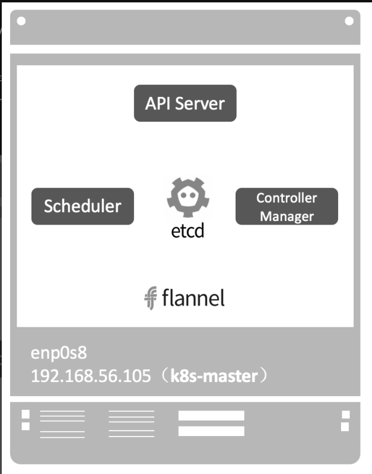
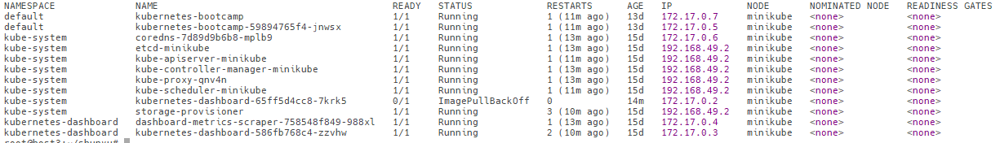

# kubernetes架构

## Master节点

Master是Kubernetes Cluster的大脑，运行着的Daemon服务包括kube-apiserver、kube-scheduler、kube-controller-manager、etcd和Pod网络（例如flannel）



**1．API Server（kube-apiserver）**

API Server提供HTTP/HTTPS RESTful API，即Kubernetes API。API Server是Kubernetes Cluster的前端接口，各种客户端工具（CLI或UI）以及Kubernetes其他组件可以通过它管理Cluster的各种资源。

**2．Scheduler（kube-scheduler）**

Scheduler负责决定将Pod放在哪个Node上运行。Scheduler在调度时会充分考虑Cluster的拓扑结构，当前各个节点的负载，以及应用对高可用、性能、数据亲和性的需求。

**3．Controller Manager（kube-controller-manager）**

Controller Manager负责管理Cluster各种资源，保证资源处于预期的状态。Controller Manager由多种controller组成，包括replication controller、endpoints controller、namespace controller、serviceaccounts controller等。不同的controller管理不同的资源。例如，replication controller管理Deployment、StatefulSet、DaemonSet的生命周期，namespace controller管理Namespace资源。

**4．etcd**

etcd负责保存Kubernetes Cluster的配置信息和各种资源的状态信息。当数据发生变化时，etcd会快速地通知Kubernetes相关组件。

**5．Pod网络**

Pod要能够相互通信，Kubernetes Cluster必须部署Pod网络，flannel是其中一个可选方案。

## Node节点

Node是Pod运行的地方，Kubernetes支持Docker、rkt等容器Runtime。Node上运行的Kubernetes组件有kubelet、kube-proxy和Pod网络（例如flannel）

**1．kubelet**

kubelet是Node的agent，当Scheduler确定在某个Node上运行Pod后，会将Pod的具体配置信息（image、volume等）发送给该节点的kubelet，kubelet根据这些信息创建和运行容器，并向Master报告运行状态。

**2．kube-proxy**

service在逻辑上代表了后端的多个Pod，外界通过service访问Pod。service接收到的请求是如何转发到Pod的呢？这就是kube-proxy要完成的工作。每个Node都会运行kube-proxy服务，它负责将访问service的TCP/UPD数据流转发到后端的容器。如果有多个副本，kube-proxy会实现负载均衡。

**3．Pod网络**

Pod要能够相互通信，Kubernetes Cluster必须部署Pod网络，flannel是其中一个可选方案。

## 实验

**为什么k8s-master上也有kubelet和kube-proxy呢？**

这是因为Master上也可以运行应用，即Master同时也是一个Node, 几乎所有的Kubernetes组件本身也运行在Pod里

```shell
kubectl get pod --all-namespaces -o wide
```



Kubernetes的系统组件都被放到kube-system namespace中。这里有一个coredns组件，它为Cluster提供DNS服务

## 部署过程

```shell
root@host3:~/shunyu# kubectl create deployment httpd-app --image=httpd --replicas=2
deployment.apps/httpd-app created
root@host3:~/shunyu#
root@host3:~/shunyu# kubectl get deployment
NAME                  READY   UP-TO-DATE   AVAILABLE   AGE
httpd-app             2/2     2            2           10s
kubernetes-bootcamp   1/1     1            1           13d
root@host3:~/shunyu# kubectl get pod -o wide
NAME                                   READY   STATUS    RESTARTS      AGE     IP            NODE       NOMINATED NODE   READINESS GATES
httpd-app-864bff6bd6-gbq8n             1/1     Running   0             39s     172.17.0.9    minikube   <none>           <none>
httpd-app-864bff6bd6-p4wrb             1/1     Running   0             39s     172.17.0.10   minikube   <none>           <none>
kubernetes-bootcamp                    1/1     Running   1 (22m ago)   13d     172.17.0.7    minikube   <none>           <none>
kubernetes-bootcamp-59894765f4-jnwsx   1/1     Running   1 (22m ago)   13d     172.17.0.5    minikube   <none>           <none>
```

①kubectl发送部署请求到API Server。

②API Server通知Controller Manager创建一个deployment资源。

③Scheduler执行调度任务，将两个副本Pod都分发到minikube

④minikube创建并运行Pod。

>1. 应用的配置和当前状态信息保存在etcd中，执行kubectl get pod时API Server会从etcd中读取这些数据。
>
>2. flannel会为每个Pod都分配IP。因为没有创建service，所以目前kube-proxy还没参与进来。

