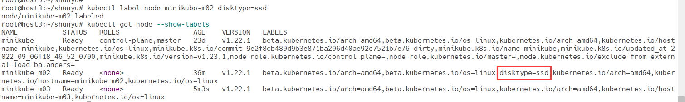
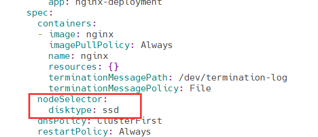
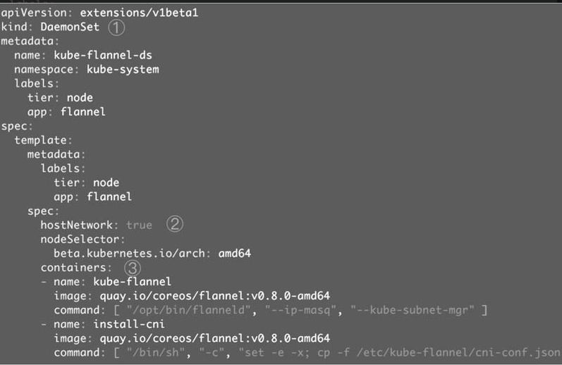

# 运行应用

## Deployment

下面的命令将部署包含两个副本的Deployment nginx-deployment，容器的image为nginx

```shell
root@host3:~/shunyu# kubectl create deployment nginx-deployment --image=nginx --replicas=2
deployment.apps/nginx-deployment created
```

```shell
# 通过kubectl get deployment 查看 nginx-deployment 的状态
root@host3:~/shunyu# kubectl get deployment nginx-deployment
NAME               READY   UP-TO-DATE   AVAILABLE   AGE
nginx-deployment   2/2     2            2           24h

# 通过kubectl describe deployment了解更详细的信息
root@host3:~/shunyu# kubectl describe deployment nginx-deployment
Name:                   nginx-deployment
Namespace:              default
CreationTimestamp:      Tue, 27 Sep 2022 17:17:09 +0800
Labels:                 app=nginx-deployment
Annotations:            deployment.kubernetes.io/revision: 1
Selector:               app=nginx-deployment
Replicas:               2 desired | 2 updated | 2 total | 2 available | 0 unavailable
StrategyType:           RollingUpdate
MinReadySeconds:        0
RollingUpdateStrategy:  25% max unavailable, 25% max surge
Pod Template:
  Labels:  app=nginx-deployment
  Containers:
   nginx:
    Image:        nginx
    Port:         <none>
    Host Port:    <none>
    Environment:  <none>
    Mounts:       <none>
  Volumes:        <none>
Conditions:
  Type           Status  Reason
  ----           ------  ------
  Available      True    MinimumReplicasAvailable
  Progressing    True    NewReplicaSetAvailable
OldReplicaSets:  <none>
NewReplicaSet:   nginx-deployment-84cd76b964 (2/2 replicas created)
Events:          <none>

# 通过kubectl get replicaset查看当前被部署的 ReplicaSet
# kubectl get replicaset 和 kubectl get rs 等效
root@host3:~/shunyu# kubectl get rs
NAME                             DESIRED   CURRENT   READY   AGE
httpd-app-864bff6bd6             2         2         2       6d2h
kubernetes-bootcamp-59894765f4   1         1         1       20d
nginx-deployment-84cd76b964      2         2         2       24h

# 通过kubectl describe replicaset 查看详细信息
# 查看第56行, Controlled By指明此ReplicaSet是由Deployment/nginx-deployment创建的
root@host3:~/shunyu# kubectl describe replicaset nginx-deployment-84cd76b964
Name:           nginx-deployment-84cd76b964
Namespace:      default
Selector:       app=nginx-deployment,pod-template-hash=84cd76b964
Labels:         app=nginx-deployment
                pod-template-hash=84cd76b964
Annotations:    deployment.kubernetes.io/desired-replicas: 2
                deployment.kubernetes.io/max-replicas: 3
                deployment.kubernetes.io/revision: 1
Controlled By:  Deployment/nginx-deployment
Replicas:       2 current / 2 desired
Pods Status:    2 Running / 0 Waiting / 0 Succeeded / 0 Failed
Pod Template:
  Labels:  app=nginx-deployment
           pod-template-hash=84cd76b964
  Containers:
   nginx:
    Image:        nginx
    Port:         <none>
    Host Port:    <none>
    Environment:  <none>
    Mounts:       <none>
  Volumes:        <none>
Events:           <none>

# 通过kubectl get pod 查看pod 最后两个副本Pod都处于Running状态
root@host3:~/shunyu# kubectl get pod
NAME                                   READY   STATUS    RESTARTS       AGE
httpd-app                              1/1     Running   0              6d2h
httpd-app-864bff6bd6-gbq8n             1/1     Running   0              6d2h
httpd-app-864bff6bd6-p4wrb             1/1     Running   0              6d2h
kubernetes-bootcamp                    1/1     Running   1 (6d2h ago)   20d
kubernetes-bootcamp-59894765f4-jnwsx   1/1     Running   1 (6d2h ago)   20d
nginx-deployment-84cd76b964-rp4vh      1/1     Running   0              24h
nginx-deployment-84cd76b964-v9xtz      1/1     Running   0              24h

# 然后用kubectl describe pod查看更详细的信息
# root@host3:~/shunyu# kubectl describe pod nginx-deployment-84cd76b964-rp4vh | grep -i 'Controlled By'
# Controlled By指明此Pod是由ReplicaSet/nginx-deployment-84cd76b964创建的
root@host3:~/shunyu# kubectl describe pod nginx-deployment-84cd76b964-rp4vh
Name:         nginx-deployment-84cd76b964-rp4vh
Namespace:    default
Priority:     0
Node:         minikube/192.168.49.2
Start Time:   Tue, 27 Sep 2022 17:17:10 +0800
Labels:       app=nginx-deployment
              pod-template-hash=84cd76b964
Annotations:  <none>
Status:       Running
IP:           172.17.0.12
IPs:
  IP:           172.17.0.12
Controlled By:  ReplicaSet/nginx-deployment-84cd76b964
Containers:
  nginx:
    Container ID:   docker://8d8a1e810890ac25163e30ae9aa853576f7b2c9a54c2b2506d9f066b8559e469
    Image:          nginx
    Image ID:       docker-pullable://nginx@sha256:0b970013351304af46f322da1263516b188318682b2ab1091862497591189ff1
    Port:           <none>
    Host Port:      <none>
    State:          Running
      Started:      Tue, 27 Sep 2022 17:18:34 +0800
    Ready:          True
    Restart Count:  0
    Environment:    <none>
    Mounts:
      /var/run/secrets/kubernetes.io/serviceaccount from kube-api-access-5pnkt (ro)
Conditions:
  Type              Status
  Initialized       True
  Ready             True
  ContainersReady   True
  PodScheduled      True
Volumes:
  kube-api-access-5pnkt:
    Type:                    Projected (a volume that contains injected data from multiple sources)
    TokenExpirationSeconds:  3607
    ConfigMapName:           kube-root-ca.crt
    ConfigMapOptional:       <nil>
    DownwardAPI:             true
QoS Class:                   BestEffort
Node-Selectors:              <none>
Tolerations:                 node.kubernetes.io/not-ready:NoExecute op=Exists for 300s
                             node.kubernetes.io/unreachable:NoExecute op=Exists for 300s
Events:                      <none>

总结一下过程
1. 用户通过kubectl创建Deployment。
2. Deployment创建ReplicaSet。
3. ReplicaSet创建Pod。
4. 对象的命名方式是“子对象的名字=父对象名字+随机字符串或数字”
```

### 创建资源的方式

- 用kubectl命令直接创建，比如“kubectl create nginx-deployment --image=nginx:1.7.9--replicas=2”，在命令行中通过参数指定资源的属性
  - 简单、直观、快捷，上手快，适合临时测试或实验
- 通过配置文件和kubectl apply创建，资源的属性写在配置文件中，文件格式为YAML
  - 配置文件描述了什么，即应用最终要达到的状态
  - 配置文件提供了创建资源的模板，能够重复部署。可以像管理代码一样管理部署
  - 适合正式的、跨环境的、规模化部署
  - 这种方式要求熟悉配置文件的语法，有一定难度

### Deployment配置文件简介

```yaml
apiVersion: apps/v1 
kind: Deployment
metadata:
  name: nginx-deployment
  labels:
    app: nginx
spec:
  replicas: 3
  selector:
    matchLabels:
      app: nginx
  template:
    metadata:
      labels:
        app: nginx
    spec:
      containers:
      - name: nginx
        image: nginx:1.14.2
```

https://www.cnblogs.com/bigcarcar/p/16098814.html

- **apiVersion**：是当前配置格式的版本。

- **kind**：是要创建的资源类型，这里是Deployment。

- **metadata**：是该资源的元数据
  - **name**：是必需的元数据项,名称在命名空间中必须是唯一的
  - **labels**：标签 key-value 键值对
- **spec**：部署所需行为的规范
  - **replicas**：期望的副本数量
  - **selector**：选择器，必须与pod模板的标签匹配，如果该字段为空，则默认采用pod模板中的labels。Label的键和值都必须与该Selector匹配
    - **matchLabels**：key value 键值对
  - **template**：描述了将要创建的pod模版
    - **metadata**：标准对象的元数据
    - **spec**：pod所需行为的规范
      - **containers**：容器信息
        - **name**：pod中的容器名 ，必须一个唯一的名称
        - **image**：镜像名

执行kubectl apply -f nginx.yml 并查看创建的deployment

```shell
root@host3:~/shunyu# kubectl apply -f nginx.yml
deployment.apps/nginx-deployment unchanged
root@host3:~/shunyu# kubectl get deployment
NAME               READY   UP-TO-DATE   AVAILABLE   AGE
httpd-app          2/2     2            2           6d23h
nginx-deployment   3/3     3            3           18m
```

- `NAME` 列出了名字空间中 Deployment 的名称。
- `READY` 显示应用程序的可用的“副本”数。显示的模式是“就绪个数/期望个数”。
- `UP-TO-DATE` 显示为了达到期望状态已经更新的副本数。
- `AVAILABLE` 显示应用可供用户使用的副本数。
- `AGE` 显示应用程序运行的时间。

查看deployment创建的ReplicaSet

```shell
root@host3:~/shunyu# kubectl get replicaset
NAME                          DESIRED   CURRENT   READY   AGE
httpd-app-864bff6bd6          2         2         2       6d23h
nginx-deployment-66b6c48dd5   3         3         3       19m
```

- `NAME` 列出名字空间中 ReplicaSet 的名称；
- `DESIRED` 显示应用的期望副本个数，即在创建 Deployment 时所定义的值。 此为期望状态；
- `CURRENT` 显示当前运行状态中的副本个数；
- `READY` 显示应用中有多少副本可以为用户提供服务；
- `AGE` 显示应用已经运行的时间长度

```shell
root@host3:~/shunyu# kubectl get pod
NAME                                READY   STATUS    RESTARTS        AGE
httpd-app                           1/1     Running   0               6d23h
httpd-app-864bff6bd6-gbq8n          1/1     Running   0               6d23h
httpd-app-864bff6bd6-p4wrb          1/1     Running   0               6d23h
kubernetes-bootcamp                 1/1     Running   1 (6d23h ago)   20d
nginx-deployment-66b6c48dd5-lhpql   1/1     Running   0               19m
nginx-deployment-66b6c48dd5-vfnz4   1/1     Running   0               19m
nginx-deployment-66b6c48dd5-zx4zz   1/1     Running   0               19m

# 删除上述资源
# kubectl delete deployment nginx-deployment或者kubectl delete -f nginx.yml
root@host3:~/shunyu# kubectl delete -f nginx.yml
deployment.apps "nginx-deployment" deleted
```

### 伸缩

伸缩是指在线增加或减少Pod的副本数，Deployment nginx-deployment初始是3个副本

```shell
root@host3:~/shunyu# kubectl apply -f nginx.yml
deployment.apps/nginx-deployment unchanged
root@host3:~/shunyu# kubectl get deployment
NAME               READY   UP-TO-DATE   AVAILABLE   AGE
httpd-app          2/2     2            2           6d23h
nginx-deployment   3/3     3            3           9s
```

现在修改nginx.yml文件，将副本改成5个

```yaml
apiVersion: apps/v1 
kind: Deployment
metadata:
  name: nginx-deployment
  labels:
    app: nginx
spec:
  replicas: 5
  selector:
    matchLabels:
      app: nginx
  template:
    metadata:
      labels:
        app: nginx
    spec:
      containers:
      - name: nginx
        image: nginx:1.14.2
```

```shell
# 重新使用kubectl apply -f nginx.yml 发现副本数变成了5个
root@host3:~/shunyu# kubectl apply -f nginx.yml
deployment.apps/nginx-deployment configured
root@host3:~/shunyu# kubectl get deployment
NAME               READY   UP-TO-DATE   AVAILABLE   AGE
httpd-app          2/2     2            2           6d23h
nginx-deployment   5/5     5            5           2m8s

# kubectl scale deployment/nginx-deployment --replicas=10
root@host3:~/shunyu# kubectl scale deployment/nginx-deployment --replicas=10
deployment.apps/nginx-deployment scaled
root@host3:~/shunyu# kubectl get deployment
NAME               READY   UP-TO-DATE   AVAILABLE   AGE
httpd-app          2/2     2            2           7d
nginx-deployment   10/10   10           10          61m
root@host3:~/shunyu# kubectl scale deployment/nginx-deployment --replicas=2
deployment.apps/nginx-deployment scaled
root@host3:~/shunyu# kubectl get deployment
NAME               READY   UP-TO-DATE   AVAILABLE   AGE
httpd-app          2/2     2            2           7d
nginx-deployment   2/2     2            2           62m
```

```shell
# 另外两个更新方式
root@host3:~/shunyu# kubectl set image deployment/nginx-deployment nginx=nginx:1.16.1
deployment.apps/nginx-deployment image updated
root@host3:~/shunyu# kubectl get deployment
NAME               READY   UP-TO-DATE   AVAILABLE   AGE
httpd-app          2/2     2            2           7d
nginx-deployment   4/5     3            4           50m
root@host3:~/shunyu# kubectl get deployment
NAME               READY   UP-TO-DATE   AVAILABLE   AGE
httpd-app          2/2     2            2           7d
nginx-deployment   5/5     5            5           51m

# 使用kubectl edit deployment/nginx-deployment
root@host3:~/shunyu# kubectl edit deployment/nginx-deployment
deployment.apps/nginx-deployment edited
```

### Failover

先通过minikube node add增加minikube的node节点

```shell
root@host3:~/shunyu# minikube node add
* Adding node m03 to cluster minikube
E0930 17:09:51.012073 1128846 register.go:141] unexpected first step: ""
* Starting node minikube-m03 in cluster minikube
E0930 17:09:51.013258 1128846 register.go:141] unexpected first step: ""
* Pulling base image ...
E0930 17:09:51.132475 1128846 register.go:141] unexpected first step: ""
* Creating docker container (CPUs=2, Memory=2200MB) ...- E0930 17:10:03.481404                                                                              1128846 register.go:141] unexpected first step: ""
* Preparing Kubernetes v1.22.1 on Docker 20.10.8 ...\ E0930 17:10:23.636055 112                                                                             8846 register.go:141] unexpected first step: ""
* Verifying Kubernetes components...
* Successfully added m03 to minikube!
root@host3:~/shunyu# minikube node list
minikube        192.168.49.2
minikube-m02    192.168.49.3
minikube-m03    192.168.49.4
```

然后通过kubectl edit deployment/nginx-deployment更新副本数量, 让其分布在三个节点上

```shell
root@host3:~/shunyu# kubectl get pod -o wide
NAME                                READY   STATUS    RESTARTS     AGE     IP            NODE           NOMINATED NODE   READINESS GATES
nginx-deployment-84cd76b964-bl9hl   1/1     Running   0            5m49s   172.17.0.2    minikube-m02   <none>           <none>
nginx-deployment-84cd76b964-sfpsq   1/1     Running   0            6h18m   172.17.0.5    minikube       <none>           <none>
nginx-deployment-84cd76b964-v5q7l   1/1     Running   0            6h18m   172.17.0.11   minikube       <none>           <none>
nginx-deployment-84cd76b964-x997f   1/1     Running   0            5m49s   172.17.0.2    minikube-m03   <none>           <none>
nginx-deployment-84cd76b964-zvrcv   1/1     Running   0            5m49s   172.17.0.3    minikube-m03   <none>           <none>
root@host3:~/shunyu#
```

关闭节点minikube-m03

```shell
root@host3:~/shunyu# minikube node stop minikube-m03
* Stopping node "minikube-m03"  ...
* Powering off "minikube-m03" via SSH ...
* Successfully stopped node minikube-m03

root@host3:~/shunyu# kubectl get node
NAME           STATUS     ROLES                  AGE   VERSION
minikube       Ready      control-plane,master   23d   v1.22.1
minikube-m02   Ready      <none>                 21m   v1.22.1
minikube-m03   NotReady   <none>                 20m   v1.22.1
```

等待一段时间，Kubernetes会检查到minikube-m03不可用，将minikube-m03上的Pod标记为Terminating状态，并在其他节点上新创建两个Pod，维持总副本数为5

```shell
NAME                                READY   STATUS        RESTARTS     AGE     IP            NODE           NOMINATED NODE   READINESS GATES
nginx-deployment-84cd76b964-bl9hl   1/1     Running       0            18m     172.17.0.2    minikube-m02   <none>           <none>
nginx-deployment-84cd76b964-ncbqj   1/1     Running       0            4m28s   172.17.0.3    minikube-m02   <none>           <none>
nginx-deployment-84cd76b964-sfpsq   1/1     Running       0            6h31m   172.17.0.5    minikube       <none>           <none>
nginx-deployment-84cd76b964-v5q7l   1/1     Running       0            6h31m   172.17.0.11   minikube       <none>           <none>
nginx-deployment-84cd76b964-x997f   1/1     Terminating   0            18m     172.17.0.2    minikube-m03   <none>           <none>
nginx-deployment-84cd76b964-xhgrn   1/1     Running       0            4m28s   172.17.0.4    minikube-m02   <none>           <none>
nginx-deployment-84cd76b964-zvrcv   1/1     Terminating   0            18m     172.17.0.3    minikube-m03   <none>           <none>
```

当minikube-m03恢复后，Terminating的Pod会被删除，不过已经运行的Pod不会重新调度回minikube-m03

```shell
root@host3:~/shunyu# minikube node start minikube-m03
* Starting node minikube-m03 in cluster minikube
* Pulling base image ...
* Restarting existing docker container for "minikube-m03" ...
* Preparing Kubernetes v1.22.1 on Docker 20.10.8 ...
* Verifying Kubernetes components...
* Successfully started node minikube-m03!

root@host3:~/shunyu#  kubectl get node
NAME           STATUS   ROLES                  AGE     VERSION
minikube       Ready    control-plane,master   23d     v1.22.1
minikube-m02   Ready    <none>                 34m     v1.22.1
minikube-m03   Ready    <none>                 2m58s   v1.22.1


root@host3:~/shunyu# kubectl get pod -o wide
NAME                                READY   STATUS    RESTARTS     AGE     IP            NODE           NOMINATED NODE   READINESS GATES
nginx-deployment-84cd76b964-bl9hl   1/1     Running   0            21m     172.17.0.2    minikube-m02   <none>           <none>
nginx-deployment-84cd76b964-ncbqj   1/1     Running   0            7m52s   172.17.0.3    minikube-m02   <none>           <none>
nginx-deployment-84cd76b964-sfpsq   1/1     Running   0            6h34m   172.17.0.5    minikube       <none>           <none>
nginx-deployment-84cd76b964-v5q7l   1/1     Running   0            6h34m   172.17.0.11   minikube       <none>           <none>
nginx-deployment-84cd76b964-xhgrn   1/1     Running   0            7m52s   172.17.0.4    minikube-m02   <none>           <none>
```

### label

默认配置下，Scheduler 会将 Pod 调度到所有可用的 Node。不过有些情况我们希望将 Pod 部署到指定的 Node，比如将有大量磁盘 I/O 的 Pod 部署到配置了 SSD 的 Node；或者 Pod 需要 GPU，需要运行在配置了 GPU 的节点上。

Kubernetes 是通过 label 来实现这个功能的。

label 是 key-value 对，各种资源都可以设置 label，灵活添加各种自定义属性。比如执行如下命令标注minikube-m02 是配置了 SSD 的节点。

```
kubectl label node minikube-m02 disktype=ssd
```

然后通过 `kubectl get node --show-labels` 查看节点的 label。



`disktype=ssd` 已经成功添加到 minikube-m02，除了 `disktype`，Node 还有几个 Kubernetes 自己维护的 label。

有了 `disktype` 这个自定义 label，接下来就可以指定将 Pod 部署到 minikube-m02。使用kubectl edit deployment/nginx-deployment更新应用：



在 Pod 模板的 `spec` 里通过 `nodeSelector` 指定将此 Pod 部署到具有 `label disktype=ssd` 的 Node 上。

部署 Deployment 并查看 Pod 的运行节点：

```shell
root@host3:~/shunyu# kubectl edit deployment/nginx-deployment
deployment.apps/nginx-deployment edited
root@host3:~/shunyu# kubectl get pod -o wide
NAME                                READY   STATUS    RESTARTS     AGE   IP            NODE           NOMINATED NODE   READINESS GATES
nginx-deployment-575555f95d-6ffx5   1/1     Running   0            15s   172.17.0.2    minikube-m02   <none>           <none>
nginx-deployment-575555f95d-97csm   1/1     Running   0            21s   172.17.0.3    minikube-m02   <none>           <none>
nginx-deployment-575555f95d-blx8h   1/1     Running   0            32s   172.17.0.6    minikube-m02   <none>           <none>
nginx-deployment-575555f95d-h2lwj   1/1     Running   0            32s   172.17.0.5    minikube-m02   <none>           <none>
nginx-deployment-575555f95d-x6nv6   1/1     Running   0            32s   172.17.0.7    minikube-m02   <none>           <none>
```

全部 5 个副本都运行在minikube-m02 上，符合我们的预期。

要删除 label `disktype`，执行如下命令：

```shell
root@host3:~/shunyu# kubectl label node minikube-m02 disktype-
node/minikube-m02 labeled
```

不过此时 Pod 并不会重新部署，依然在 minikube-m02 上运行。

```shell
root@host3:~/shunyu# kubectl get pod -o wide
NAME                                READY   STATUS    RESTARTS     AGE     IP            NODE           NOMINATED NODE   
nginx-deployment-575555f95d-6ffx5   1/1     Running   0            2m11s   172.17.0.2    minikube-m02   <none>           <none>
nginx-deployment-575555f95d-97csm   1/1     Running   0            2m17s   172.17.0.3    minikube-m02   <none>           <none>
nginx-deployment-575555f95d-blx8h   1/1     Running   0            2m28s   172.17.0.6    minikube-m02   <none>           <none>
nginx-deployment-575555f95d-h2lwj   1/1     Running   0            2m28s   172.17.0.5    minikube-m02   <none>           <none>
nginx-deployment-575555f95d-x6nv6   1/1     Running   0            2m28s   172.17.0.7    minikube-m02   <none>           <none>
```

除非在 nginx.yml 中删除 `nodeSelector` 设置，然后通过重新部署，Kubernetes 会删除之前的 Pod 并调度和运行新的 Pod。

```shell
root@host3:~/shunyu# kubectl get pod -o wide
NAME                                READY   STATUS    RESTARTS     AGE   IP            NODE           NOMINATED NODE   READINESS GATES
nginx-deployment-84cd76b964-46k9p   1/1     Running   0            26s   172.17.0.2    minikube-m02   <none>           <none>
nginx-deployment-84cd76b964-d6ksq   1/1     Running   0            38s   172.17.0.3    minikube-m03   <none>           <none>
nginx-deployment-84cd76b964-lrnlb   1/1     Running   0            38s   172.17.0.4    minikube-m03   <none>           <none>
nginx-deployment-84cd76b964-mflbc   1/1     Running   0            32s   172.17.0.5    minikube-m03   <none>           <none>
nginx-deployment-84cd76b964-xl7rk   1/1     Running   0            38s   172.17.0.2    minikube-m03   <none>           <none>
```

## DaemonSet

Deployment部署的副本Pod会分布在各个Node上，每个Node都可能运行好几个副本。DaemonSet的不同之处在于：每个Node上最多只能运行一个副本。

DaemonSet的典型应用场景有：

- 在集群的每个节点上运行存储Daemon，比如glusterd或ceph
- 在每个节点上运行日志收集Daemon，比如flunentd或logstash
- 在每个节点上运行监控Daemon，比如Prometheus Node Exporter或collectd

Kubernetes自己就在用DaemonSet运行系统组件

```python
root@host3:~# kubectl get daemonset --namespace=kube-system
NAME         DESIRED   CURRENT   READY   UP-TO-DATE   AVAILABLE   NODE SELECTOR            AGE
kindnet      3         3         3       3            3           <none>                   17d
kube-proxy   3         3         3       3            3           kubernetes.io/os=linux   41d
```

### kube-flannel-ds

flannel的DaemonSet就定义在kube-flannel.yml中



- DaemonSet配置文件的语法和结构与Deployment几乎完全一样，只是将kind设为DaemonSet
- hostName指定Pod直接使用的是Node网络，相当于docker run --network=host
- containers定义了运行flannel服务的两个容器

### kube-proxy

使用kubectl edit daemonset kube-proxy --namespace=kube-system查看kube-system的yaml文件

```yaml
apiVersion: apps/v1
kind: DaemonSet  # kind: DaemonSet指定这是一个DaemonSet类型的资源。
metadata:
  annotations:
    deprecated.daemonset.template.generation: "1"
  creationTimestamp: "2022-09-06T10:46:52Z"
  generation: 1
  labels:
    k8s-app: kube-proxy
  name: kube-proxy
  namespace: kube-system
  resourceVersion: "2300605"
  uid: 92f3e4bd-fa2c-44b7-a90d-abce1e18ba94
spec:
  revisionHistoryLimit: 10
  selector:
    matchLabels:
      k8s-app: kube-proxy
  template:
    metadata:
      creationTimestamp: null
      labels:
        k8s-app: kube-proxy
    spec:
      containers: # containers定义了kube-proxy的容器。
      - command:
        - /usr/local/bin/kube-proxy
        - --config=/var/lib/kube-proxy/config.conf
        - --hostname-override=$(NODE_NAME)
        env:
        - name: NODE_NAME
          valueFrom:
            fieldRef:
              apiVersion: v1
              fieldPath: spec.nodeName
        image: registry.cn-hangzhou.aliyuncs.com/google_containers/kube-proxy:v1.22.1
        imagePullPolicy: IfNotPresent
        name: kube-proxy
        resources: {}
        securityContext:
          privileged: true
        terminationMessagePath: /dev/termination-log
        terminationMessagePolicy: File
        volumeMounts:
        - mountPath: /var/lib/kube-proxy
          name: kube-proxy
        - mountPath: /run/xtables.lock
          name: xtables-lock
        - mountPath: /lib/modules
          name: lib-modules
          readOnly: true
      dnsPolicy: ClusterFirst
      hostNetwork: true
      nodeSelector:
        kubernetes.io/os: linux
      priorityClassName: system-node-critical
      restartPolicy: Always
      schedulerName: default-scheduler
      securityContext: {}
      serviceAccount: kube-proxy
      serviceAccountName: kube-proxy
      terminationGracePeriodSeconds: 30
      tolerations:
      - operator: Exists
      volumes:
      - configMap:
          defaultMode: 420
          name: kube-proxy
        name: kube-proxy
      - hostPath:
          path: /run/xtables.lock
          type: FileOrCreate
        name: xtables-lock
      - hostPath:
          path: /lib/modules
          type: ""
        name: lib-modules
  updateStrategy:
    rollingUpdate:
      maxSurge: 0
      maxUnavailable: 1
    type: RollingUpdate
status: # status是当前DaemonSet的运行时状态
  currentNumberScheduled: 3
  desiredNumberScheduled: 3
  numberAvailable: 3
  numberMisscheduled: 0
  numberReady: 3
  observedGeneration: 1
  updatedNumberScheduled: 3
```

### 运行自己的DaemonSet

Prometheus是流行的系统监控方案，Node Exporter是Prometheus的agent，以Daemon的形式运行在每个被监控节点上，直接在Docker中运行Node Exporter容器

```shell
docker run -d \
    -v "/proc:/host/proc" \
    -v "/sys:/host/sys" \
    -v "/:/rootfs" \
    --net=host \
    prom/node-exporter \
    --path.procfs /host/proc \
    --path.sysfs /host/sys \
    --collector.filesystem.ignore-mount=points "^/(sys|proc|dev|host|etc)($|/)"
```

将其转换为DaemonSet的YAML配置文件node_exporter.yaml

cat node_exporter.yml

```yaml
apiVersion: apps/v1
kind: DaemonSet
metadata:
  name: node-exporter-daemonset
spec:
  selector:
    matchLabels:
      app: prometheus
  template:
    metadata:
      labels:
        app: prometheus
    spec:
      hostNetwork: true    #直接使用Host的网络。
      containers:
      - name: node-exporter
        image: prom/node-exporter
        imagePullPolicy: IfNotPresent
        command:       #设置容器启动命令。
        - /bin/node_exporter
        - --path.procfs
        - /host/proc
        - --path.sysfs
        - /host/sys
        - --collector.filesystem.ignored-mount-points
        - ^/(sys|proc|dev|host|etc)($|/)
        volumeMounts:      #通过Volume将Host路径/proc、/sys和/映射到容器中
        - name: proc
          mountPath: /host/proc
        - name: sys
          mountPath: /host/sys
        - name: root
          mountPath: /rootfs
      volumes:
      - name: proc
        hostPath:
          path: /proc
      - name: sys
        hostPath:
          path: /sys
      - name: root
        hostPath:
          path: /
```

执行kubectl apply -f node_exporter.yml,DaemonSet node-exporter-daemonset部署成功，minikube上运行了node exporter Pod。

```shell
root@host3:~# kubectl apply -f node_exporter.yml
daemonset.apps/node-exporter-daemonset created
root@host3:~# kubectl get pod
NAME                                READY   STATUS               RESTARTS      AGE
nginx-deployment-84cd76b964-46k9p   1/1     Running              0             20d
nginx-deployment-84cd76b964-d6ksq   1/1     Running              0             20d
nginx-deployment-84cd76b964-lrnlb   1/1     Running              0             20d
nginx-deployment-84cd76b964-mflbc   1/1     Running              0             20d
nginx-deployment-84cd76b964-xl7rk   1/1     Running              0             20d
node-exporter-daemonset-5rq9x       1/1     Running              0             2m18s
node-exporter-daemonset-hlwfl       1/1     Running              0             2m18s
node-exporter-daemonset-rt8cl       1/1     Running              0             2m18s
```

## Job

容器按照持续运行的时间可分为两类：服务类容器和工作类容器。服务类容器通常持续提供服务，需要一直运行，比如HTTP Server、Daemon等。工作类容器则是一次性任务，比如批处理程序，完成后容器就退出。

简单的job配置文件

```yaml
apiVersion: batch/v1  # batch/v1是当前Job的apiVersion
kind: Job # 指明当前资源的类型为Job
metadata:
  name: myjob
spec:
  template:
    metadata:
      name: myjob
    spec:
      containers:
      - name: hellow
        image: busybox
        command: ["echo", "hello k8s job!"]
      restartPolicy: Never # restartPolicy指定什么情况下需要重启容器,对于Job，只能设置为Never或者OnFailure,对于其他controller（比如Deployment），可以设置为Always。
```

通过kubectl apply -f myjob.yml启动Job，通过kubectl get job查看Job的状态

```shell
root@host3:~# kubectl apply -f myjob.yml
job.batch/myjob created
root@host3:~# kubectl get job
NAME    COMPLETIONS   DURATION   AGE
myjob   1/1           23s        74s
```

通过kubectl get pod查看Pod的状态

```shell
root@host3:~# kubectl get pod
NAME                                READY   STATUS      RESTARTS      AGE
myjob--1-7rmsg                      0/1     Completed   0             7m58s
```

通过kubectl logs可以查看Pod的标准输出

```shell
root@host3:~# kubectl logs myjob--1-7rmsg
hello k8s job!
```

### Pod失败的情况

删除之前的job故意引入一个错误

```yaml
apiVersion: batch/v1  # batch/v1是当前Job的apiVersion
kind: Job # 指明当前资源的类型为Job
metadata:
  name: myjob
spec:
  template:
    metadata:
      name: myjob
    spec:
      containers:
      - name: hellow
        image: busybox
        command: ["echo-xxxx", "hello k8s job!"]
      restartPolicy: Never 
```

运行新的job,可以看到多个pod的状态不正常

```shell
root@host3:~# kubectl delete -f myjob.yml
job.batch "myjob" deleted
root@host3:~# vi myjob.yml
root@host3:~# kubectl apply -f myjob.yml
job.batch/myjob created
root@host3:~# kubectl get job
NAME    COMPLETIONS   DURATION   AGE
myjob   0/1           12s        12s
root@host3:~# kubectl get pod
NAME                                READY   STATUS               RESTARTS      AGE
myjob--1-hfl2w                      0/1     ContainerCannotRun   0             59s
myjob--1-mmtn5                      0/1     ContainerCannotRun   0             22s
myjob--1-r5fv4                      0/1     ContainerCannotRun   0             52s
myjob--1-vgtw2                      0/1     ContainerCannotRun   0             42s
```

使用kubectl describe pod查看某个Pod的启动日志

```shell
Events:
  Type     Reason     Age    From               Message
  ----     ------     ----   ----               -------
  Normal   Scheduled  3m47s  default-scheduler  Successfully assigned default/myjob--1-r5fv4 to minikube-m02
  Normal   Pulling    3m47s  kubelet            Pulling image "busybox"
  Normal   Pulled     3m43s  kubelet            Successfully pulled image "busybox" in 3.61558054s
  Normal   Created    3m43s  kubelet            Created container hellow
  Warning  Failed     3m43s  kubelet            Error: failed to start container "hellow": Error response from daemon: OCI runtime create failed: container_linux.go:380: starting container process caused: exec: "xxxx": executable file not found in $PATH: unknown
```

**为什么kubectl get pod会看到这么多个失败的Pod？**

当第一个Pod启动时，容器失败退出，根据restartPolicy: Never，此失败容器不会被重启，但Job DESIRED的Pod是1，目前SUCCESSFUL为0，不满足，所以Job controller会启动新的Pod，直到SUCCESSFUL为1。对于我们这个例子，SUCCESSFUL永远也到不了1，所以Job controller会一直创建新的Pod。为了终止这个行为，只能删除Job。如果将restartPolicy设置为OnFailure,失败后容器就会重新启动

### Job的并行性

有时我们希望能同时运行多个Pod，提高Job的执行效率。这个可以通过parallelism设置，如下所示。

```
apiVersion: batch/v1
kind: Job
metadata:
  name: myjob2
spec:
  parallelism: 2
  template:
    metadata:
      name: myjob
    spec:
      containers:
      - name: hello
        image: busybox
        command: ["echo", "hello k8s job! "]
      restartPolicy: OnFailure
```

这里我们将并行的Pod数量设置为2，实践一下，如图所示。 Job一共启动了两个Pod，而且AGE相同，可见是并行运行的。


我们还可以通过completions设置Job成功完成Pod的总数，如下所示。

```shell
apiVersion: batch/v1
kind: Job
metadata:
  name: myjob3
spec:
  completions: 6
  parallelism: 2
  template:
    metadata:
      name: myjob
    spec:
      containers:
      - name: hello
        image: busybox
        command: ["echo", "hello k8s job! "]
      restartPolicy: OnFailure
```

上面配置的含义是：每次运行两个Pod，直到总共有6个Pod成功 完成。实践一下，如图所示。


如果不指定 completions和parallelism，默认值均为1。

上面的例子只是为了演示Job的并行特性，实际用途不大。不过现实中确实存在很多需要并行处理的场景。比如批处理程序，每个副本（Pod）都会从任务池中读取任务并执行，副本越多，执行时间就越短，效率就越高。这种类似的场景都可以用Job来实现。

### 定时Job

Linux中有cron程序定时执行任务，Kubernetes的CronJob提供了类似的功能，可以定时执行Job。CronJob配置文件示例如下所示。

```
[root@k8s-master ~]# cat cronjob.yml
apiVersion: batch/v1beta1
kind: CronJob
metadata:
 name: hello
spec:
 schedule: "*/1 * * * *"
 jobTemplate:
  spec:
   template:
    spec:
     containers:
     \- name: hello
      image: busybox
      command: ["echo", "hello k8s job!"]
     restartPolicy: OnFailure
```

①batch/v2alpha1是当前CronJob的apiVersion。

② 指明当前资源的类型为CronJob。

③ schedule指定什么时候运行Job，其格式与Linux cron一致。这里*/1 * * * *的含义是每一分钟启动一次。

④ jobTemplate定义Job的模板，格式与前面的Job一致。

接下来通过kubectl apply创建CronJob，如图所示。


这次成功了。通过kubectl get cronjob查看CronJob的状态，如图所示。


等待几分钟，然后通过kubectl get jobs查看Job的执行情况，如图所示。


可以看到每隔一分钟就会启动一个Job。执行kubectl logs可查看某个Job的运行日志，如图所示。


