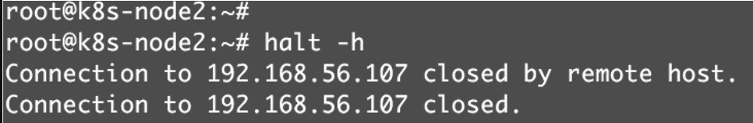
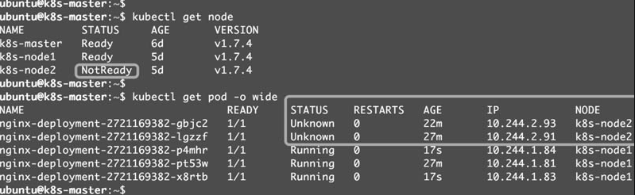
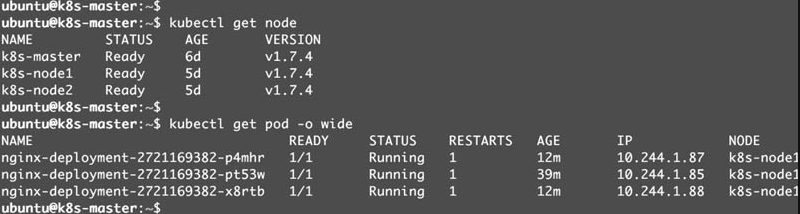

# 运行应用

## Deployment

下面的命令将部署包含两个副本的Deployment nginx-deployment，容器的image为nginx

```shell
root@host3:~/shunyu# kubectl create deployment nginx-deployment --image=nginx --replicas=2
deployment.apps/nginx-deployment created
```

```shell
# 通过kubectl get deployment 查看 nginx-deployment 的状态
root@host3:~/shunyu# kubectl get deployment nginx-deployment
NAME               READY   UP-TO-DATE   AVAILABLE   AGE
nginx-deployment   2/2     2            2           24h

# 通过kubectl describe deployment了解更详细的信息
root@host3:~/shunyu# kubectl describe deployment nginx-deployment
Name:                   nginx-deployment
Namespace:              default
CreationTimestamp:      Tue, 27 Sep 2022 17:17:09 +0800
Labels:                 app=nginx-deployment
Annotations:            deployment.kubernetes.io/revision: 1
Selector:               app=nginx-deployment
Replicas:               2 desired | 2 updated | 2 total | 2 available | 0 unavailable
StrategyType:           RollingUpdate
MinReadySeconds:        0
RollingUpdateStrategy:  25% max unavailable, 25% max surge
Pod Template:
  Labels:  app=nginx-deployment
  Containers:
   nginx:
    Image:        nginx
    Port:         <none>
    Host Port:    <none>
    Environment:  <none>
    Mounts:       <none>
  Volumes:        <none>
Conditions:
  Type           Status  Reason
  ----           ------  ------
  Available      True    MinimumReplicasAvailable
  Progressing    True    NewReplicaSetAvailable
OldReplicaSets:  <none>
NewReplicaSet:   nginx-deployment-84cd76b964 (2/2 replicas created)
Events:          <none>

# 通过kubectl get replicaset查看当前被部署的 ReplicaSet
# kubectl get replicaset 和 kubectl get rs 等效
root@host3:~/shunyu# kubectl get rs
NAME                             DESIRED   CURRENT   READY   AGE
httpd-app-864bff6bd6             2         2         2       6d2h
kubernetes-bootcamp-59894765f4   1         1         1       20d
nginx-deployment-84cd76b964      2         2         2       24h

# 通过kubectl describe replicaset 查看详细信息
# 查看第56行, Controlled By指明此ReplicaSet是由Deployment/nginx-deployment创建的
root@host3:~/shunyu# kubectl describe replicaset nginx-deployment-84cd76b964
Name:           nginx-deployment-84cd76b964
Namespace:      default
Selector:       app=nginx-deployment,pod-template-hash=84cd76b964
Labels:         app=nginx-deployment
                pod-template-hash=84cd76b964
Annotations:    deployment.kubernetes.io/desired-replicas: 2
                deployment.kubernetes.io/max-replicas: 3
                deployment.kubernetes.io/revision: 1
Controlled By:  Deployment/nginx-deployment
Replicas:       2 current / 2 desired
Pods Status:    2 Running / 0 Waiting / 0 Succeeded / 0 Failed
Pod Template:
  Labels:  app=nginx-deployment
           pod-template-hash=84cd76b964
  Containers:
   nginx:
    Image:        nginx
    Port:         <none>
    Host Port:    <none>
    Environment:  <none>
    Mounts:       <none>
  Volumes:        <none>
Events:           <none>

# 通过kubectl get pod 查看pod 最后两个副本Pod都处于Running状态
root@host3:~/shunyu# kubectl get pod
NAME                                   READY   STATUS    RESTARTS       AGE
httpd-app                              1/1     Running   0              6d2h
httpd-app-864bff6bd6-gbq8n             1/1     Running   0              6d2h
httpd-app-864bff6bd6-p4wrb             1/1     Running   0              6d2h
kubernetes-bootcamp                    1/1     Running   1 (6d2h ago)   20d
kubernetes-bootcamp-59894765f4-jnwsx   1/1     Running   1 (6d2h ago)   20d
nginx-deployment-84cd76b964-rp4vh      1/1     Running   0              24h
nginx-deployment-84cd76b964-v9xtz      1/1     Running   0              24h

# 然后用kubectl describe pod查看更详细的信息
# root@host3:~/shunyu# kubectl describe pod nginx-deployment-84cd76b964-rp4vh | grep -i 'Controlled By'
# Controlled By指明此Pod是由ReplicaSet/nginx-deployment-84cd76b964创建的
root@host3:~/shunyu# kubectl describe pod nginx-deployment-84cd76b964-rp4vh
Name:         nginx-deployment-84cd76b964-rp4vh
Namespace:    default
Priority:     0
Node:         minikube/192.168.49.2
Start Time:   Tue, 27 Sep 2022 17:17:10 +0800
Labels:       app=nginx-deployment
              pod-template-hash=84cd76b964
Annotations:  <none>
Status:       Running
IP:           172.17.0.12
IPs:
  IP:           172.17.0.12
Controlled By:  ReplicaSet/nginx-deployment-84cd76b964
Containers:
  nginx:
    Container ID:   docker://8d8a1e810890ac25163e30ae9aa853576f7b2c9a54c2b2506d9f066b8559e469
    Image:          nginx
    Image ID:       docker-pullable://nginx@sha256:0b970013351304af46f322da1263516b188318682b2ab1091862497591189ff1
    Port:           <none>
    Host Port:      <none>
    State:          Running
      Started:      Tue, 27 Sep 2022 17:18:34 +0800
    Ready:          True
    Restart Count:  0
    Environment:    <none>
    Mounts:
      /var/run/secrets/kubernetes.io/serviceaccount from kube-api-access-5pnkt (ro)
Conditions:
  Type              Status
  Initialized       True
  Ready             True
  ContainersReady   True
  PodScheduled      True
Volumes:
  kube-api-access-5pnkt:
    Type:                    Projected (a volume that contains injected data from multiple sources)
    TokenExpirationSeconds:  3607
    ConfigMapName:           kube-root-ca.crt
    ConfigMapOptional:       <nil>
    DownwardAPI:             true
QoS Class:                   BestEffort
Node-Selectors:              <none>
Tolerations:                 node.kubernetes.io/not-ready:NoExecute op=Exists for 300s
                             node.kubernetes.io/unreachable:NoExecute op=Exists for 300s
Events:                      <none>

总结一下过程
1. 用户通过kubectl创建Deployment。
2. Deployment创建ReplicaSet。
3. ReplicaSet创建Pod。
4. 对象的命名方式是“子对象的名字=父对象名字+随机字符串或数字”
```

### 创建资源的方式

- 用kubectl命令直接创建，比如“kubectl create nginx-deployment --image=nginx:1.7.9--replicas=2”，在命令行中通过参数指定资源的属性
  - 简单、直观、快捷，上手快，适合临时测试或实验
- 通过配置文件和kubectl apply创建，资源的属性写在配置文件中，文件格式为YAML
  - 配置文件描述了什么，即应用最终要达到的状态
  - 配置文件提供了创建资源的模板，能够重复部署。可以像管理代码一样管理部署
  - 适合正式的、跨环境的、规模化部署
  - 这种方式要求熟悉配置文件的语法，有一定难度

### Deployment配置文件简介

```yaml
apiVersion: apps/v1 
kind: Deployment
metadata:
  name: nginx-deployment
  labels:
    app: nginx
spec:
  replicas: 3
  selector:
    matchLabels:
      app: nginx
  template:
    metadata:
      labels:
        app: nginx
    spec:
      containers:
      - name: nginx
        image: nginx:1.14.2
```

https://www.cnblogs.com/bigcarcar/p/16098814.html

- **apiVersion**：是当前配置格式的版本。

- **kind**：是要创建的资源类型，这里是Deployment。

- **metadata**：是该资源的元数据
  - **name**：是必需的元数据项,名称在命名空间中必须是唯一的
  - **labels**：标签 key-value 键值对
- **spec**：部署所需行为的规范
  - **replicas**：期望的副本数量
  - **selector**：选择器，必须与pod模板的标签匹配，如果该字段为空，则默认采用pod模板中的labels。Label的键和值都必须与该Selector匹配
    - **matchLabels**：key value 键值对
  - **template**：描述了将要创建的pod模版
    - **metadata**：标准对象的元数据
    - **spec**：pod所需行为的规范
      - **containers**：容器信息
        - **name**：pod中的容器名 ，必须一个唯一的名称
        - **image**：镜像名

执行kubectl apply -f nginx.yml 并查看创建的deployment

```shell
root@host3:~/shunyu# kubectl apply -f nginx.yml
deployment.apps/nginx-deployment unchanged
root@host3:~/shunyu# kubectl get deployment
NAME               READY   UP-TO-DATE   AVAILABLE   AGE
httpd-app          2/2     2            2           6d23h
nginx-deployment   3/3     3            3           18m
```

- `NAME` 列出了名字空间中 Deployment 的名称。
- `READY` 显示应用程序的可用的“副本”数。显示的模式是“就绪个数/期望个数”。
- `UP-TO-DATE` 显示为了达到期望状态已经更新的副本数。
- `AVAILABLE` 显示应用可供用户使用的副本数。
- `AGE` 显示应用程序运行的时间。

查看deployment创建的ReplicaSet

```shell
root@host3:~/shunyu# kubectl get replicaset
NAME                          DESIRED   CURRENT   READY   AGE
httpd-app-864bff6bd6          2         2         2       6d23h
nginx-deployment-66b6c48dd5   3         3         3       19m
```

- `NAME` 列出名字空间中 ReplicaSet 的名称；
- `DESIRED` 显示应用的期望副本个数，即在创建 Deployment 时所定义的值。 此为期望状态；
- `CURRENT` 显示当前运行状态中的副本个数；
- `READY` 显示应用中有多少副本可以为用户提供服务；
- `AGE` 显示应用已经运行的时间长度

```shell
root@host3:~/shunyu# kubectl get pod
NAME                                READY   STATUS    RESTARTS        AGE
httpd-app                           1/1     Running   0               6d23h
httpd-app-864bff6bd6-gbq8n          1/1     Running   0               6d23h
httpd-app-864bff6bd6-p4wrb          1/1     Running   0               6d23h
kubernetes-bootcamp                 1/1     Running   1 (6d23h ago)   20d
nginx-deployment-66b6c48dd5-lhpql   1/1     Running   0               19m
nginx-deployment-66b6c48dd5-vfnz4   1/1     Running   0               19m
nginx-deployment-66b6c48dd5-zx4zz   1/1     Running   0               19m

# 删除上述资源
# kubectl delete deployment nginx-deployment或者kubectl delete -f nginx.yml
root@host3:~/shunyu# kubectl delete -f nginx.yml
deployment.apps "nginx-deployment" deleted
```

### 伸缩

伸缩是指在线增加或减少Pod的副本数，Deployment nginx-deployment初始是3个副本

```shell
root@host3:~/shunyu# kubectl apply -f nginx.yml
deployment.apps/nginx-deployment unchanged
root@host3:~/shunyu# kubectl get deployment
NAME               READY   UP-TO-DATE   AVAILABLE   AGE
httpd-app          2/2     2            2           6d23h
nginx-deployment   3/3     3            3           9s
```

现在修改nginx.yml文件，将副本改成5个

```yaml
apiVersion: apps/v1 
kind: Deployment
metadata:
  name: nginx-deployment
  labels:
    app: nginx
spec:
  replicas: 5
  selector:
    matchLabels:
      app: nginx
  template:
    metadata:
      labels:
        app: nginx
    spec:
      containers:
      - name: nginx
        image: nginx:1.14.2
```

```shell
# 重新使用kubectl apply -f nginx.yml 发现副本数变成了5个
root@host3:~/shunyu# kubectl apply -f nginx.yml
deployment.apps/nginx-deployment configured
root@host3:~/shunyu# kubectl get deployment
NAME               READY   UP-TO-DATE   AVAILABLE   AGE
httpd-app          2/2     2            2           6d23h
nginx-deployment   5/5     5            5           2m8s

# kubectl scale deployment/nginx-deployment --replicas=10
root@host3:~/shunyu# kubectl scale deployment/nginx-deployment --replicas=10
deployment.apps/nginx-deployment scaled
root@host3:~/shunyu# kubectl get deployment
NAME               READY   UP-TO-DATE   AVAILABLE   AGE
httpd-app          2/2     2            2           7d
nginx-deployment   10/10   10           10          61m
root@host3:~/shunyu# kubectl scale deployment/nginx-deployment --replicas=2
deployment.apps/nginx-deployment scaled
root@host3:~/shunyu# kubectl get deployment
NAME               READY   UP-TO-DATE   AVAILABLE   AGE
httpd-app          2/2     2            2           7d
nginx-deployment   2/2     2            2           62m
```

```shell
# 另外两个更新方式
root@host3:~/shunyu# kubectl set image deployment/nginx-deployment nginx=nginx:1.16.1
deployment.apps/nginx-deployment image updated
root@host3:~/shunyu# kubectl get deployment
NAME               READY   UP-TO-DATE   AVAILABLE   AGE
httpd-app          2/2     2            2           7d
nginx-deployment   4/5     3            4           50m
root@host3:~/shunyu# kubectl get deployment
NAME               READY   UP-TO-DATE   AVAILABLE   AGE
httpd-app          2/2     2            2           7d
nginx-deployment   5/5     5            5           51m

# 使用kubectl edit deployment/nginx-deployment
root@host3:~/shunyu# kubectl edit deployment/nginx-deployment
deployment.apps/nginx-deployment edited
```

### Failover

先通过minikube node add增加minikube的node节点

```shell
root@host3:~/shunyu# minikube node add
* Adding node m03 to cluster minikube
E0930 17:09:51.012073 1128846 register.go:141] unexpected first step: ""
* Starting node minikube-m03 in cluster minikube
E0930 17:09:51.013258 1128846 register.go:141] unexpected first step: ""
* Pulling base image ...
E0930 17:09:51.132475 1128846 register.go:141] unexpected first step: ""
* Creating docker container (CPUs=2, Memory=2200MB) ...- E0930 17:10:03.481404                                                                              1128846 register.go:141] unexpected first step: ""
* Preparing Kubernetes v1.22.1 on Docker 20.10.8 ...\ E0930 17:10:23.636055 112                                                                             8846 register.go:141] unexpected first step: ""
* Verifying Kubernetes components...
* Successfully added m03 to minikube!
root@host3:~/shunyu# minikube node list
minikube        192.168.49.2
minikube-m02    192.168.49.3
minikube-m03    192.168.49.4
```

然后通过kubectl edit deployment/nginx-deployment更新副本数量, 让其分布在三个节点上

```shell
root@host3:~/shunyu# kubectl get pod -o wide
NAME                                READY   STATUS    RESTARTS     AGE     IP            NODE           NOMINATED NODE   READINESS GATES
nginx-deployment-84cd76b964-bl9hl   1/1     Running   0            5m49s   172.17.0.2    minikube-m02   <none>           <none>
nginx-deployment-84cd76b964-sfpsq   1/1     Running   0            6h18m   172.17.0.5    minikube       <none>           <none>
nginx-deployment-84cd76b964-v5q7l   1/1     Running   0            6h18m   172.17.0.11   minikube       <none>           <none>
nginx-deployment-84cd76b964-x997f   1/1     Running   0            5m49s   172.17.0.2    minikube-m03   <none>           <none>
nginx-deployment-84cd76b964-zvrcv   1/1     Running   0            5m49s   172.17.0.3    minikube-m03   <none>           <none>
root@host3:~/shunyu#
```

关闭节点minikube-m03

```shell

```




等待一段时间，Kubernetes会检查到k8s-node2不可用，将k8s-node2上的Pod标记为Unknown状态，并在k8s-node1上新创建两个Pod，维持总副本数为3



当k8s-node2恢复后，Unknown的Pod会被删除，不过已经运行的Pod不会重新调度回k8s-node2



### label

默认配置下，Scheduler 会将 Pod 调度到所有可用的 Node。不过有些情况我们希望将 Pod 部署到指定的 Node，比如将有大量磁盘 I/O 的 Pod 部署到配置了 SSD 的 Node；或者 Pod 需要 GPU，需要运行在配置了 GPU 的节点上。

Kubernetes 是通过 label 来实现这个功能的。

label 是 key-value 对，各种资源都可以设置 label，灵活添加各种自定义属性。比如执行如下命令标注 k8s-node1 是配置了 SSD 的节点。

```
kubectl label node k8s-node1 disktype=ssd
```

然后通过 `kubectl get node --show-labels` 查看节点的 label。


`disktype=ssd` 已经成功添加到 k8s-node1，除了 `disktype`，Node 还有几个 Kubernetes 自己维护的 label。

有了 `disktype` 这个自定义 label，接下来就可以指定将 Pod 部署到 k8s-node1。编辑 nginx.yml：


在 Pod 模板的 `spec` 里通过 `nodeSelector` 指定将此 Pod 部署到具有 label `disktype=ssd` 的 Node 上。

部署 Deployment 并查看 Pod 的运行节点：


全部 6 个副本都运行在 k8s-node1 上，符合我们的预期。

要删除 label `disktype`，执行如下命令：

```
kubectl label node k8s-node1 disktype--
```

 即删除。


不过此时 Pod 并不会重新部署，依然在 k8s-node1 上运行。


除非在 nginx.yml 中删除 `nodeSelector` 设置，然后通过 `kubectl apply` 重新部署。


Kubernetes 会删除之前的 Pod 并调度和运行新的 Pod。