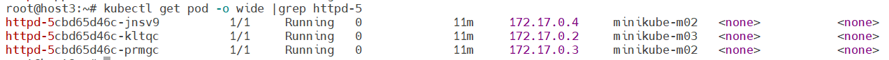
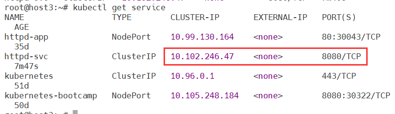
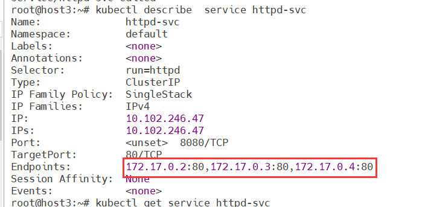
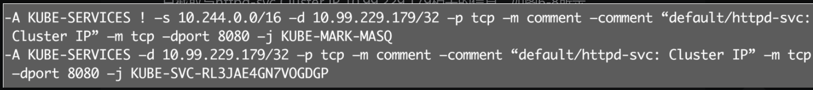
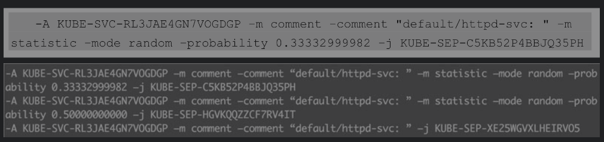
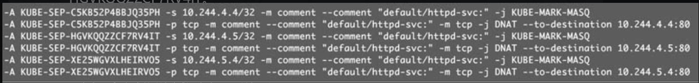

# 通过Service访问Pod

当Controller用新Pod替代发生故障的Pod时，新Pod会分配到新的IP地址。这样就产生了一个问题：如果一组Pod对外提供服务（比如HTTP），它们的IP很有可能发生变化，那么客户端如何找到并访问这个服务呢？Kubernetes给出的解决方案是Service，Deployment等Controller会通过动态创建和销毁Pod来保证应用整体的健壮性。

## 创建Service

Kubernetes Service从逻辑上代表了一组Pod，具体是哪些Pod则是由label来挑选的。

Service有自己的IP，而且这个IP是不变的。客户端只需要访问Service的IP，Kubernetes则负责建立和维护Service与Pod的映射关系。无论后端Pod如何变化，对客户端不会有任何影响，因为Service没有变。

启动三个Pod，运行httpd镜像，label是run: httpd

编写deployment的yaml文件

```yaml
apiVersion: apps/v1
kind: Deployment
metadata:
  name: httpd
spec:
  replicas: 3
  selector:
    matchLabels:
      run: httpd
  template:
    metadata:
        labels:
          run: httpd
    spec:
      containers:
      - name: httpd
        image: httpd
        ports:
        - containerPort : 80
```

启动三个Pod，运行httpd镜像，label是run: httpd，Pod分配了各自的IP，这些IP只能被Kubernetes Cluster中的容器和节点访问**（但是其实访问不了）**



创建Service，配置文件如下

```yaml
apiVersion: v1
kind: Service # 指明当前资源的类型为Service
metadata:
  name: httpd-svc # Service的名字为httpd-svc
spec:
  selector:
    run: httpd # selector指明挑选那些label为run: httpd的Pod作为Service的后端。
  ports: # 将Service的8080端口映射到Pod的80端口，使用TCP协议
  - protocol: TCP
    port: 8080
    targetPort: 80
```

httpd-svc分配到一个CLUSTER-IP，可以通过集群IP来访问httpd**（但是其实访问不了）**



通过kubectl describe可以查看httpd-svc与Pod的对应关系，Endpoints罗列了三个Pod的IP和端口



##　Cluster IP底层实现

Cluster IP是一个虚拟IP，是由Kubernetes节点上的iptables规则管理的。



这两条规则的含义是：（1）如果Cluster内的Pod（源地址来自10.244.0.0/16）要访问httpd-svc，则允许。（2）其他源地址访问httpd-svc，跳转到规则KUBE-SVC-RL3JAE4GN7VOG DGP。

KUBE-SVC-RL3JAE4GN7VOGDGP规则如下



（1）1/3的概率跳转到规则KUBE-SEP-C5KB52P4BBJQ35PH。（2）1/3的概率（剩下2/3的一半）跳转到规则KUBE-SEP-HGVKQQZZCF7RV4IT。（3）1/3的概率跳转到规则KUBE-SEP-XE25WGVXLHEIRVO5。



即将请求分别转发到后端的三个Pod。

通过上面的分析，我们得到结论：iptables将访问Service的流量转发到后端Pod，而且使用类似轮询的负载均衡策略。另外，Cluster的每一个节点都配置了相同的iptables规则，这样就确保了整个Cluster都能够通过Service的Cluster IP访问Service

## DNS访问Service

[KubeDNS 和 CoreDNS - 知乎 (zhihu.com)](https://zhuanlan.zhihu.com/p/80141656)

[Service详细描述 | Kuboard](https://kuboard.cn/learning/k8s-intermediate/service/service-details.html#创建-service-无-label-selector)


在Cluster中，除了可以通过Cluster IP访问Service，Kubernetes还提供了更为方便的DNS访问。

kubeadm部署时会默认安装kube-dns组件

```shell
root@host3:~# kubectl get deployment  --namespace=kube-system
NAME                   READY   UP-TO-DATE   AVAILABLE   AGE
coredns                1/1     1            1           51d
kubernetes-dashboard   0/1     1            0           35d
```

