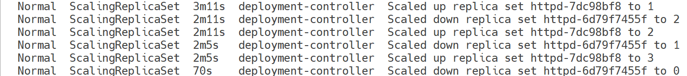
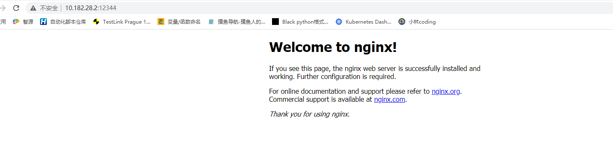

# Rolling Update

滚动更新是一次只更新一小部分副本，成功后再更新更多的副本，最终完成所有副本的更新,最大好处是零停机，整个更新过程始终有副本在运行，从而保证了业务的连续性。

## 滚动更新实践

部署三副本应用，初始镜像为httpd:2.2.31，然后将其更新到httpd:2.2.32

```yaml
# my_deployment.yaml
apiVersion: apps/v1
kind: Deployment
metadata:
  name: httpd
spec:
  replicas: 3
  selector:
    matchLabels:
      run: httpd
  template:
    metadata:
      labels:
        run: httpd
    spec:
      containers:
      - name: httpd
        image: httpd:2.2.31
        ports:
        - containerPort: 80
```

通过kubectl apply -f my_deployment.yaml部署应用

```shell
root@host3:~# kubectl get deployment httpd -o wide
* Another minikube instance is downloading dependencies... | NAME    READY   UP-TO-DATE   AVAILABLE   AGE    CONTAINERS   IMAGES         SELECTOR
httpd   3/3     3            3           5d7h   httpd        httpd:2.2.31   run=httpd
root@host3:~# kubectl get replicaset -o wide
NAME               DESIRED   CURRENT   READY   AGE     CONTAINERS   IMAGES         SELECTOR
httpd-6d79f7455f   3         3         3       3m42s   httpd        httpd:2.2.31   pod-template-hash=6d79f7455f,run=httpd
root@host3:~# kubectl get pod
NAME                            READY   STATUS    RESTARTS   AGE
httpd-6d79f7455f-2hb9q          1/1     Running   0          4m17s
httpd-6d79f7455f-h7zwh          1/1     Running   0          3m38s
httpd-6d79f7455f-lzd5n          1/1     Running   0          2m54s
```

部署过程如下

- 创建Deployment httpd

- 创建ReplicaSet httpd-6d79f7455f

- 创建三个Pod

- 当前镜像为httpd:2.2.31

将配置文件中的httpd:2.2.31替换为httpd:2.2.32，再次执行kubectl apply

```shell
# 通过kubectl edit deployment httpd 修改
# 直接修改配置文件
# kubectl set image deployment httpd httpd=httpd:2.2.32
root@host3:~# kubectl set image deployment httpd httpd=httpd:2.2.32
deployment.apps/httpd image updated
root@host3:~# kubectl get deployment -o wide
NAME    READY   UP-TO-DATE   AVAILABLE   AGE    CONTAINERS   IMAGES         SELECTOR
httpd   3/3     1            3           5d7h   httpd        httpd:2.2.32   run=httpd
root@host3:~# kubectl get replicaset -o wide
NAME               DESIRED   CURRENT   READY   AGE   CONTAINERS   IMAGES         SELECTOR
httpd-6d79f7455f   3         3         3       12m   httpd        httpd:2.2.31   pod-template-hash=6d79f7455f,run=httpd
httpd-7dc98bf8     1         1         0       24s   httpd        httpd:2.2.32   pod-template-hash=7dc98bf8,run=httpd
root@host3:~# kubectl get pod
NAME                            READY   STATUS    RESTARTS   AGE
httpd-7dc98bf8-27clr            1/1     Running   0          2m4s
httpd-7dc98bf8-fh887            1/1     Running   0          64s
httpd-7dc98bf8-gz9jz            1/1     Running   0          58s
```

我们发现了如下变化：

- Deployment httpd的镜像更新为httpd:2.2.32
- 新创建了ReplicaSet httpd-7dc98bf8，镜像为httpd:2.2.32，并且管理了三个新的Pod
- 之前的ReplicaSet httpd-6d79f7455f里面已经没有任何Pod。

具体过程可以通过kubectl describe deployment httpd查看，每次只更新替换一个Pod



每次替换的Pod数量是可以定制的。Kubernetes提供了两个参数maxSurge和maxUnavailable来精细控制Pod的替换数量

# 回滚

kubectl apply每次更新应用时，Kubernetes都会记录下当前的配置，保存为一个revision，这样就可以回滚到某个特定revision

默认配置下，Kubernetes只会保留最近的几个revision，可以在Deployment配置文件中通过revisionHistoryLimit属性增加revision数量

应用有三个配置文件，即httpd.v1.yaml、httpd.v2.yaml和httpd.v3.yaml，分别对应不同的httpd镜像2.4.16、2.4.17和2.4.18

```yaml
# httpd.v1.yaml
apiVersion: apps/v1
kind: Deployment
metadata:
  name: httpd
spec:
  revisionHistoryLimit: 10
  replicas: 3
  selector:
    matchLabels:
      run: httpd
  template:
    metadata:
      labels:
        run: httpd
    spec:
      containers:
      - name: httpd
        image: httpd:2.4.16
        ports:
        - containerPort: 80
        
# httpd.v2.yaml
apiVersion: apps/v1
kind: Deployment
metadata:
  name: httpd
spec:
  revisionHistoryLimit: 10
  replicas: 3
  selector:
    matchLabels:
      run: httpd
  template:
    metadata:
      labels:
        run: httpd
    spec:
      containers:
      - name: httpd
        image: httpd:2.4.17
        ports:
        - containerPort: 80

# httpd.v3.yaml
apiVersion: apps/v1
kind: Deployment
metadata:
  name: httpd
spec:
  revisionHistoryLimit: 10
  replicas: 3
  selector:
    matchLabels:
      run: httpd
  template:
    metadata:
      labels:
        run: httpd
    spec:
      containers:
      - name: httpd
        image: httpd:2.4.18
        ports:
        - containerPort: 80
```

通过kubectl apply部署并更新应用，使用--record将当前的命令记录到revision记录中,这样我们就可以知道每个revison对应的是哪个配置文件了

```shell
root@host3:~# kubectl apply -f httpd.v1.yaml --record
Flag --record has been deprecated, --record will be removed in the future
deployment.apps/httpd configured
root@host3:~# kubectl get deployment httpd -o wide
NAME    READY   UP-TO-DATE   AVAILABLE   AGE    CONTAINERS   IMAGES         SELECTOR
httpd   3/3     1            3           6d6h   httpd        httpd:2.4.16   run=httpd
root@host3:~# kubectl apply -f httpd.v2.yaml --record
Flag --record has been deprecated, --record will be removed in the future
deployment.apps/httpd configured
root@host3:~# kubectl get deployment httpd -o wide
NAME    READY   UP-TO-DATE   AVAILABLE   AGE    CONTAINERS   IMAGES         SELECTOR
httpd   3/3     1            3           6d6h   httpd        httpd:2.4.17   run=httpd
root@host3:~# kubectl apply -f httpd.v3.yaml --record
Flag --record has been deprecated, --record will be removed in the future
deployment.apps/httpd configured
root@host3:~# kubectl get deployment httpd -o wide
NAME    READY   UP-TO-DATE   AVAILABLE   AGE    CONTAINERS   IMAGES         SELECTOR
httpd   3/3     1            3           6d6h   httpd        httpd:2.4.18   run=httpd
```

通过kubectl rollout history deployment httpd查看revison历史记录,CHANGE-CAUSE就是--record的结果。

```shell
root@host3:~# kubectl rollout history deployment httpd
deployment.apps/httpd
REVISION  CHANGE-CAUSE
2         <none>
3         <none>
4         <none>
5         kubectl apply --cluster=minikube --filename=httpd.v1.yaml --record=true
6         kubectl apply --cluster=minikube --filename=httpd.v2.yaml --record=true
7         kubectl apply --cluster=minikube --filename=httpd.v3.yaml --record=true
```

如果要回滚到某个版本，比如revision 1，可以执行命令kubectl rollout undo deployment httpd --to-revision=5

```shell
root@host3:~# kubectl rollout undo deployment httpd --to-revision=5
deployment.apps/httpd rolled back
root@host3:~# kubectl get deployment httpd -o wide
NAME    READY   UP-TO-DATE   AVAILABLE   AGE    CONTAINERS   IMAGES         SELECTOR
httpd   3/3     1            3           6d6h   httpd        httpd:2.4.16   run=httpd
```

此时，revison历史记录也会发生相应变化,revison 1变成了revison 4。不过我们可以通过CHANGE-CAUSE知道每个revison的具体含义，所以一定要在执行kubectl apply时加上--record参数

```shell
root@host3:~# kubectl rollout history deployment httpd
deployment.apps/httpd
REVISION  CHANGE-CAUSE
2         <none>
3         <none>
4         <none>
6         kubectl apply --cluster=minikube --filename=httpd.v2.yaml --record=true
7         kubectl apply --cluster=minikube --filename=httpd.v3.yaml --record=true
8         kubectl apply --cluster=minikube --filename=httpd.v1.yaml --record=true
```

## 上周问题

编写deployment的yaml文件

```shell
# my_deployment.yaml
apiVersion: apps/v1
kind: Deployment
metadata:
  name: nginx
spec:
  replicas: 3
  selector:
    matchLabels:
      run: nginx
  template:
    metadata:
        labels:
          run: nginx
    spec:
      containers:
      - name: nginx
        image: node1.hillstone:5000/nginx:1.22.0
        ports:
        - containerPort : 80
```

使用kubectl apply -f my_deployment.yamll创建deployment

```shell
[root@bdap-master hillstone]# kubectl apply -f my_deployment.yaml
deployment.apps/nginx created
[root@bdap-master hillstone]# kubectl get deployment
NAME                    READY   UP-TO-DATE   AVAILABLE   AGE
extservice-deployment   1/1     1            1           8d
nginx                   3/3     3            3           30s
webservice-deployment   1/1     1            1           8d
[root@bdap-master hillstone]# kubectl get pod -o wide
NAME                                           READY   STATUS    RESTARTS   AGE   IP              NODE                    NOMINATED NODE   READINESS GATES
apigateway-deployment-c45f9                    1/1     Running   2          8d    10.219.149.1    bdap-master.hillstone   <none>           <none>
extservice-deployment-ff8477f9f-z5rgs          1/1     Running   9          8d    10.219.148.16   bdap-master.hillstone   <none>           <none>
logstash-89mnz                                 1/1     Running   1          8d    10.219.148.19   bdap-master.hillstone   <none>           <none>
nginx-cb99d9f5b-5m6v8                          1/1     Running   0          85s   10.219.148.25   bdap-master.hillstone   <none>           <none>
nginx-cb99d9f5b-f5h5g                          1/1     Running   0          85s   10.219.148.23   bdap-master.hillstone   <none>           <none>
nginx-cb99d9f5b-kxx4l                          1/1     Running   0          85s   10.219.148.24   bdap-master.hillstone   <none>           <none>
node-exporter-prometheus-node-exporter-dcxjg   1/1     Running   1          8d    10.219.149.1    bdap-master.hillstone   <none>           <none>
webservice-deployment-5d7d7d66dc-k7ffg         1/1     Running   24         8d    10.219.148.13   bdap-master.hillstone   <none>           <none>
[root@bdap-master hillstone]# curl 10.219.148.25:80
<!DOCTYPE html>
<html>
<head>
<title>Welcome to nginx!</title>
<style>
    body {
        width: 35em;
        margin: 0 auto;
        font-family: Tahoma, Verdana, Arial, sans-serif;
    }
</style>
</head>
<body>
<h1>Welcome to nginx!</h1>
<p>If you see this page, the nginx web server is successfully installed and
working. Further configuration is required.</p>

<p>For online documentation and support please refer to
<a href="http://nginx.org/">nginx.org</a>.<br/>
Commercial support is available at
<a href="http://nginx.com/">nginx.com</a>.</p>

<p><em>Thank you for using nginx.</em></p>
</body>
</html>
```

创建service

```shell
# my_service.yaml
apiVersion: v1
kind: Service
metadata:
  name: nginx-svc 
spec:
  selector:
    run: nginx 
  ports: 
  - protocol: TCP
    port: 12344
    targetPort: 80
```

使用kubectl apply -f my_service.yaml创建service

```
[root@bdap-master hillstone]# kubectl apply -f my_service.yaml
service/nginx-svc created
[root@bdap-master hillstone]# kubectl get svc
NAME                                     TYPE        CLUSTER-IP      EXTERNAL-IP   PORT(S)                                                                                                                                                           AGE
extservice                               NodePort    10.96.244.218   <none>        80:10080/TCP                                                                                                                                                      8d
kubernetes                               ClusterIP   10.96.244.1     <none>        443/TCP                                                                                                                                                           8d
logstash                                 NodePort    10.96.244.169   <none>        25044:25044/TCP,20514:20514/UDP,26514:26514/TCP,29996:29996/UDP,26666:26666/TCP,27777:27777/TCP,21812:21812/UDP,21813:21813/UDP,21440:21440/UDP,26667:26667/TCP   8d
nginx-svc                                ClusterIP   10.96.244.239   <none>        12344/TCP                                                                                                                                                          78s
node-exporter-prometheus-node-exporter   ClusterIP   10.96.244.190   <none>        9100/TCP                                                                                                                                                          8d

```

通过集群IP访问

```shell
[root@bdap-master hillstone]# curl 10.96.244.239:12344
<!DOCTYPE html>
<html>
<head>
<title>Welcome to nginx!</title>
<style>
    body {
        width: 35em;
        margin: 0 auto;
        font-family: Tahoma, Verdana, Arial, sans-serif;
    }
</style>
</head>
<body>
<h1>Welcome to nginx!</h1>
<p>If you see this page, the nginx web server is successfully installed and
working. Further configuration is required.</p>

<p>For online documentation and support please refer to
<a href="http://nginx.org/">nginx.org</a>.<br/>
Commercial support is available at
<a href="http://nginx.com/">nginx.com</a>.</p>

<p><em>Thank you for using nginx.</em></p>
</body>
</html>
```

kubectl describe可以查看nginx-svc与Pod的对应关系

```shell
[root@bdap-master hillstone]# kubectl describe service nginx-svc
Name:              nginx-svc
Namespace:         default
Labels:            <none>
Annotations:       kubectl.kubernetes.io/last-applied-configuration:
                     {"apiVersion":"v1","kind":"Service","metadata":{"annotations":{},"name":"nginx-svc","namespace":"default"},"spec":{"ports":[{"port":12344,"...
Selector:          run=nginx
Type:              ClusterIP
IP:                10.96.244.239
Port:              <unset>  12344/TCP
TargetPort:        80/TCP
Endpoints:         10.219.148.23:80,10.219.148.24:80,10.219.148.25:80
Session Affinity:  None
Events:            <none>
```

通过外网访问nginx

```yaml
# my_service.yaml
apiVersion: v1
kind: Service
metadata:
  name: nginx-svc
spec:
  type: NodePort
  selector:
    run: nginx
  ports:
  - protocol: TCP
    port: 12344
    targetPort: 80
    nodePort: 12344
```

查看修改后的nginx-svc

```shell
[root@bdap-master hillstone]# kubectl apply -f my_service.yaml
service/nginx-svc configured
[root@bdap-master hillstone]# kubectl get service nginx-svc
NAME        TYPE       CLUSTER-IP      EXTERNAL-IP   PORT(S)          AGE
nginx-svc   NodePort   10.96.244.239   <none>        12344:12344/TCP   7m28s
```

通过iptable开启12344对外开放的端口

```shell
iptables -t mangle -I BDAP-INPUT-SECURITY -p tcp --dport 12344 -j ACCEPT -w
```

