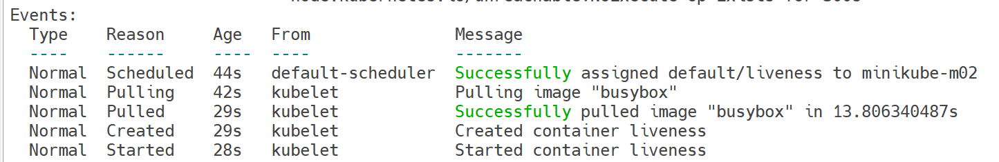
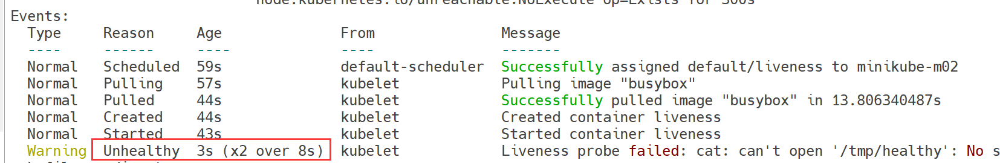
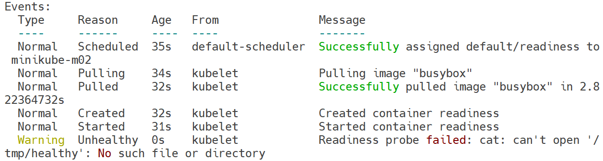

# Health Check

强大的自愈能力是Kubernetes这类容器编排引擎的一个重要特性。自愈的默认实现方式是自动重启发生故障的容器。除此之外，用户还可以利用Liveness和Readiness探测机制设置更精细的健康检查，进而实现如下功能

- 零停机部署
- 避免部署无效的镜像
- 更加安全的滚动升级。

## 默认的健康检查

Kubernetes默认的健康检查机制：每个容器启动时都会执行一个进程，此进程由Dockerfile的CMD或ENTRYPOINT指定。如果进程退出时返回码非零，则认为容器发生故障，Kubernetes就会根据restartPolicy重启容器

下面模拟一个容器发生故障的场景，Pod的restartPolicy设置为OnFailure

```yaml
# healthcheck.yaml
apiVersion: v1
kind: Pod
metadata:
  labels:
    run: pod
  name: healthcheck
spec:
  containers:
  - name: healthcheck
    args:
    - /bin/sh
    - -c
    - sleep 10; exit 1
    image: busybox
  restartPolicy: OnFailure
```

执行kubectl apply创建Pod，命名为healthcheck，过几分钟查看Pod的状态，可看到容器当前已经重启了2次

```shell
root@host3:~# kubectl apply -f healthcheck1.yaml
pod/healthcheck created
root@host3:~# kubectl get pods
NAME                            READY   STATUS    RESTARTS      AGE
healthcheck                     1/1     Running   2 (26s ago)   55s
```

在上面的例子中，容器进程返回值非零，Kubernetes则认为容器发生故障，需要重启。

## Liveness探测

有不少情况是发生了故障，但进程并不会退出。比如访问Web服务器时显示500内部错误，可能是系统超载，也可能是资源死锁，此时httpd进程并没有异常退出，在这种情况下重启容器可能是最直接、最有效的解决方案，需要通过Liveness探测来处理这类场景。

Liveness探测让用户可以自定义判断容器是否健康的条件。如果探测失败，Kubernetes就会重启容器。

### 例子

```yaml
# liveness.yaml
apiVersion: v1
kind: Pod
metadata:
  labels:
    run: pod
  name: liveness
spec:
  restartPolicy: OnFailure
  containers:
  - name: liveness
    args:
    - /bin/sh
    - -c
    - touch /tmp/healthy; sleep 30;rm -rf /tmp/healthy; sleep 60
    image: busybox
    livenessProbe:
      exec:
        command:
        - cat
        - /tmp/healthy
      initialDelaySeconds: 10
      periodSeconds: 5
```

livenessProbe部分定义如何执行Liveness探测：

- 探测的方法是：通过cat命令检查/tmp/healthy文件是否存在。如果命令执行成功，返回值为零，Kubernetes则认为本次Liveness探测成功；如果命令返回值非零，本次Liveness探测失败
- initialDelaySeconds：10指定容器启动10之后开始执行Liveness探测，我们一般会根据应用启动的准备时间来设置。比如某个应用正常启动要花30秒，那么initialDelaySeconds的值就应该大于30
- periodSeconds：5指定每5秒执行一次Liveness探测。Kubernetes如果连续执行3次Liveness探测均失败，则会杀掉并重启容器

```shell
root@host3:~# kubectl apply -f liveness.yaml
pod/liveness created
```

通过kubectl describe pod liveness查看pod的日志，容器启动的前30s，/tmp/healthy存在，Liveness探测成功，events部分显示正常的日志



30s后，日志会显示/tmp/healthy已经不存在，Liveness探测失败，3次失败后容器就会重启



使用kubectl get pod liveness查看pod的重启次数

```shell
root@host3:~# kubectl get pod liveness
NAME       READY   STATUS    RESTARTS        AGE
liveness   1/1     Running   6 (2m28s ago)   10m
```

## Readiness探测

除了Liveness探测，Kubernetes Health Check机制还包括Readiness探测。

用户通过Liveness探测可以告诉Kubernetes什么时候通过重启容器实现自愈；Readiness探测则是告诉Kubernetes什么时候可以将容器加入到Service负载均衡池中，对外提供服务。

Readiness探测的配置语法与Liveness探测完全一样

```yaml
# readiness.yaml
apiVersion: v1
kind: Pod
metadata:
  labels:
    run: pod
  name: readiness
spec:
  restartPolicy: OnFailure
  containers:
  - name: readiness
    args:
    - /bin/sh
    - -c
    - touch /tmp/healthy; sleep 30;rm -rf /tmp/healthy; sleep 60
    image: busybox
    readinessProbe:
      exec:
        command:
        - cat
        - /tmp/healthy
      initialDelaySeconds: 10
      periodSeconds: 5
```



Pod readiness的READY状态经历了如下变化：

- 刚被创建时，READY状态为不可用。
- 30秒后（initialDelaySeconds），第一次进行Readiness探测并成功返回，设置READY为可用。
- 30秒后，/tmp/healthy被删除，连续3次Readiness探测均失败后，READY被设置为不可用。

**Liveness探测和Readiness探测对比**

- Liveness探测和Readiness探测是两种Health Check机制，如果不特意配置，Kubernetes将对两种探测采取相同的默认行为，即通过判断容器启动进程的返回值是否为零来判断探测是否成功
- 两种探测的配置方法完全一样，支持的配置参数也一样。不同之处在于探测失败后的行为：Liveness探测是重启容器；Readiness探测则是将容器设置为不可用，不接收Service转发的请求
- Liveness探测和Readiness探测是独立执行的，二者之间没有依赖，所以可以单独使用，也可以同时使用。用Liveness探测判断容器是否需要重启以实现自愈；用Readiness探测判断容器是否已经准备好对外提供服务。

## Health Check在Scale Up中的应用

对于多副本应用，当执行扩容操作时，新副本会作为后端服务器被添加到Service的负载均衡中，与已有副本一起处理客户的请求。考虑到应用启动通常都需要一个准备阶段，比如加载缓存数据、连接数据库等，从容器启动到真正能够提供服务是需要一段时间的。我们可以通过Readiness探测判断容器是否就绪，避免将请求发送到还没有准备好的后端服务器。

```yaml
# test.yaml
apiVersion: apps/v1
kind: Deployment
metadata:
  name: web
spec:
  replicas: 3
  selector:
    matchLabels:
      app: web
  template:
    metadata:
      labels:
        app: web
    spec:
      containers:
      - name: web
        image: httpd
        ports:
        - containerPort: 8080
        readinessProbe:
          httpGet:
            scheme: HTTP
            path: /healthy
            port: 8080
          initialDelaySeconds: 30
          periodSeconds: 5

---
apiVersion: v1
kind: Service
metadata:
  name: web-svc
spec:
  selector:
    app: web
  ports:
  - protocol: TCP
    port: 8080
    targetPort: 80
```

readinessProbe部分使用了不同于exec的另一种探测方法httpGet,Kubernetes对于该方法探测成功的判断条件是http请求的返回代码在200～400之间

- schema指定协议，支持HTTP（默认值）和HTTPS

- path指定访问路径

- port指定端口。

上面配置的作用是：

- 容器启动30秒之后开始探测
- 如果http://[container_ip]:8080/healthy返回代码不是200～400，表示容器没有就绪，不接收Service web-svc的请求
- 每隔5秒探测一次,直到返回代码为200～400，表明容器已经就绪，然后将其加入到web-svc的负载均衡中，开始处理客户请求
- 探测会继续以5秒的间隔执行，如果连续发生3次失败，容器又会从负载均衡中移除，直到下次探测成功重新加入。

## Health Check在滚动更新中的应用

