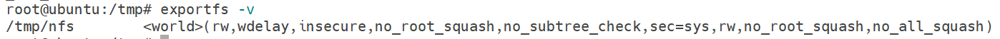

# 8-数据管理

## volume

容器和Pod的生命周期可能很短，会被频繁地销毁和创建。容器销毁时，保存在容器内部文件系统中的数据都会被清除。为了持久化保存容器的数据，可以使用Kubernetes Volume。

Volume的生命周期独立于容器，Pod中的容器可能被销毁和重建，但Volume会被保留。本质上，Kubernetes Volume是一个目录，当Volume被mount到Pod，Pod中的所有容器都可以访问这个Volume。

### emptyDir

emptyDir是最基础的Volume类型。正如其名字所示，一个emptyDir Volume是Host上的一个空目录。

emptyDir Volume对于容器来说是持久的，对于Pod则不是。当Pod从节点删除时，Volume的内容也会被删除。但如果只是容器被销毁而Pod还在，则Volume不受影响。也就是说：emptyDir Volume的生命周期与Pod一致。Pod中的所有容器都可以共享Volume，它们可以指定各自的mount路径。

**实践**

```yaml
# vi test.yaml
apiVersion: v1
kind: Pod
metadata:
  name: producer-consumer
spec:
  containers:
  - image: busybox
    name: producer
    volumeMounts:
    - mountPath: /producer_dir
      name: shared-volume
    args:
    - /bin/sh
    - -c
    - echo "hello world" > /producer_dir/hello;sleep 30000
    
  - image: busybox
    name: consumer
    volumeMounts:
    - mountPath: /consumer_dir
      name: shared-volume
    args:
    - /bin/sh
    - -c
    - cat /consumer_dir/hello ; sleep 30000

  volumes:
  - name: shared-volume
    emptyDir: {}
```

这里我们模拟了一个producer-consumer场景。Pod有两个容器producer和consumer，它们共享一个Volume。producer负责往Volume中写数据，consumer则是从Volume读取数据。

- 文件最底部volumes定义了一个emptyDir类型的Volume shared-volume。
- producer容器将shared-volume mount到/producer_dir目录。
- producer通过echo将数据写到文件hello里。
- consumer容器将shared-volume mount到/consumer_dir目录。
- consumer通过cat从文件hello读数据。

**执行命令创建Pod**

```shell
root@host3:~# kubectl apply -f test.yaml
pod/producer-consumer created
root@host3:~# kubectl get pod
NAME                            READY   STATUS      RESTARTS         AGE
producer-consumer               2/2     Running     0                15s
root@host3:~# kubectl logs producer-consumer consumer
hello world
```

使用kubectl logs显示容器consumer成功读到了producer写入的数据，验证了两个容器共享emptyDir Volume。因为emptyDir是Docker Host文件系统里的目录，其效果相当于执行了docker run -v  /producer_dir和docker run -v  /consumer_dir

emptyDir是Host上创建的临时目录，其优点是能够方便地为Pod中的容器提供共享存储，不需要额外的配置，它不具备持久性，如果Pod不存在了，emptyDir也就没有了。

### hostPath

hostPath Volume的作用是将Docker Host文件系统中已经存在的目录mount给Pod的容器

大部分应用都不会使用hostPath Volume，因为这实际上增加了Pod与节点的耦合，限制了Pod的使用,不过那些需要访问Kubernetes或Docker内部数据的应用则需要使用hostPath

**实践**

```yaml
# vi test.yaml
apiVersion: v1
kind: Pod
metadata:
  name: producer-consumer
spec:
  containers:
  - image: busybox
    name: producer
    volumeMounts:
    - mountPath: /producer_dir
      name: shared-volume
    args:
    - /bin/sh
    - -c
    - echo "hello world" > /producer_dir/hello;sleep 30000
    
  - image: busybox
    name: consumer
    volumeMounts:
    - mountPath: /consumer_dir
      name: shared-volume
    args:
    - /bin/sh
    - -c
    - cat /consumer_dir/hello ; sleep 30000
    
  volumes:
  - name: shared-volume
    hostPath:
      path: /root/hostpath
```

使用 kubectl describe查看pod

```shell
root@host3:~# kubectl delete pod producer-consumer
pod "producer-consumer" deleted
root@host3:~# vi test.yaml
root@host3:~# kubectl apply -f test.yaml
pod/producer-consumer created
root@host3:~# kubectl logs producer-consumer consumer
hello world
root@host3:~# kubectl describe pod  producer-consumer | grep -A 4 Volumes
Volumes:
  test-volume:
    Type:          HostPath (bare host directory volume)
    Path:          /root/hostpath
    HostPathType:
```

### 外部Storage Provider

如果Kubernetes部署在诸如AWS、GCE、Azure等公有云上，可以直接使用云硬盘作为Volume。

## PV & PVC 

PersistentVolume（PV）是外部存储系统中的一块存储空间，由管理员创建和维护。与Volume一样，PV具有持久性，生命周期独立于Pod

PersistentVolumeClaim （PVC）是用来向 Kubernetes 申请存储资源的。PVC 是给 Pod 使用的对象，它相当于是 Pod 的代理，代表 Pod 向系统申请 PV。一旦资源申请成功，Kubernetes 就会把 PV 和 PVC 关联在一起，这个动作叫做“绑定”,有了PVC，用户只需要告诉Kubernetes需要什么样的存储资源，而不必关心真正的空间从哪里分配、如何访问等底层细节信息

### NFS PersistentVolume

#### 准备工作-搭建nfs服务器

1. 安装NFS服务器端

```shell
 apt install nfs-kernel-server
```

2. 给 NFS 指定一个存储位置

```shell
mkdir -p /tmp/nfs
```

3. 配置 NFS 访问共享目录，修改 /etc/exports，指定目录名、允许访问的网段，还有权限等参数

```shell
# 在/ect/exports最下方中添加如下内容
/tmp/nfs *(rw,sync,no_subtree_check,no_root_squash,insecure)
```

4. 使用 exportfs -ra 让配置生效

```shell
exportfs -ra
```

5. 使用 exportfs -v 查看是否正确



7. 以使用 systemctl 来启动 NFS 服务器

```shell
sudo systemctl start nfs-server
sudo systemctl enable nfs-server
sudo systemctl status nfs-server
```

8. 使用showmount来检查NFS的完了挂载情况

```shell
root@ubuntu:/tmp# showmount -e 127.0.0.1
Export list for 127.0.0.1:
/tmp/nfs *
```

9. 在k8s节点上安装NFS客户端

```shell
apt -y install nfs-common
```

10. 使用showmount查看NFS是否可以正常挂载

```shell
# 10.182.79.36是1-8步中搭建的NFS服务器
root@host3:~# showmount -e 10.182.79.36
Export list for 10.182.79.36:
/tmp/nfs *
```

11. 创建挂载点，并用命令 mount 把 NFS 服务器的共享目录挂载挂载点上

```shell
mkdir -p /tmp/test
mount -t nfs 192.168.10.208:/tmp/nfs /tmp/test
```

#### 创建PV

```yaml
# vi test.yaml
apiVersion: v1
kind: PersistentVolume
metadata:
  name: test-pv
spec:
  storageClassName: nfs
  persistentVolumeReclaimPolicy: Recycle
  accessModes:
    - ReadWriteOnce
  capacity:
    storage: 1Gi
  nfs:
    path: /tmp/nfs/test-pv
    server: 10.182.79.36
```

accessModes：定义了存储设备的访问模式，简单来说就是虚拟盘的读写权限，和 Linux 的文件访问模式差不多，目前 Kubernetes 里有 3 种，这 3 种访问模式限制的对象是节点而不是 Pod，因为存储是系统级别的概念，不属 于 Pod 里的进程。：

- ReadWriteOnce：存储卷可读可写，但只能被一个节点上的 Pod 挂载。 
- ReadOnlyMany：存储卷只读不可写，可以被任意节点上的 Pod 多次挂载。 
- ReadWriteMany：存储卷可读可写，也可以被任意节点上的 Pod 多次挂载

capacity：表示存储设备的容量，当前指定为1GB

persistentVolumeReclaimPolicy：当PV的回收策略为，支持的策略有3种：

- Retain表示需要管理员手工回收
- Recycle表示当PVC被删除时自动清除PV中的数据
- Delete表示删除Storage Provider上的对应存储资源

storageClassName：对存储类型的抽象 StorageClass，相当于为PV设置了一个分类，PVC可以指定class申请相应class的PV

path：指定PV在NFS服务器上对应的目录。

server：NFS服务器的IP地址

```shell
root@host3:~# vi test.yaml
root@host3:~# kubectl apply -f test.yaml
persistentvolume/test-pv created
root@host3:~# kubectl get pv
NAME      CAPACITY   ACCESS MODES   RECLAIM POLICY   STATUS      CLAIM   STORAGECLASS   REASON   AGE
test-pv   1Gi        RWO            Recycle          Available           nfs                     14s
```

STATUS为Available，表示test-pv就绪，可以被PVC申请

#### 创建PVC

```yaml
# vi test.yaml
apiVersion: v1
kind: PersistentVolumeClaim
metadata:
  name: test-pvc
spec:
  storageClassName: nfs
  accessModes:
    - ReadWriteOnce
  resources:
    requests:
      storage: 1Gi
```

PVC只需要指定PV的容量、访问模式和class即可

```shell
root@host3:~# vi test.yaml
root@host3:~# kubectl apply -f test.yaml
persistentvolumeclaim/test-pvc created
root@host3:~# kubectl get pv
NAME      CAPACITY   ACCESS MODES   RECLAIM POLICY   STATUS   CLAIM              STORAGECLASS   REASON   AGE
test-pv   1Gi        RWO            Recycle          Bound    default/test-pvc   nfs                     4m55s
root@host3:~# kubectl get pvc
NAME       STATUS   VOLUME    CAPACITY   ACCESS MODES   STORAGECLASS   AGE
test-pvc   Bound    test-pv   1Gi        RWO            nfs            64s
```

kubectl get pvc和kubectl get pv的输出可以看到test-pv已经被test-pvc申请成功

#### 在pod中使用PVC

```shell
# vi test.yaml
apiVersion: v1
kind: Pod
metadata:
  name: test-pod
spec:
  containers:
  - image: busybox
    name: test-pod
    volumeMounts:
    - mountPath: /test
      name: shared-volume
    args:
    - /bin/sh
    - -c
    - echo "hello world" > /test/hello; sleep 30000
  volumes:
  - name: shared-volume
    persistentVolumeClaim:
      claimName: test-pvc
```

在volumes中通过persistentVolumeClaim指定使用的PVC

```shell
root@host3:~# vi test.yaml
root@host3:~# kubectl apply -f test.yaml
pod/test-pod created
root@host3:~# kubectl get pod
NAME                            READY   STATUS              RESTARTS   AGE
node-exporter-daemonset-dck97   1/1     Running             0          26d
node-exporter-daemonset-ndthb   1/1     Running             0          26d
node-exporter-daemonset-qgr5g   1/1     Running             0          26d
test-pod                        0/1     ContainerCreating   0          10s
```

发现test-pod处于ContainerCreating状态，使用kubectl describe pod 查看原因，发现是没有在nfs服务器上创建对应的目录


```shell
root@host3:~# kubectl get pod
NAME                            READY   STATUS    RESTARTS   AGE
node-exporter-daemonset-dck97   1/1     Running   0          26d
node-exporter-daemonset-ndthb   1/1     Running   0          26d
node-exporter-daemonset-qgr5g   1/1     Running   0          26d
test-pod                        1/1     Running   0          6m29s
```

验证nfs服务器上是否新建hello文件，以及查看其中的内容

```shell
root@ubuntu:/tmp/nfs# cd test-pv/
root@ubuntu:/tmp/nfs/test-pv# ls
hello
root@ubuntu:/tmp/nfs/test-pv# cat hello
hello world
```

### 回收PV

当不需要使用PV时，可用删除PVC回收PV

```shell
# 先删除pod，然后删除pvc
root@host3:~# kubectl delete pod test-pod
pod "test-pod" deleted
root@host3:~# kubectl delete pvc test-pvc
persistentvolumeclaim "test-pvc" deleted
root@host3:~# kubectl get pod
NAME                            READY   STATUS              RESTARTS   AGE
node-exporter-daemonset-dck97   1/1     Running             0          26d
node-exporter-daemonset-ndthb   1/1     Running             0          26d
node-exporter-daemonset-qgr5g   1/1     Running             0          26d
recycler-for-test-pv            0/1     ContainerCreating   0          9s
root@host3:~# kubectl get pv
NAME      CAPACITY   ACCESS MODES   RECLAIM POLICY   STATUS      CLAIM   STORAGECLASS   REASON   AGE
test-pv   1Gi        RWO            Recycle          Available           nfs                     41m
root@host3:~# ls /tmp/test/test-pv/
root@host3:~#
```

当test-pvc被删除后，我们发现Kubernetes启动了一个新Pod recycler-for-test-pv，这个Pod的作用就是清除test-pv的数据

当数据清除完毕时test-pv的状态为Available，此时可以被新的PVC申请

-------------------------------

-----------------------------------------

将策略设置为Retain，可以保留数据

```shell
# vi test.yaml
apiVersion: v1
kind: PersistentVolume
metadata:
  name: test-pv
spec:
  storageClassName: nfs
  persistentVolumeReclaimPolicy: Retain
  accessModes:
    - ReadWriteOnce
  capacity:
    storage: 1Gi
  nfs:
    path: /tmp/nfs/test-pv
    server: 10.182.79.36
```

验证效果，重新依次创建pv，pvc，pod

```shell
# 验证volume是否生效
root@host3:~# cat /tmp/test/test-pv/hello
hello world
# 验证pod删除后，数据是否存在
root@host3:~# kubectl delete pod test-pod
pod "test-pod" deleted
root@host3:~# cat /tmp/test/test-pv/hello
hello world
# pv的回收策略为Retain时，pvc删除后，pv的数据是否还会保留
root@host3:~# kubectl delete pvc test-pvc
persistentvolumeclaim "test-pvc" deleted
root@host3:~# kubectl get pv
NAME      CAPACITY   ACCESS MODES   RECLAIM POLICY   STATUS     CLAIM              STORAGECLASS   REASON   AGE
test-pv   1Gi        RWO            Retain           Released   default/test-pvc   nfs                     4m6s
root@host3:~# cat /tmp/test/test-pv/hello
hello world
```

虽然test-pv中的数据得到了保留，但其PV状态会一直处于Released，不能被其他PVC申请。为了重新使用存储资源，可以删除并重新创建test-pv，**删除操作只是删除了PV对象，存储空间中的数据并不会被删除**

```shell
root@host3:~# kubectl delete pv test-pv
persistentvolume "test-pv" deleted
root@host3:~# cat /tmp/test/test-pv/hello
hello world
```

PV还支持Delete的回收策略，会删除PV在Storage Provider上对应的存储空间。NFS的PV不支持Delete，支持Delete的Provider有AWS EBS、GCE PD、Azure Disk、OpenStack Cinder Volume等。

### PV动态供给

提前创建了PV，然后通过PVC申请PV并在Pod中使用，这种方式叫作静态供给

如果没有满足PVC条件的PV，会动态创建PV，这种方式叫动态供给。相比静态供给，动态供给有明显的优势：不需要提前创建PV，减少了管理员的工作量，效率高

动态供给是通过StorageClass实现的，StorageClass定义了如何创建PV

## 例子

为MySQL数据库提供持久化存储

1. 创建PV和PVC

```yaml
# 创建pv和pvc
apiVersion: v1
kind: PersistentVolume
metadata:
  name: mysql-pv
spec:
  storageClassName: nfs
  persistentVolumeReclaimPolicy: Retain
  accessModes:
    - ReadWriteOnce
  capacity:
    storage: 1Gi
  nfs:
    path: /tmp/nfs/mysql-pv
    server: 10.182.79.36
---
apiVersion: v1
kind: PersistentVolumeClaim
metadata:
  name: mysql-pvc
spec:
  storageClassName: nfs
  accessModes:
    - ReadWriteOnce
  resources:
    requests:
      storage: 1Gi
```

```shell
root@host3:~# vi test.yaml
root@host3:~# kubectl apply -f test.yaml
persistentvolume/mysql-pv created
persistentvolumeclaim/mysql-pvc created
root@host3:~# kubectl get pv
NAME       CAPACITY   ACCESS MODES   RECLAIM POLICY   STATUS   CLAIM               STORAGECLASS   REASON   AGE
mysql-pv   1Gi        RWO            Retain           Bound    default/mysql-pvc   nfs                     7s
root@host3:~# kubectl get pvc
NAME        STATUS   VOLUME     CAPACITY   ACCESS MODES   STORAGECLASS   AGE
mysql-pvc   Bound    mysql-pv   1Gi        RWO            nfs            13s
```

2. 部署MySQL

```yaml
# 创建mysql-svc和mysql-deploy
apiVersion: v1
kind: Service
metadata:
  name: mysql-svc
spec:
  ports:
  - port: 3306
    targetPort: 3306
    nodePort: 30060
  selector:
    app: mysql
  type: NodePort
---
apiVersion: apps/v1 
kind: Deployment
metadata:
  name: mysql-deploy
  labels:
    app: mysql
spec:
  replicas: 1
  selector:
    matchLabels:
      app: mysql
  template:
    metadata:
      labels:
        app: mysql
    spec:
      containers:
      - name: mysql
        image: mysql:5.6
        //args: 
        //- /bin/sh
        //- -c
        //- ll /tmp/tmp.gRLcKMR5sn; sleep 30000
        securityContext:
          allowPrivilegeEscalation: true
        env:
        - name: MYSQL_ROOT_PASSWORD
          value: password
        ports:
        - containerPort: 3306
        volumeMounts:
        - name: mysql-storage
          mountPath: /var/lib/mysql
      volumes:
      - name: mysql-storage
        persistentVolumeClaim:
          claimName: mysql-pvc
```

运行之后发现起不来，有权限的问题

