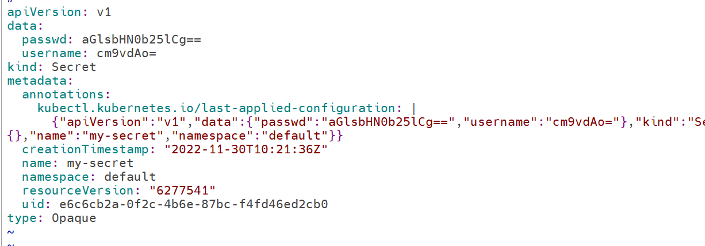

# Secret & Configmap

应用启动过程中可能需要一些敏感信息，比如访问数据库的用户名、密码或者密钥。将这些信息直接保存在容器镜像中显然不妥，Kubernetes提供的解决方案是Secret。

Secret会以密文的方式存储数据，避免了直接在配置文件中保存敏感信息。Secret会以Volume的形式被mount到Pod，容器可通过文件的方式使用Secret中的敏感数据；此外，容器也可以环境变量的方式使用这些数据。

## 创建Secret

### 通过--from-literal创建Secret

每个--from-literal对应一个信息条目

```
kubectl create secret generic my-secret --from-literal=username=root --from-literal=passwd=hillstone
```

```shell
root@host3:~# kubectl get secret
NAME                  TYPE                                  DATA   AGE
default-token-bdqkx   kubernetes.io/service-account-token   3      84d
my-secret             Opaque                                2      5m1s
```

### 通过--from-file创建Secret

每个文件内容对应一个信息条目

```shell
root@host3:~# echo "root" > username.txt
root@host3:~# echo "hillstone" > passwd.txt
root@host3:~# kubectl create secret generic my-secret-2 --from-file=username.txt --from-file=passwd.txt
secret/my-secret-2 created
root@host3:~# kubectl get secret
NAME                  TYPE                                  DATA   AGE
default-token-bdqkx   kubernetes.io/service-account-token   3      84d
my-secret             Opaque                                2      7m30s
my-secret-2           Opaque                                2      4s
```

### 通过--from-env-file创建Secret

文件env.txt中每行Key=Value对应一个信息条目

```shell
root@host3:~# cat << EOF >> env.txt
> username=root
> passwd=hillstone
> EOF
root@host3:~# kubectl create secret generic my-secret-3 --from-env-file=env.txt
secret/my-secret-3 created
root@host3:~# kubectl get secret
NAME                  TYPE                                  DATA   AGE
default-token-bdqkx   kubernetes.io/service-account-token   3      84d
my-secret             Opaque                                2      11m
my-secret-2           Opaque                                2      3m59s
my-secret-3           Opaque                                2      29s
```

### YAML配置文件创建Secret

```shell
# test.yaml
apiVersion: v1
kind: Secret
metadata:
  name: my-secret
data:
  username: cm9vdAo=
  passwd: aGlsbHN0b25lCg==
```

文件中的敏感数据必须是通过base64编码

```shell
root@host3:~# echo "root" | base64
cm9vdAo=
root@host3:~# echo "hillstone" | base64
aGlsbHN0b25lCg==
```

## 查看Secret

通过kubectl get secret查看存在的secret

```shell
root@host3:~# kubectl get secret
NAME                  TYPE                                  DATA   AGE
default-token-bdqkx   kubernetes.io/service-account-token   3      84d
my-secret             Opaque                                2      18m
my-secret-2           Opaque                                2      10m
my-secret-3           Opaque                                2      7m4s
```

DATA字段显示数据的条目，通过kubectl describe secret查看条目的Key

```shell
root@host3:~# kubectl describe secret my-secret
Name:         my-secret
Namespace:    default
Labels:       <none>
Annotations:  <none>

Type:  Opaque

Data
====
passwd:    10 bytes
username:  5 bytes
```

如果还想查看Value，可以用kubectl edit secret mysecret，然后通过base64将Value反编码



```shell
root@host3:~# echo "aGlsbHN0b25lCg==" | base64 --decode
hillstone
root@host3:~# echo "cm9vdAo=" | base64 --decode
root
```

## 在Pod中使用Secret

Pod可以通过Volume或者环境变量的方式使用Secret

### Volume方式

优点：以Volume方式使用的Secret支持动态更新：Secret更新后，容器中的数据也会更新

```yaml
# test.yaml
apiVersion: v1
kind: Pod
metadata:
  name: my-pod
spec:
  containers:
  - name: my-pod
    image: busybox
    args:
    - /bin/sh
    - -c
    - sleep 30000;
    volumeMounts:
    - name: foo
      mountPath: "/etc/foo"
      readOnly: true
  volumes:
  - name: foo
    secret:
      secretName: my-secret
```

Kubernetes会在指定的路径/etc/foo下为每条敏感数据创建一个文件，文件名就是数据条目的Key，这里是/etc/foo/username和/etc/foo/password，Value则以明文存放在文件中。

```shell
root@host3:~# kubectl exec -it my-pod -- /bin/sh
/ # ls /etc/foo
passwd    username
/ # cat /etc/foo/passwd
hillstone
/ # cat /etc/foo/username
root
```

我们也可以自定义存放数据的文件名，将配置文件修改如下:这时数据将分别存放在/etc/foo/my-path/my-username和/etc/foo/my-path1/my-passwd中

```shell
# test.yaml
apiVersion: v1
kind: Pod
metadata:
  name: my-pod
spec:
  containers:
  - name: my-pod
    image: busybox
    args:
    - /bin/sh
    - -c
    - sleep 30000;
    volumeMounts:
    - name: foo
      mountPath: "/etc/foo"
      readOnly: true
  volumes:
  - name: foo
    secret:
      secretName: my-secret
      - key: username
        path: my-path/my-username
      - key: passwd
        path: my-path1/my-passwd
```


```shell
root@host3:~# kubectl apply -f test.yaml
pod/my-pod created
root@host3:~# kubectl exec -it my-pod -- sh
/ # ls /etc/foo
my-path   my-path1
/ # cat /etc/foo/my-path/my-username
root
/ # cat /etc/foo/my-path1/my-passwd
hillstone
```

> 直接通过yaml文件编辑pod会报错

以Volume方式使用的Secret支持动态更新：Secret更新后，容器中的数据也会更新，将password更新为12345

```shell
root@host3:~# echo "12345" | base64
MTIzNDUK
```

```yaml
# test.yaml
apiVersion: v1
kind: Secret
metadata:
  name: my-secret
data:
  username: cm9vdAo=
  passwd: MTIzNDUK
```

```shell
root@host3:~# kubectl apply -f test.yaml
secret/my-secret configured
root@host3:~# kubectl exec -it my-pod -- sh
/ # cat /etc/foo/my-path/my-username
root
/ # cat /etc/foo/my-path1/my-passwd
12345
```

### 环境变量方式

通过Volume使用Secret，容器必须从文件读取数据，稍显麻烦，Kubernetes还支持通过环境变量使用Secret，但无法支撑Secret动态更新。

```yaml
# test.yaml
apiVersion: v1
kind: Pod
metadata:
  name: my-pod
spec:
  containers:
  - name: my-pod
    image: busybox
    args:
    - /bin/sh
    - -c
    - sleep 30000;
    env:
    - name: USERNAME
      valueFrom:
        secretKeyRef:
          name: my-secret
          key: username
    - name: PASSWD
      valueFrom:
        secretKeyRef:
          name: my-secret
          key: passwd
```

```shell
root@host3:~# kubectl apply -f test.yaml
pod/my-pod created
root@host3:~# kubectl exec -it my-pod -- sh
/ # echo $USERNAME
root
/ # echo $PASSWD
12345
```

## ConfigMap

Secret可以为Pod提供密码、Token、私钥等敏感数据；对于一些非敏感数据，比如应用的配置信息，则可以用ConfigMap