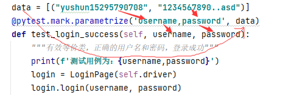

# selenium

```python
#导入selenium
from selenium import webdriver
#打开浏览器
driver = webdriver.Chrome()
#使用webdriver打开一个链接
driver.get('https://www.baidu.com')
#最大等待时间
driver.implicitly_wait(10)   
#窗口截图
driver.save_screenshot(r"D:\xxx.png")

#对浏览器页面的相关操作
driver.set_window_size(400,800)  #控制浏览器窗口大小 
driver.back()             #控制浏览器后退
driver.forword()          #控制浏览器前进
driver.maximize_window()  #窗口最大化
driver.close()            #关闭窗口
driver.quit()             #关闭所有相关窗口
driver.refresh()          #刷新窗口
driver.current_url        #获取当前页面的url地址
driver.name               #获取浏览器的名称
driver.page_source        #获取当前页面的源代码
driver.title              #获取当前页面的标题


#对元素的相关操作
element.size              #获取当前元素的大小
element.tag_name          #获取当前元素的标签名称
element.text              #获取当前元素的文本值
element.get_attribute('textContent')   # 获取元素的文本内容与 element.text 类似，但不同的是，get_attribute('textContent') 获取的是元素的实际文本内容，不受样式等因素的影响，而 element.text 获取的则是可见文本内容，即被 CSS 隐藏或者所在的元素没有被渲染的文本内容是获取不到的
element.get_attribute("type")   #获取当前元素的属性值，获取当前元素的type属性
get_attribute('innerHTML')   #获取当前元素的HTML
element.is_displayed()    #检查元素是否对用户可见
element.send_keys('asd')  #模拟输入文本框，在使用前可以先使用clear()清除文本框中的预制内容
element.click()           #单击元素
element.clear()           #清除文本框中的内容
element.submit()          #提交表单，在搜索框不提供提交按钮时，提交文本


#元素定位的方法
#所有的元素定位方法都有两种表示形式
driver.find_element_by_class_name('animal')
driver.find_element(by='name',value='animal')
#使用 find_elements 选择的是符合条件的所有元素，如果没有符合条件的元素，返回空列表
#使用 find_element 选择的是符合条件的第一个元素，如果没有符合条件的元素，抛出 NoSuchElementException 异常
element = driver.find_element_by_id('kw')  #通过id
#一个元素可以有多个class元素，多个class之间用空格隔开如：<span class="chinese student">张三</span>
#使用by_class_name定位元素时，如果class有多个值，只需要输入一个值就可以，不能输入多个值
element = driver.find_element_by_class_name('animal')  #通过class属性，会返回匹配到的第一个元素
element = driver.find_elements_by_tag_name('div')   #选择所有的tag名为 div的元素
element = driver.find_elements_by_name('passwd')  #选择所有的name为passwd的元素
#通过元素的文本链接定位
如:<a href="http://news.baidu.com" target="_blank" class="mnav c-font-normal c-color-t">新闻</a>
element = driver.find_elements_by_link_text('新闻')        #通过完整的文本信息来定位这个链接
element = driver.find_elements_by_partial_link_text('新')  #通过部分文字来定位这个链接
#元素定位之xpath
#绝对路径，从根节点一层层地搜索到需要被定位的元素，绝对路径起始于正斜杠(/)
driver.find_elements_by_xpath('/html/body/div/div[2]/div[5]/div[1]/div/form/span[1]/input')  #百度的搜索框
#可以通过右击元素标签-->copy-->copy full xpath 的方式快速获取元素的绝对路径
#在同一个层级中，如果有多个相同的标签名，那么就按照上下顺序确定元素，从1开始如div[2]
#相对路径，使用//开头
driver.find_elements_by_xpath('//div[2]')    #匹配所有的，当前页面有超过两个div子标签的第二个div[2]子标签
#还可以使用元素的属性值来定位
driver.find_elements_by_xpath("//input[@id='kw']")  #匹配所有的id为kw的input标签
driver.find_elements_by_xpath("//*[@id='kw']")      #匹配所有的id为kw的标签
#使用逻辑运算符
driver.find_element_by_xpath("//input[@id='kw' and @class='s_ipt']")   #匹配id为kw且class为s_ipt的input标签
driver.find_element_by_xpath("//input[@id='kw' and not(@class)]")   #匹配id为kw且没有class属性的input标签
#使用模糊属性值定位
#contains，用于匹配一个属性中包含的字符串
driver.find_element_by_xpath("//span[contains(@class,'ip')]")   #定位百度的搜索框
#starts-with,用于匹配一个属性中以xxx开头的字符串
driver.find_element_by_xpath("//span[starts-with(@class,'s')]") #定位百度的搜索框
#text()
driver.find_element_by_xpath("//a[text()='新闻']")          #定位百度的新闻链接
driver.find_element_by_xpath("//a[contains(text(),'新')]")  #定位百度的新闻链接
#与层级相结合
#如果一个元素没有唯一标识这个元素的属性值，那么我们可以通过定位其上下级元素来定位他
element = driver.find_element_by_xpath("//span[@class='bg s_ipt_wr quickdelete-wrap']/input")  #通过定位百度文本框的父标签，来定位百度文档的文本框
element = driver.find_element_by_xpath("//*[@id = 'kw']/../..")   #通过定位百度文本，来定位from标签，..表示父标签
#使用xpath轴进行定位
```

| Xpath轴关键字     | 轴的定义说明                   | 定位表达式示例                             | 表达式解释                                                   |
| ----------------- | ------------------------------ | ------------------------------------------ | ------------------------------------------------------------ |
| parent            | 选取当前节点的父节点           | //img[@id='male']/parent::div              | 查找id属性为male的img元素，并找到他的父标签，等效于//img[@id='male']/.. |
| ancestor          | 选取当前节点的所有祖先节点     | //img[@id='male']/ancestor::div            | 查找id属性为male的img元素，并基于该元素找到其上级的所有div元素 |
| child             | 选取当前节点的子节点           | //div[@id='v1']/child::img                 | 查找id属性为v1的div元素，并找到标签为img的子元素,等效于//div[@id='v1']/img |
| descendant        | 选取当前节点的所有后代节点     | //div[@id='v1']/descendant::img            | 查找id属性为v1的div元素，并基于该元素找到其下级的所有img标签 |
| following-sibling | 选取当前节点的后续所有兄弟节点 | //img[@id='male']/following-sibling::input | 查找id属性为male的img元素，并基于该元素找到其后续同级节点中的所有div元素 |
| preceding-sibling | 选取当前节点的前面所有兄弟节点 | //img[@id='male']/preceding-sibling::input | 查找id属性为male的img元素，并基于该元素找到其前面同级节点中的所有div元素 |
| following         | 选取当前节点的后续所有节点     | //div[@id='v1']/following::img             | 查找id属性为v1的div元素，并基于该元素找到其后面的所有img标签（不包含后代） |
| preceding         | 选取当前节点的前面所有节点     | //div[@id='v1']/preceding::img             | 查找id属性为v1的div元素，并基于该元素找到其前面的所有img标签（不包含祖先） |

```python
driver.find_element_by_xpath("//a[@href = 'http://news.baidu.com']/following-sibling::a[1]")  #通过百度的新闻链接，定位到hao123链接
#获取匹配到的倒数第二个元素
driver.find_element_by_xpath("//div[last()-1]")
#获取匹配到的倒数第1个元素
driver.find_element_by_xpath("//div[last()]")
#获取匹配到的第n个元素
driver.find_element_by_xpath("//div[2]")

#css定位
#通过class定位
driver.find_element_by_css_selector(".s_ipt")   #和by_class_name一样，如果有多个class值，只需要填一个class参数
#通过id定位
driver.find_element_by_css_selector("#kw")
#通过标签名定位
driver.find_elements_by_css_selector("input")    #定位所有的input标签的元素
#通过标签层级关系定位
driver.find_elements_by_css_selector("span > input")   #定位所有的父标签为span，自己的标签名为input的元素
driver.find_elements_by_css_selector("span input")   #定位所有的祖先标签为span，自己的标签名为input的元素
#通过属性定位
driver.find_elements_by_css_selector("[id='kw']")         #定位所有id为kw的元素
driver.find_elements_by_css_selector("form#form >span >input.s_ipt")  #定位所有父标签的父标签为form，id为form；父标签为span；自己的class为s_ipt的input标签
driver.find_element_by_css_selector("[id *= 'k']")        #定位所有id中包含k的元素
driver.find_element_by_css_selector("[id ^= 'k']")        #定位所有id中以k开头的元素
driver.find_element_by_css_selector("[id $= 'w']")        #定位所有id中以w结尾的元素
#获取匹配到的倒数第二个元素
driver.find_elements_by_css_selector("span:nth-last-child(2)")
#获取匹配到的倒数第1个元素
driver.find_elements_by_css_selector("span:last-child")
#获取匹配到的第n个元素
driver.find_elements_by_css_selector("span:nth-child(n)")
#获取匹配到的第一个元素
driver.find_elements_by_css_selector("span:first-child")

#模拟鼠标操作
from selenium.webdriver import ActionChains
ac = ActionChains(driver)
ac.context(webElement对象).perform()          #右击
ac.double_click(webelement对象).perform()     #双击
ac.drag_and_drop(webElement对象1，webElement对象2).perform()  #拖到元素对象1到元素对象2
ac.move_to_element(webElement对象).perform()  #移动并悬浮到元素上
ac.click_and_hold(webElement对象).perform()   #单击元素，并保持不松开
ac.move_by_offset(x,y).perform()              #移动鼠标到(x,y)

      

#模拟键盘
from selenium.webdriver.common.keys import Keys
element.send_keys(Keys.BACK_SPACE)   #删除键
element.send_keys(Keys.SPACE)        #空格键
element.send_keys(Keys.TAB)          #tab
element.send_keys(Keys.ESCAPE)       #esc
element.send_keys(Keys.ENTER)        #回车键
element.send_keys(Keys.CONTROL,'a')  #全选Ctrl + a
element.send_keys(Keys.CONTROL,'c')  #复制
element.send_keys(Keys.CONTROL,'x')  #剪切
element.send_keys(Keys.CONTROL,'v')  #粘贴
element.send_keys(Keys.F1)
…………
element.send_keys()


#多表单切换
#在web应用中经常会遇到frame/iframe表单嵌套页面的应用，webdriver只能在一个页面上对元素进行识别定位，无法直接
#定位到frame/iframe上的元素，需要使用switch_to.frame()方法将当前定位主题切换到frame/iframe的表单
iframe_element = browser.find_element_by_css_selector("[id ^= 'x-URS-iframe']")    #定位到iframe表单
driver.switch_to.frame(iframe_element)        #切换到定位的表单
element = driver.find_element_by_xpath("//label[text()='邮箱帐号或手机号码']/following-sibling::input[1]")   
element.clear()
element.send_keys('yushun15295790708')
driver.switch_to.parent_frame()      #返回上一层表单
driver.switch_to.default_content()   #返回到最外层


#多窗口切换
handle = driver.current_window_handle         #获得当前窗口的句柄
all_handle = driver.window_handle                 #获得所有打开窗口的句柄
driver.switch_to.window(handle)            #切换到相应的窗口
#例子
driver = webdriver.Chrome()
driver.get("https://www.baidu.com")
search_window_hanle = driver.current_window_handle      #获取百度搜索窗口的句柄
driver.find_element_by_link_text('hao123').click()      #定位并点击hao123链接
all_hanle = driver.window_handles                       #获取当前所有的窗口句柄，窗口句柄以列表的形式存在了all_handle中
driver.switch_to.window(all_hanle[-1])                  #切换到hao123窗口
element_hao123_search = driver.find_element_by_xpath("//div/input[@name='word' and @data-hook='searchInput']")  #定位到hao123窗口中的搜索框
element_hao123_search.clear()
element_hao123_search.send_keys('王者荣耀')          #输入王者荣耀并提交
element_hao123_search.submit()
driver.switch_to.window(search_window_hanle)        #切回到百度所搜窗口
element_baidu_search = driver.find_element_by_id('kw')  #定位到百度搜索框
element_baidu_search.clear()
element_baidu_search.send_keys('中国')
element_baidu_search.submit()      ##输入中国并提交


#警告框处理
alert = driver.switch_to.alert #获取当前窗口的警告窗口
alert.text  #获取警告窗中的文字
alert.accept()    #接收警告框
alert.dismiss()   #解散警告框
alert.sent_keys() #在警告框中输入文字（如果可以）
#例子
driver.find_element_by_id('s-usersetting-top').click()   #点击百度页面的设置
driver.implicitly_wait(10)  
driver.find_element_by_xpath("//div[@id='s-user-setting-menu']/div/a[1]").click()   #点击设置下面的搜索设置
driver.implicitly_wait(10)
driver.find_element_by_xpath("//input[@id='nr_3']").click()    #定位并点击弹窗中的每页50条
driver.implicitly_wait(10)
driver.find_element_by_xpath("//div[@id='se-setting-7']/a[2]").click()  #定位并点击保存设置
driver.implicitly_wait(10)
alert = driver.switch_to.alert   #获取警告窗
driver.implicitly_wait(10) 
print(alert.text)  #打印警告信息
alert.accept()  #接收警告信息
```

**判断元素是否可以点击、被选中、是否可见**

```python
from selenium import webdriver
from selenium.webdriver.common.by import By

driver = webdriver.Firefox()
# 打开百度
driver.get("https://www.baidu.com")
# 定位百度首页的地图按钮
element = driver.find_element(By.XPATH, "//a[@class='mnav c-font-normal c-color-t']")
# 判断元素是否可点击
element.is_enabled()
# 判断元素是否可见
element.is_displayed()
#判断元素是可以被选中
element.is_selected()
```

**logging模块的使用**

logging模块级别的常用函数

| 日志等级         | 创建日志函数                           | 说明                                 |
| ---------------- | -------------------------------------- | ------------------------------------ |
| logging.DEBUG    | logging.debug(msg, *args, **kwargs)    | 创建一条严重级别为DEBUG的日志记录    |
| logging.INFO     | logging.info(msg, *args, **kwargs)     | 创建一条严重级别为INFO的日志记录     |
| logging.WARNING  | logging.warning(msg, *args, **kwargs)  | 创建一条严重级别为WARNING的日志记录  |
| logging.ERROR    | logging.error(msg, *args, **kwargs)    | 创建一条严重级别为ERROR的日志记录    |
| logging.CRITICAL | logging.critical(msg, *args, **kwargs) | 创建一条严重级别为CRITICAL的日志记录 |
|                  | logging.log(level, *args, **kwargs)    | 创建一条严重级别为level的日志记录    |
|                  | logging.basicConfig(**kwargs)          | 对root logger进行一次性配置          |

**日志处理**

```python
logging.basicConfig(**kwargs) #函数说明
#logging.basicConfig(**kwargs)函数是一个一次性的配置，只有在第一次调用时在有效，之后重新配置并不会生效
#参数
filename    #文件位置，指定日志输出到哪个文件，默认输出到控制台
filemode    #打开模式，指定日志文件的打开方式，默认为'a',只有在filename设置时才有效
format      #指定日志的格式
level       #指定输出到文件、或者控制台的最低级别
#日志格式
asctime     %(asctime)s       #日志发送的时间，以人类可读的形式
levelname   %(levelname)s     #日志的级别
filename    %(filename)s      #调用日志记录函数的文件名
funcName    %(funcName)s      #调用日志记录函数的函数名
message     %(message)s       #日志记录的文本内容
#简单的日志发送函数，-----一定要记住，在导入import logging后，最好马上配置logging.basicConfig()
import logging
logging.basicConfig(filename=f'logs/{time.strftime("%Y年%m月%d日", time.localtime())}.txt',
                    level=logging.INFO,format= "%(asctime)s-%(filename)s-%(funcName)s-%(levelname)s:%(message)s")
def sent_logging(level,message):
    logging.log(level,message)
```

[Python之日志处理（logging模块） - 云游道士 - 博客园 (cnblogs.com)](https://www.cnblogs.com/yyds/p/6901864.html)

**发送邮件**

```python
pip install yagmail   #安装插件

yag = yagmail.SMTP(
        user='2639773860@qq.com',        #发送者账号
        password= "ubjoqzodklhqdihj",    #发送者密码
        host='smtp.qq.com',              #发送者邮箱的smtp地址
        port=25,                         #发送者邮箱的smtp端口
        smtp_ssl=False)

yag.send(to=receiver,                    #接收者账号
     subject=subject,                    #邮件主题
     contents=contents,                  #邮件正文
     attachments = location)             #附件的地址
```

[Python3 发送邮件 - 简书 (jianshu.com)](https://www.jianshu.com/p/d99cfbb03cef)

**从excel获取数据**

```python
pip intsall xlrd    #安装模块
#单元格中的数据类型
#0 empty 空
#1 string  （text）
#2 number
#3 date
#4 boolean
#5 error
#6 blank
import xlrd     #导入模块
workbook = xlrd.open_workbook('D:\\')        #打开execl文件，返回book对象
sheet_name = wk.sheet_names()                #获取book对象的所有sheet名，并以列表的形式返回
sheet = wk.sheet_by_index(0)                 #通过索引的方式，获取sheet对象，并返回，起始值为0
sheet1 = wk.sheet_by_name("sheet1")          #通过sheet的名字获取sheet对象，并返回
rows = sheet.nrows             #返回sheet对象中有多少行数据
cols = sheel.ncols             #返回sheet对象中有多少列数据    看最多的最大的值
sheet.row(7)      #[empty:'', empty:'', number:1.0] 返回对应行中的所有单元格对象组成的列表
sheet.col(0)      #[empty:'', empty:'', empty:'', empty:'', empty:'', empty:'', empty:'', empty:''] 返回对应列中的所有单元格对象组成的列表
sheet.row_types() #array('B', [0, 0, 2]) 返回对应行中的所有单元格对象的类型
sheet.col_types(0) #[0, 0, 0, 0, 0, 0, 0, 0] 返回对应列中的所有单元格对象的类型
sheet.row_values() #['', '', 1.0] 返回对应行中的所有单元格对象的值
sheet.col_values(0) #['', '', '', '', '', '', '', ''] 返回对应列中的所有单元格对象的值
sheet.cell(7, 2)   #返回单元格对象 number:1.0
sheet.cell_type(7, 2)    #返回单元格中的数据类型 2
sheet.cell_value(7, 2)   #返回单元格中的数据 1.0
```

[python里面的xlrd模块详解 - 拷贝达人 - 博客园 (cnblogs.com)](https://www.cnblogs.com/lnd-blog/p/12535423.html)

**pytest**

```python
#安装pip
pip install pytest
#编写规则
#测试文件要以test开头或者结尾
#测试类要以Test开头，并且不能带有init方法
#测试函数要以test开头
#pytest的运行方式
#通过命令行运行
#pytest       不带任何参数，将运行当前目录中的所有测试文件
#pytset test_login_page.py   后面跟上文件名，将运行test_login_page.py文件中的所有测试文件
#pytest test_login_page.py::test_login_fail 后面跟上文件名和函数名并用：：分割，将运行test_login_fail函数
#pytest -v 用于显示每个测试函数详细的执行结果
#pytest -q 用于显示每个测试函数简略的执行结果
#pytest -s 用于显示每个测试函数中print()的输出
#通过pytest.main()
pytest.main(['-v','test_login_page.py']) #将命令放在pytest.main()中

#pytest生成html格式的测试报告
#安装pytest-html
#通命令行或者pytest.main()实现
pytest.main(['--html=report/{location}.html',"--self-contained-html",'-v','test_login_page.py'])

#setup和teaerdown等
#setup_module/teardown_module       在模块的开始和结束生效
#setup_function/teardown_function   在函数的开始和结束生效
#setup_class/teardown_class         在类的开始和结束生效
#setup_method/teardown_method       在类中的每个函数的开始和结束生效
#setup/teardown                     在函数的开始和结束生效

#pytest的参数化处理
#使用@pytest.mark.parametrize装饰函数
data = [("yushun15295790708", "1234567890..asd")]
@pytest.mark.parametrize('username,password', data)
def test_login_success(self, username, password):
    """有效等价类，正确的用户名和密码，登录成功"""
    print(f'测试用例为：{username,password}')
    login = LoginPage(self.driver)
    login.login(username, password)
```



[Python Pytest 教程|极客教程 (geek-docs.com)](https://geek-docs.com/python/python-tutorial/python-pytest.html)

[PyTest自动化测试 学习基础知识之PyTest生成html测试报告；allure开源测试报告框架 - 简书 (jianshu.com)](https://www.jianshu.com/p/9c22a0fbb8cb)

[pytest -- 使用和调用 - luizyao - 博客园 (cnblogs.com)](https://www.cnblogs.com/luizyao/p/11498169.html)

**三种等待**

```python
#强制等待，使用time模块的sleep函数
import time
time.sleep(3)    #不管你浏览器是否加载完,程序都得等待3秒,3秒一到,继续执行下面的代码

#隐性等待，使用implicity_wait(s),在一个地方设置之后，其后的整个driver有效期都有效
driver.implicitly_wait(30)
#隐式等待是设置了一个最长等待时间,如果在规定时间内网页加载完成,则执行下一步,否则一直等到时间截止,然后执行下一步
#这里有一个弊端,那就是程序会一直等待整个页面加载完成,才会执行下一步,但有时候页面想要的元素早就在加载完成了
#但是因为个别的东西特别慢,我仍得等到页面全部完成才能执行下一步

#显示等待，使用WebDriverWait，等待某个条件成立时继续执行，否则在达到最大时长后抛出超时异常TimeoutException
#导入模块
from selenium.webdriver.support.wait import WebDriverWait
#WebDriverWait参数说明
#driver                 传入的WebDriver实例
#timeout                最长等待时间
#poll_frequency         轮询的时间间隔，默认为0.5秒
#ignored_exceptions     忽略的异常，默认为NoSuchElementException
#如果在调用until或until_not的过程中抛出ignored_exceptions中的异常，则不中断代码，继续等待
#如果抛出的是ignored_exceptions外的异常，则中断代码，抛出异常
#until() 和 until_not()
#method: 在等待期间，每隔一段时间调用这个传入的方法，直到返回值不是False
#message: 如果超时，抛出TimeoutException，将message传入异常
#method可以自定义，也可以使用selenium.webdriver.support.expected_conditions中预定义的方法
#自定义
WebDriverWait(driver,10).until(lambda driver:driver.find_element_by_id("kw")).send_keys("pytest")
#预定义
from selenium.webdriver.support import expected_conditions as EC
from selenium.webdriver.common.by import By
WebDriverWait(driver, 20, 0.5).until(EC.title_is("163网易免费邮--中文邮箱第一品牌"))
#预定义的一些方法
title_is： 判断当前页面的title是否完全等于（==）预期字符串，返回布尔值
title_contains : 判断当前页面的title是否包含预期字符串，返回布尔值
presence_of_element_located : 判断某个元素是否被加到了dom树里，并不代表该元素一定可见
visibility_of_element_located : 判断某个元素是否可见. 可见代表元素非隐藏，并且元素的宽和高都不等于0
visibility_of : 跟上面的方法做一样的事情，只是上面的方法要传入locator，这个方法直接传定位到的element就好了
presence_of_all_elements_located : 判断是否至少有1个元素存在于dom树中。举个例子，如果页面上有n个元素的class都是‘column-md-3‘，那么只要有1个元素存在，这个方法就返回True
text_to_be_present_in_element : 判断某个元素中的text是否 包含 了预期的字符串
text_to_be_present_in_element_value : 判断某个元素中的value属性是否 包含 了预期的字符串
frame_to_be_available_and_switch_to_it : 判断该frame是否可以switch进去，如果可以的话，返回True并且switch进去，否则返回False
invisibility_of_element_located : 判断某个元素中是否不存在于dom树或不可见
element_to_be_clickable : 判断某个元素中是否可见并且是enable的，这样的话才叫clickable
staleness_of : 等某个元素从dom树中移除，注意，这个方法也是返回True或False
element_to_be_selected : 判断某个元素是否被选中了,一般用在下拉列表
element_selection_state_to_be : 判断某个元素的选中状态是否符合预期
element_located_selection_state_to_be : 跟上面的方法作用一样，只是上面的方法传入定位到的element，而这个方法传入locator
alert_is_present : 判断页面上是否存在alert
```

