## vscode python第三方库自动补全

使用`vscode`远程连接执行机查看代码时，会发现脚本中有很多导入模块的语句(`page`模块以及`htng`框架中的模块)被标黄，这样不仅会使强迫症患者非常的难受，而且最重要的是没有语法的提示以及跳转

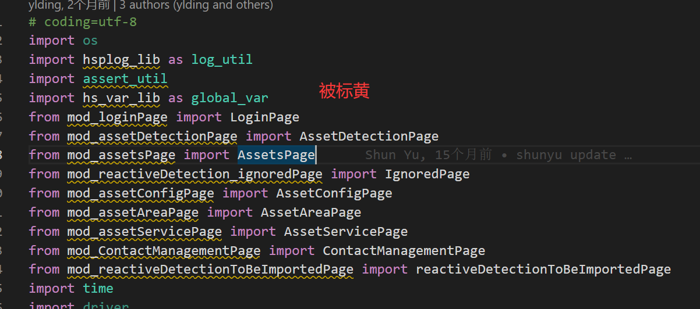

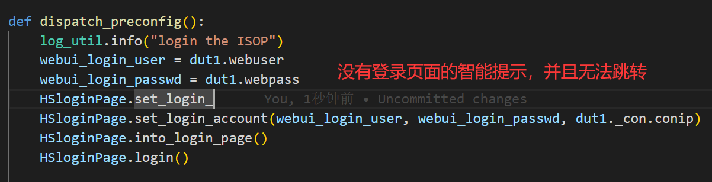

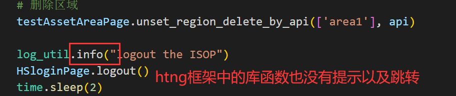

为了实现`vscode`智能提示以及跳转，需要手动将一些库加入到`python`解析路径中，具体做法

- 在当前工程目录下创建一个`.vscode`目录
- 在`.vscode`目录中创建`settings.json`文件
- 在`settings.json`文件中添加`vscode`找不到的模块，内容可参考下面的代码块

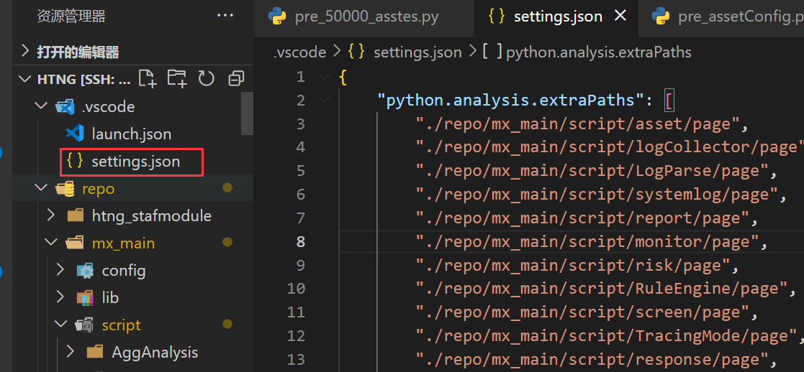

```json
// .vscode/setting.json
{
    "python.analysis.extraPaths": [
        "./repo/mx_main/script/asset/page",
        "./repo/mx_main/script/logCollector/page",
        "./repo/mx_main/script/LogParse/page",
        "./repo/mx_main/script/systemlog/page",
        "./repo/mx_main/script/report/page",
        "./repo/mx_main/script/monitor/page",
        "./repo/mx_main/script/risk/page",
        "./repo/mx_main/script/RuleEngine/page",
        "./repo/mx_main/script/screen/page",
        "./repo/mx_main/script/TracingMode/page",
        "./repo/mx_main/script/response/page",
        "./repo/mx_main/script/vulnerability/page",
        "./repo/mx_main/script/intelligence/page",
        "./repo/mx_main/script/settings/page",
        "./repo/mx_main/script/login/page",
        "./repo/mx_main/script/threatlog/page",
        "./repo/mx_main/script/threatevent/page",
        "./repo/mx_main/script/threat/page",
        "/usr/local/python37/lib/python3.7/site-packages/htng_hsui/common",
        "/usr/local/python37/lib/python3.7/site-packages/htng_hsui/plugins",
        "/usr/local/python37/lib/python3.7/site-packages/htng",
        "/usr/local/python37/lib/python3.7/site-packages/htng/commands",
        "/usr/local/python37/lib/python3.7/site-packages/htng/config",
        "/usr/local/python37/lib/python3.7/site-packages/htng/extensions",
        "/usr/local/python37/lib/python3.7/site-packages/htng/install",
        "/usr/local/python37/lib/python3.7/site-packages/htng/lib/common",
        "/usr/local/python37/lib/python3.7/site-packages/htng/lib/loader",
        "/usr/local/python37/lib/python3.7/site-packages/htng/lib/taskcontrol",
        "/usr/local/python37/lib/python3.7/site-packages/htng/plugins/*",
        "/usr/local/python37/lib/python3.7/site-packages/htng/settings/*",
        "/usr/local/python37/lib/python3.7/site-packages/htng/templates/*",
        "/usr/local/python37/lib/python3.7/site-packages/htng/utils/*",
        "/usr/local/python37/lib/python3.7/site-packages/htng/plugins",
        "/usr/local/python37/lib/python3.7/site-packages/htng/settings",
        "/usr/local/python37/lib/python3.7/site-packages/htng/templates",
        "/usr/local/python37/lib/python3.7/site-packages/htng/utils",
    ]
}
```

保存`setting.json`文件后，就有智能提示并可以跳转了

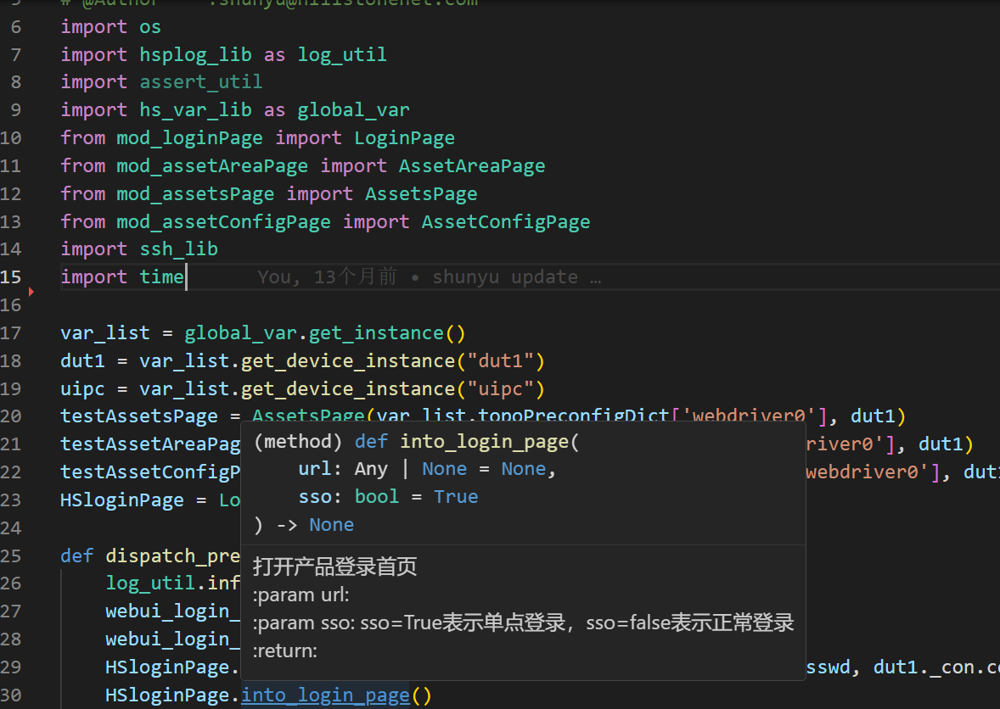

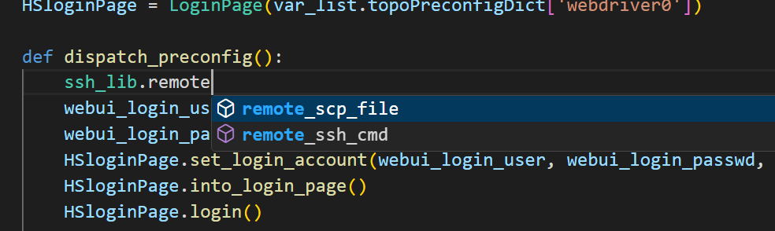

>但是对于`htng`库中的一些提示还是没有`pycharm`智能，不知道是不是我配置有啥问题，但是暂时也可以解决一些问题

## 第三方库自动补全

https://blog.csdn.net/maokelong95/article/details/54379046?utm_source=blogxgwz0

每个脚本编写时，可能需要在脚本的开头写上脚本的解释器、编码格式、文件名称、编写时间、作者等，但是每个脚本都写一遍会比较麻烦，而且脚本的文件名称/编写时间是一个动态的内容，每次编写都需要修改不可以简单的复制，可以定义自己的代码模板，来快速输入这些代码。

- 依次点击右下角的 设置->用户代码片段
  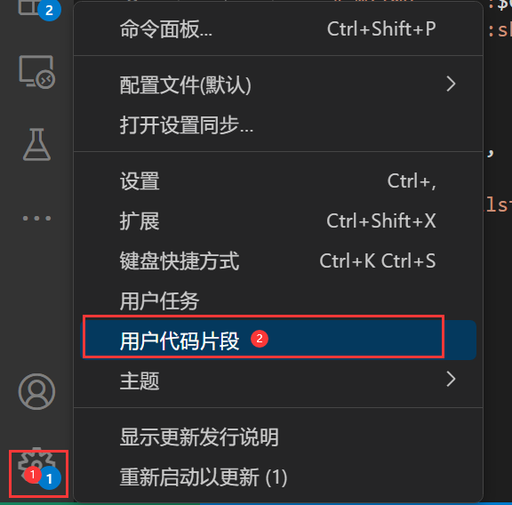

- 弹出框输入`Python`后回车, 会生成一个`python.json`文件

- `python.json`输入如下内容

  ```json
  {
      "PYHEAD": {
          "prefix": "utf",
          "body": [
              "#!/usr/bin/env python",
              "# -*- coding:utf-8 -*-",
              "# @FileName  :$TM_FILENAME",
              "# @Function  :",
              "# @Time      :$CURRENT_YEAR/$CURRENT_MONTH/$CURRENT_DATE $CURRENT_HOUR:$CURRENT_MINUTE:$CURRENT_SECOND",
              "# @Author    :shunyu@hillstonenet.com",
          ]
      }
  }
  ```

- 在脚本中输入`prefix`对应的命令(上述`json`文件中的`prefix`是`utf`),会发现有智能提示
  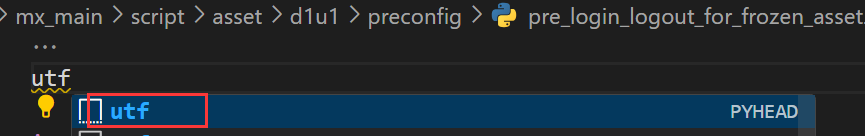

- 直接回车会生成如下代码片段

  ```python
  #!/usr/bin/env python
  # -*- coding:utf-8 -*-
  # @FileName  :pre_login_logout_for_frozen_asset.py
  # @Function  :
  # @Time      :2023/10/08 18:18:15
  # @Author    :shunyu@hillstonenet.com
  ```

## vscode 脚本调试

https://zhuanlan.zhihu.com/p/359283509

目前我们常用的脚本调试方法为在脚本中加入等待、日志等方式实现的，但是这个方式有以下问题

1. 有可能加的日志不够多，后续还需要添加更多的日志，但是脚本又需要重新跑一遍
2. 加了的日志有可能太多了，没有必要需要删除
3. 加入等待时间，在执行到某一步时需要查看页面的元素定位，但是有可能等待时间过短，导致元素定位没有搞清楚就走到下一步了，并且需要我们一直盯着脚本

因此我们可以直接使用`vscode`中的`debug`功能，使用`debug`有如下几个优势

1. 实时性：`Debug`模式下，程序会以调试模式运行，可以立即看到变量的值、函数的返回值等信息，方便快速定位问题。而日志调试需要在程序运行结束后查看日志文件，无法实时了解程序运行状态。

2. 交互性：`Debug`模式下，可以逐行执行代码，观察代码执行过程中的状态变化，更便于理解和分析问题。而日志调试只能查看已经记录的信息，无法实时交互。

3. 灵活性：`Debug`模式下，可以根据需要设置断点、单步执行等操作，更加灵活地控制程序的执行过程。而日志调试通常只能查看已经记录的信息，无法进行实时的操作。

### 使用vscode debug进行脚本调试的步骤如下

- 在当前工程目录下创建一个`.vscode`目录

- 在`.vscode`目录中创建`launch.json`文件
  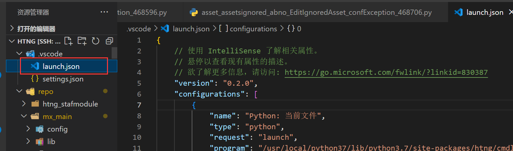

- 在`launch.json`中添加如下内容

  ```json
  {
      // 使用 IntelliSense 了解相关属性。 
      // 悬停以查看现有属性的描述。
      // 欲了解更多信息，请访问: https://go.microsoft.com/fwlink/?linkid=830387
      "version": "0.2.0",
      "configurations": [
          {
              "name": "Python: 当前文件",
              "type": "python",
              "request": "launch",
              "program": "/usr/local/python37/lib/python3.7/site-packages/htng/cmdline.py",
              "console": "integratedTerminal",
              "justMyCode": true,
              "args": ["run",
              "--taskid=shunyu_threat", // 要运行的任务
              "--console=1"]
          }
      ]
  }
  ```

- 在脚本中添加断点，并点击运行
  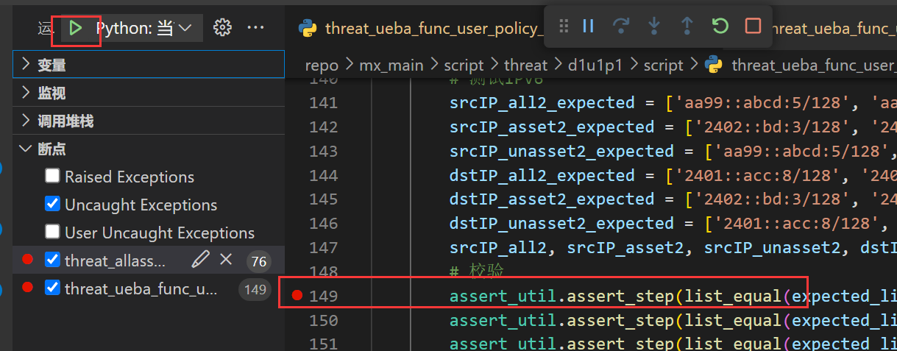

- 等待脚本执行到断点处，可以查看变量的值
  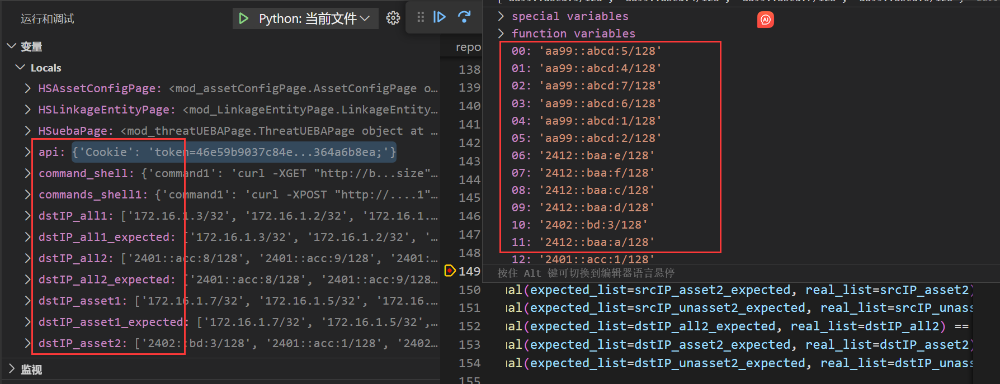

### 断点调试按钮


**Continue 继续(F5) / Pause 暂停(F6)**

继续执行程序，直到遇到下一个断点为止。

**Step Over 单步跳过 (F10)**

在普通代码行运行时，会逐行运行程序。
若遇到调用自定义函数命令，且在该定义的函数里没有断点，则直接运行完该函数，不会进入该函数并逐行运行该函数内的代码
否则，若在函数内有断点，则会在自定义函数里执行到的第一个断点停下

**Step Into 单步调试 (F11)**

逐行顺序运行程序。若遇到自定义函数，则进入该函数，逐行运行该函数内的代码。即，该步骤会按顺序走程序里的每一步

**Step Out 单步跳出 (Shift + F11)**

当前运行在自定义函数里时，如果在该自定义函数里没有断点，则会直接运行完当前自定义函数，停在调用函数的那一行

**Restart 重启 (Ctrl+Shift+F5)**

重新启动脚本

**Stop 停止 (Shift + F5)**

立即停止整个程序运行