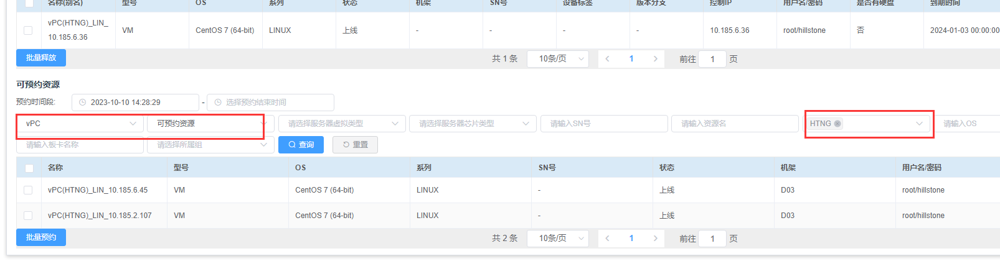
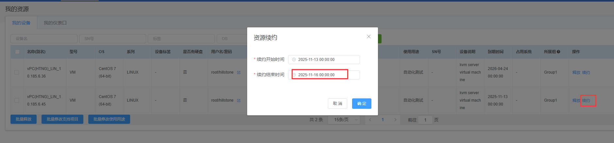
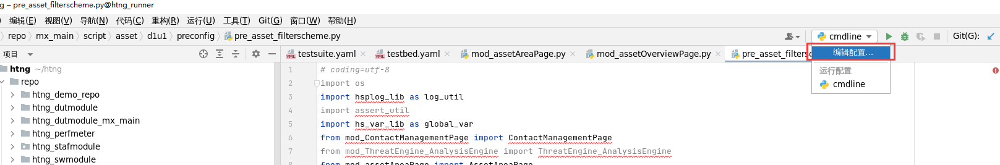
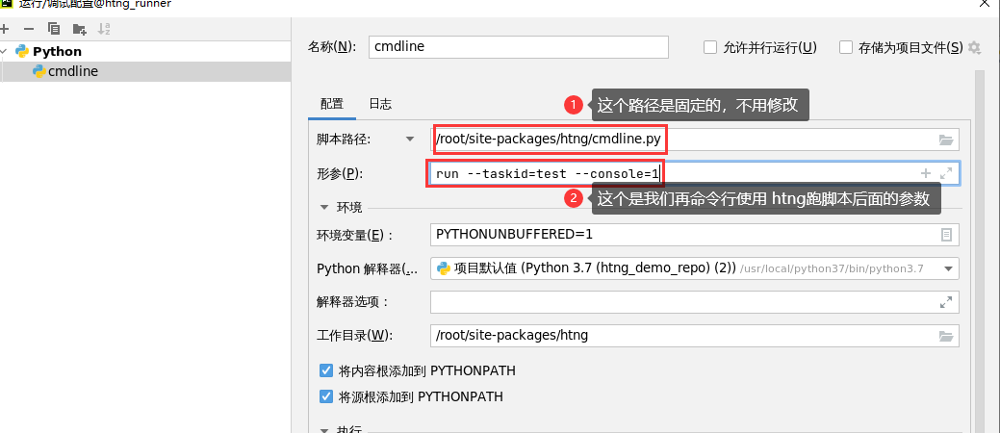
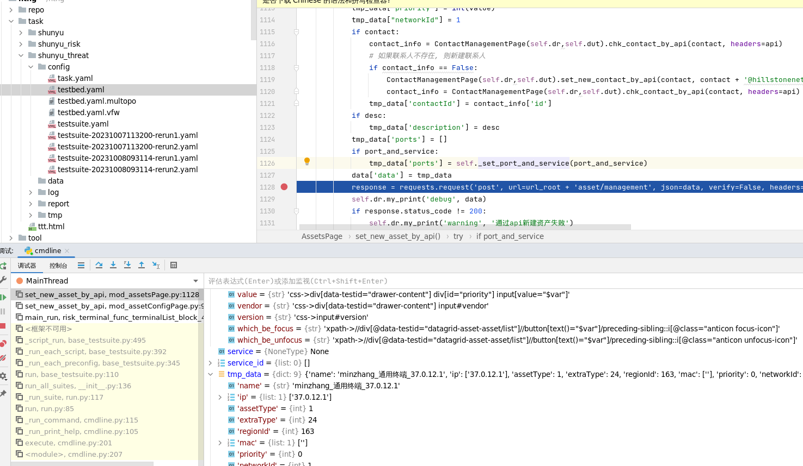

https://ils.hillstonenet.com/#/resource-center/all-resource






```shell
# 克隆智源代码仓库并切换分支
cd /root/htng/repo/
git clone https://gitlab.hillstonenet.com/hspdev/hst/project/script/webui/isop/mx_main.gitnet.com/hspdev/hst/project/script/web
cd mx_main/
git checkout -b 2.11_cn origin/2.11_cn

# 打开pycharm
htng pycharm start
```


设置运行/调试配置






