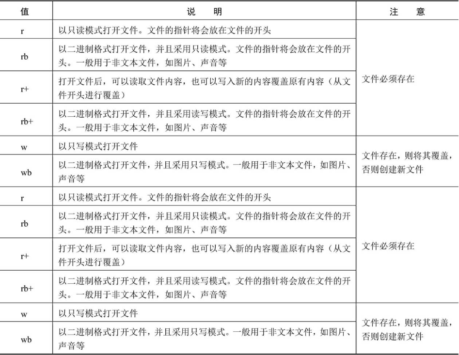

# 文件操作

## 创建和打开文件

通过内置的open()函数创建或者打开文件

```python
file = open(filename, mode, buffering, encoding="GBK")
```

**file**：open函数的返回值，被创建的文件对象。

**filename**：要创建或打开文件的文件名称

**mode**：可选参数，用于指定文件的打开模式，默认为r（只读）

**buffering**：可选参数，用于指定读写文件的缓冲模式，值为0表示不缓存；值为1表示缓存；如果大于1，则表示缓冲区的大小。默认为缓存模式。

**encoding**：使用open()函数打开文件时，默认采用GBK编码



## 关闭文件

打开文件后，需要及时关闭，以免对文件造成不必要的破坏

```python
file.close()
```

close()方法先刷新缓冲区中还没有写入的信息，然后再关闭文件，这样可以将没有写入文件的内容写入文件中。在关闭文件后，便不能再进行写入操作了。

### 打开文件时使用with语句

打开文件后，要及时将其关闭。如果忘记关闭，可能会带来意想不到的问题。另外，如果在打开文件时抛出了异常，那么将导致文件不能被及时关闭。为了更好地避免此类问题发生，可以使用Python提供的with语句，从而实现在处理文件时，无论是否抛出异常，都能保证with语句执行完毕后关闭已经打开的文件。

```python
with opne('xxx.txt', 'rb') as f:
    f.read()
```

## 写入文件

Python的文件对象提供了write()方法，可以向文件中写入内容

```python
with opne('xxx.txt', 'w') as f:
    f.write('aaaaaaaa')
```

在调用write()方法向文件中写入内容的前提是，打开文件时，指定的打开模式为w（可写）或者a（追加），否则，将抛出异常。

> 在写入文件后，一定要调用close()方法关闭文件，否则写入的内容不会保存到文件中。这是因为当我们在写入文件内容时，操作系统不会立刻把数据写入磁盘，而是先缓存起来，只有调用close()方法时，操作系统才会保证把没有写入的数据全部写入磁盘。

> 在向文件中写入内容后，如果不想马上关闭文件，也可以调用文件对象提供的flush()方法，把缓冲区的内容写入文件。这样也能保证数据全部写入磁盘。

## 读取文件

文件对象提供了read()方法读取指定个数的字符

```python
file.read([size])
```

**file**：为打开的文件对象

**size**：为可选参数，用于指定要读取的字符个数，如果省略则一次性读取所有内容。

> 在调用read()方法读取文件内容的前提是，打开文件时，指定的打开模式为r（只读）或者r＋（读写），否则，将抛出异常。

### 读取一行

在使用read()方法读取文件时，如果文件很大，一次读取全部内容到内存，容易造成内存不足，所以通常会采用逐行读取。文件对象提供了readline()方法用于每次读取一行数据。

```python
file.readline()
```

### 读取全部行

读取全部行的作用与调用read()方法时不指定size类似，只不过读取全部行时，返回的是一个字符串列表，每个元素为文件的一行内容

```python
file.readlines()
```


## 移动文件指针

使用read(size)方法读取文件时，是从文件的开头读取的。如果想要读取部分内容，可以先使用文件对象的seek()方法将文件的指针移动到新的位置，然后再应用read(size)方法读取。

```python
file.seek(offset[,whence])
```

**file**：为打开的文件对象

**offset**：用于指定移动的字符个数，其具体位置与whence有关。

**whence**：用于指定从什么位置开始计算。值为0表示从文件头开始计算，1表示从当前位置开始计算，2表示从文件尾开始计算，默认为0。

> 对于whence参数，如果在打开文件时没有使用b模式（即rb），那么只允许从文件头开始计算相对位置，从文件尾/当前位置计算时就会引发异常。

>  在使用seek()方法时，offset的值是按一个汉字占两个字符、英文和数字占一个字符计算的。这与read(size)方法不同。