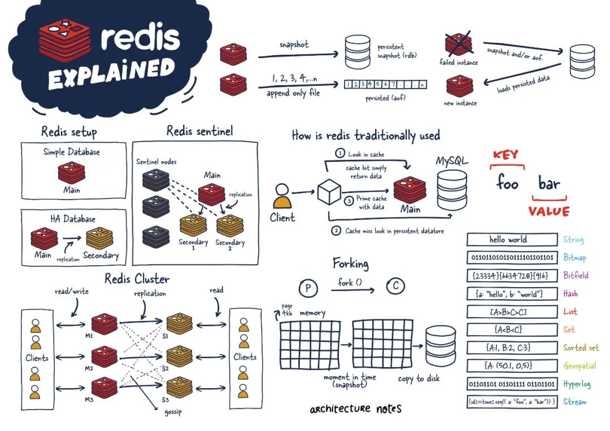
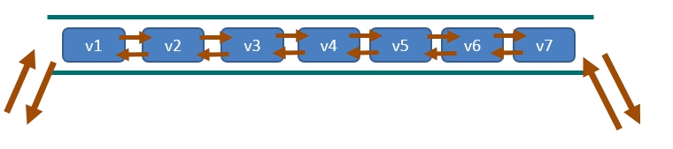
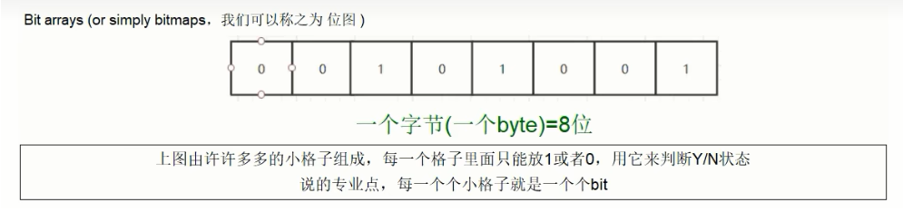

# Redis

## redis概述

### redis简介

https://try.redis.io/

https://www.redis.net.cn/tutorial/3502.html

**官方简介**

Redis 是一个开源（BSD 许可），基于内存的数据结构存储，用作数据库、缓存、消息代理和流处理引擎。Redis 提供了多种数据结构，如字符串、哈希、列表、集合、带范围查询的有序集合、位图、超日志、地理空间索引和流。Redis 内置了数据复制、Lua 脚本编写、LRU 淘汰机制、事务处理，以及不同级别的磁盘持久性，并通过 Redis Sentinel 提供高可用性以及通过 Redis Cluster 实现自动分区。

你可以对这些类型执行原子操作，例如追加字符串；在哈希中增加值；向列表中推送一个元素；计算集合的交集、并集和差集；或获取有序集合中排名最高的成员。

为了达到顶级性能，Redis 与一个内存数据集一起工作。根据你的使用案例，Redis 可以通过定期将数据集转储到磁盘或将每条命令追加到基于磁盘的日志来持久化数据。如果你只需要一个功能丰富的、网络化的、基于内存的缓存，你也可以禁用持久性。

Redis 支持异步复制，具有快速的非阻塞同步，并且在网络分离时能够自动重连并部分重新同步。


> Redis 是一种基于内存的数据库，对数据的读写操作都是在内存中完成，因此**读写速度非常快**，常用于**缓存，消息队列、分布式锁等场景**。
>
> Redis 提供了多种数据类型来支持不同的业务场景，比如 String(字符串)、Hash(哈希)、 List (列表)、Set(集合)、Zset(有序集合)、Bitmaps（位图）、HyperLogLog（基数统计）、GEO（地理信息）、Stream（流），并且对数据类型的操作都是**原子性**的，因为执行命令由单线程负责的，不存在并发竞争的问题。
>
> 除此之外，Redis 还支持**事务 、持久化、Lua 脚本、多种集群方案（主从复制模式、哨兵模式、切片机群模式）、发布/订阅模式，内存淘汰机制、过期删除机制**等等。

### redis能做什么

Redis可以用于以下一些场景:

1. 缓存:网站热点数据、页面内容、API响应等经常访问的内容可以缓存在Redis中,大大减轻数据库压力,提高网站性能。
2. 聊天系统:Redis是实时聊天系统不错的选择,支持发布/订阅功能,可以实现聊天消息的实时推送。
3. 会话管理:用于保存会话相关数据,取代传统的文件或数据库来存储会话。
4. 应用排行榜:例如微博热榜,微信好友动态等,利用sorted set可以实现实时更新的排行功能。
5. 提交痕迹:利用List结构可以实现如点击列表的提交痕迹记录。
6. App排程任务:通过简单的LPUSH和BRPOP实现任务的队列调度。
7. 地图映射:利用Geo哈希存储地理位置的信息。
8. 网络状态监控:利用Keys用作主机状态报告的订阅-发布频道。
9. 高速缓存:与Memcached类似,用于加速动态网页或api内容。
10. 数据过期处理:Redis实现了存活时间,可以定期检查过期内存回收。
11. 分布式锁:利用SETNX实现分布式锁功能。

总之,Redis作为内存存储数据库,对实时性有需求的场景都很适用,比如社交、共享单车、快递送投等。

### 下载并安装redis

https://developer.aliyun.com/article/925491

```shell
# 快速版本
docker run --name my-redis -p 6379:6379 -d -e REDIS_PASSWORD=123456 redis

# 下载docker镜像
docker pull redis:7.0

# 创建redis配置文件目录和数据文件目录
mkdir -p ~/redis/{conf,data}

# 下载redis配置文件
wget -O ~/redis/conf/redis6379.conf https://raw.githubusercontent.com/redis/redis/7.0/redis.conf

# 创建redis容器
docker run -d \
    --privileged=true \
    -p 6379:6379 \
    --name my-redis \
    -v ~/redis/conf/redis6379.conf:/etc/redis/redis.conf \
    -v ~/redis/data/6379:/data \
    redis:7.0 \
    redis-server /etc/redis/redis.conf \
    --appendonly yes
    
# 进入redis容器，查看redis版本
[root@localhost ~]# docker exec -it my-redis /bin/bash
root@2eae2ba4d39c:/data# redis-cli --version
redis-cli 7.0.13
```


配置文件

https://www.redis.net.cn/tutorial/3504.html

```shell
# 绑定地址 让其他主机也可以链接到本机的redis
bind 0.0.0.0

#  Redis默认不是以守护进程的方式运行，可以通过该配置项修改，使用yes启用守护进程
daemonize yes

# 指定Redis监听端口，默认端口为6379
port 6379

# 设置Redis连接密码
requirepass 123456
```


## redis命令

[英文命令文档](https://redis.io/commands/) [中文命令文档](https://www.redis.net.cn/order/)

**命令不区分大小写，而key是区分大小写的**

```shell
127.0.0.1:6379> set K1 v1
OK
127.0.0.1:6379> set k1 v1
OK
127.0.0.1:6379> keys *
1) "K1"
2) "k1"
127.0.0.1:6379> get k1
"v1"
127.0.0.1:6379> get K1
"v1"
127.0.0.1:6379> set K1 123
OK
127.0.0.1:6379> set k1 456
OK
127.0.0.1:6379> keys *
1) "K1"
2) "k1"
127.0.0.1:6379> get k1
"456"
127.0.0.1:6379> get K1
"123"
```

**帮助命令 help @类型**

```shell
127.0.0.1:6379> help @string

  APPEND key value
  summary: Append a value to a key
  since: 2.0.0

  DECR key
  summary: Decrement the integer value of a key by one
  since: 1.0.0
.....
127.0.0.1:6379> help @set

  SADD key member [member ...]
  summary: Add one or more members to a set
  since: 1.0.0

  SCARD key
  summary: Get the number of members in a set
  since: 1.0.0

  SDIFF key [key ...]
  summary: Subtract multiple sets
  since: 1.0.0

```

### 基本命令

#### 进入redis客户端

```shell
redis-cli -h 127.0.0.1 -p 6379 -a 123456 -n 0
# -h 127.0.0.1  redis服务器IP地址
# -p 6379  redis服务器端口
# -a 123456  redis服务器密码
# -n 0  redis服务器第几个数据库

root@1271388bcfb8:/data# redis-cli -h 10.185.5.86 -a 123456 -n 3
Warning: Using a password with '-a' or '-u' option on the command line interface may not be safe.
10.185.5.86:6379[3]>
```

#### redis键

**keys**：查看所有符合pattern的key

```shell
# 基本语法
KEYS PATTERN 

# 实例
127.0.0.1:6379> keys *
(empty array)
127.0.0.1:6379> set name xxx
OK
127.0.0.1:6379> set name1 xxx1
OK
127.0.0.1:6379> set value vi
OK
127.0.0.1:6379> keys name*
1) "name1"
2) "name"
127.0.0.1:6379> keys *
1) "name1"
2) "name"
3) "value"
```

**exists key**:命令用于检查给定key是否存在。

```shell
# 基本语法
EXISTS KEY_NAME

# 返回值
若 key 存在返回 1 ，否则返回 0 

# 实例
127.0.0.1:6379> exists name
(integer) 0
127.0.0.1:6379> set name vi
OK
127.0.0.1:6379> exists name
(integer) 1
```

**type key**:返回 key 所储存的值的类型

```
# 基本语法
TYPE KEY_NAME 

# 返回值
none (key不存在)
string (字符串)
list (列表)
set (集合)
zset (有序集)
hash (哈希表)

# 实例
127.0.0.1:6379> set k1 v1
OK
127.0.0.1:6379> type k1
string
127.0.0.1:6379> sadd pat dog
(integer) 1
127.0.0.1:6379> type pat
set
127.0.0.1:6379> type xxx
none
```

**del key**:删除指定的key数据

```shell
# 语法
DEL KEY_NAME [KEY_NAME...]

# 返回值
返回被成功删除的key的数量，删除不存在的key时会返回0

# 实例
127.0.0.1:6379> set k1 v1
OK
127.0.0.1:6379> set k2 v2
OK
127.0.0.1:6379> set k3 v3
OK
127.0.0.1:6379> set k4 v4
OK
127.0.0.1:6379> del k1
(integer) 1
127.0.0.1:6379> exists k1
(integer) 0
127.0.0.1:6379> del k2 k3
(integer) 2
127.0.0.1:6379> del k3
(integer) 0
127.0.0.1:6379> del k4 k5
(integer) 1
```

**ttl key**:以秒为单位，返回给定 key 的剩余生存时间
**pttl key**:以毫秒为单位，返回给定 key 的剩余生存时间
**expire key seconds** 为给定 key 设置过期时间

```shell
# 语法
TTL KEY_NAME
PTTL KEY_NAME
Expire KEY_NAME TIME_IN_SECONDS

# 返回值
ttl  以秒为单位返回 key 的剩余过期时间, -1 表示永久有效, -2 表示已经过期
pttl 以毫秒为单位，返回给定 key 的剩余生存时间, -1 表示永久有效, -2 表示已经过期
expire key seconds 为给定 key 设置过期时间

# 实例
127.0.0.1:6379> set k1 v1
OK
127.0.0.1:6379> ttl k1
(integer) -1
127.0.0.1:6379> expire k1 10
(integer) 1
127.0.0.1:6379> ttl k1
(integer) 7
127.0.0.1:6379> ttl k1
(integer) 4
127.0.0.1:6379> ttl k1
(integer) -2
127.0.0.1:6379> get k1
(nil)
```

**flashdb**:清除当前库中的所有内容
**flashall**:清除所有库中的所有内容
**select database_index**:切换数据库

```shell
# 实例
127.0.0.1:6379> set k1 v1
OK
127.0.0.1:6379> set k2 v2
OK
127.0.0.1:6379> keys *
1) "k2"
2) "k1"
127.0.0.1:6379> select 2
OK
127.0.0.1:6379[2]> set k1 v1
OK
127.0.0.1:6379[2]> keys *
1) "k1"
127.0.0.1:6379[2]> select 3
OK
127.0.0.1:6379[3]> set k3 v3
OK
127.0.0.1:6379[3]> set k4 v4
OK
127.0.0.1:6379[3]> keys *
1) "k4"
2) "k3"
127.0.0.1:6379[3]> FLUSHDB
OK
127.0.0.1:6379[3]> keys *
(empty array)
127.0.0.1:6379[3]> select 2
OK
127.0.0.1:6379[2]> keys *
1) "k1"
127.0.0.1:6379[2]> FLUSHALL
OK
127.0.0.1:6379[2]> keys *
(empty array)
127.0.0.1:6379[2]> select 0
OK
127.0.0.1:6379> keys *
(empty array)
```

**help**:可以通过help命令来获得关于特定命令的使用帮助信息,可以在不离开终端的情况下快速查找命令的语法和功能

```shell
# 语法
help @type    获取某个数据类型全部的命令帮助手册
help command  获取某个命令的帮助手册


# 实例
127.0.0.1:6379> help type

  TYPE key
  summary: Determine the type stored at key
  since: 1.0.0
  group: generic
127.0.0.1:6379> help @list

  BLMOVE source destination LEFT|RIGHT LEFT|RIGHT timeout
  summary: Pop an element from a list, push it to another list and return it; or block until one is available
  since: 6.2.0

  BLPOP key [key ...] timeout
  summary: Remove and get the first element in a list, or block until one is available
  since: 2.0.0
  ......
```

> redis中的命令是不区分大小写的，但是key和value是区分大小写的

### Redis字符串(string)

#### 基本命令

**set**：设置字符串类型的键值对

```shel
# 语法
SET key value [NX | XX] [GET] [EX seconds | PX milliseconds |EXAT unix-time-seconds | PXAT unix-time-milliseconds | KEEPTTL]
```

- `EX` seconds -- 设置指定的过期时间，以秒为单位
- `PX` milliseconds -- 设置指定的过期时间，以毫秒为单位
- `EXAT` timestamp-seconds -- 设置key的过期时间为指定的Unix时间，以秒为单位
- `PXAT` timestamp-milliseconds -- 设置key的过期时间为指定Unix时间，以毫秒为单位
- `NX` -- 仅当key不存在时才生效
- `XX` -- 仅当key存在时才生效
- `KEEPTTL` -- 保留与key关联的生存时间, 在redis 6.2中新增的参数
- `GET` -- 设置key前返回存储在key中的旧字符串，如果key不存在，则返回 nil。如果存储在键上的值不是字符串，则返回错误

```shell
# 示例
127.0.0.1:6379> set k1 v1
OK
127.0.0.1:6379> get k1
"v1"
127.0.0.1:6379> ttl k1
(integer) -1

127.0.0.1:6379> set k2 v2 nx
OK
127.0.0.1:6379> get k2
"v2"
127.0.0.1:6379> set k2 v3 nx
(nil)
127.0.0.1:6379> get k2
"v2"

127.0.0.1:6379> set k2 v3 xx
OK
127.0.0.1:6379> get k2
"v3"
127.0.0.1:6379> set k3 v3 xx
(nil)
127.0.0.1:6379> get k3
(nil)

127.0.0.1:6379> set k4 v4 ex 10
OK
127.0.0.1:6379> ttl k4
(integer) 6
127.0.0.1:6379> ttl k4
(integer) -2

127.0.0.1:6379> set k5 v5 px 3000
OK
127.0.0.1:6379> ttl k5
(integer) 1
127.0.0.1:6379> ttl k5
(integer) -2

127.0.0.1:6379> set k6 v6 exat 1705211978
OK
127.0.0.1:6379> ttl k6
(integer) 870
127.0.0.1:6379> set k7 v7 pxat 1705211978000
OK
127.0.0.1:6379> ttl k7
(integer) 843

127.0.0.1:6379> set k1 v100 get
"v1"
127.0.0.1:6379> get k1
"v100"
```

**setnx**：仅当key不存在时才生效，效果同set key value nx

**setxx**：仅当key存在时才生效，效果同set key value xx

**setex**：设置指定的过期时间，以秒为单位，效果同set key value ex seconds

**setpx**：设置指定的过期时间，以毫秒为单位，效果同set key value ex milliseconds

**setexat**：设置key的过期时间为指定的Unix时间，以秒为单位，效果同set key value ex timestamp-seconds

**setpxat**：设置key的过期时间为指定的Unix时间，以毫秒为单位，效果同set key value ex timestamp-milliseconds

**getset**：设置key前返回存储在key中的旧字符串，如果key不存在，则返回 nil，效果同set key value get

**mset**：批量设置字符串key

```shell
# 示例
127.0.0.1:6379> mset k1 v1 k2 v2
OK
127.0.0.1:6379> get k1 
"v1"
127.0.0.1:6379> get k2
"v2"
```

**mget**：批量获取字符串key

```shell
# 示例
127.0.0.1:6379> mset k1 v1 k2 v2
OK
127.0.0.1:6379> mget k1 k2
1) "v1"
2) "v2"
127.0.0.1:6379> mget k1 k2 k0
1) "v1"
2) "v2"
3) (nil)
```

**msetnx**：如果key都不存在，批量设置字符串key，要么都成功，要么都失败

```shell
# 示例
127.0.0.1:6379> mset k1 v1 k2 v2
OK
127.0.0.1:6379> mget k1 k2
1) "v1"
2) "v2"
127.0.0.1:6379> msetnx k3 v3 k4 v4
(integer) 1
127.0.0.1:6379> mget k1 k2 k3 k4
1) "v1"
2) "v2"
3) "v3"
4) "v4"
127.0.0.1:6379> msetnx k4 v0 k5 v5
(integer) 0
127.0.0.1:6379> mget k4 k5
1) "v4"
2) (nil)
```

**getrande**：获取指定区间范围的值

**setrange**：设置key指定区间范围的值

```shell
# 语法
GETRANGE key start end
SETRANGE key offset value

# 示例
127.0.0.1:6379> set a abcdefgh
OK
127.0.0.1:6379> getrange a 0 -1
"abcdefgh"
127.0.0.1:6379> getrange a 1 2
"bc"
127.0.0.1:6379> getrange a 0 7
"abcdefgh"
127.0.0.1:6379> getrange a -1 7
"h"
127.0.0.1:6379> getrange a -1 -3
""
127.0.0.1:6379> setrange a 1 oo
(integer) 8
127.0.0.1:6379> get a
"aoodefgh"
127.0.0.1:6379> SETRANGE a 6 pppp
(integer) 10
127.0.0.1:6379> get a
"aoodefpppp"
```

**incr**：将key中储存的数字值加1

**decr**：将key中储存的数字值减1

**incrby**：将key所储存的值加上给定的增量值

**decrby**：将key所储存的值减去给定的减量值

```shell
# 一定要是数字才可以
127.0.0.1:6379> set k1 100
OK
127.0.0.1:6379> incr k1
(integer) 101
127.0.0.1:6379> get k1
"101"
127.0.0.1:6379> incrby k1 5
(integer) 106
127.0.0.1:6379> get k1
"106"
127.0.0.1:6379> decr k1
(integer) 105
127.0.0.1:6379> get k1
"105"
127.0.0.1:6379> decrby k1 1000
(integer) -895
127.0.0.1:6379> get k1
"-895"
127.0.0.1:6379> set k2 abcd
OK
127.0.0.1:6379> incr k2
(error) ERR value is not an integer or out of range
```

**append**：向key中原始的值追加内容

```shell
127.0.0.1:6379> set k1 v1
OK
127.0.0.1:6379> append k1 v2
(integer) 4
127.0.0.1:6379> get k1
"v1v2"
```

**strlen**：返回字符串的长度

```shell
127.0.0.1:6379> set k1 v11111
OK
127.0.0.1:6379> strlen k1
(integer) 6
```

**getbit**：对key所储存的字符串值，获取指定偏移量上的位

**setbit**：对key所储存的字符串值，设置或清除指定偏移量上的位

#### 使用场景

- 缓存是Redis字符串的最常见使用场景。可以将经常查询但不经常更改的数据，如用户会话、网页内容、数据库查询结果等，缓存在Redis中，以减少对数据库或后端服务的访问，从而提高应用性能。1
- Redis的INCR、DECR等命令可以原子性地对字符串表示的数字进行增加或减少。这些特性使得Redis字符串很适合实现计数器功能，如网站访问量统计、限流计数等。
- 利用SET命令的NX选项（只有当键不存在时才设置键值），可以实现分布式锁的功能。这对于在分布式环境中同步资源访问至关重要。
- 可以将一次性令牌、验证码等存储在 Redis 字符串中，并设置过期时间，这样可以很容易地实现令牌的验证和自动过期。2
- 在Web应用中，可以使用Redis存储用户会话信息。与其他存储会话的方案相比，Redis提供了更快的访问速度和自动过期的功能。3
- 可以使用Redis字符串存储应用配置。由于Redis的读写速度快，这可以提供一个高效的方式来管理和访问配置信息。

### Redis列表(list)

#### 概述

单key多value，容量是2的32次方减1个元素大概40多亿，主要功能有push/pop等，一般用在栈、队列、消息队列等场景。left、right都可以插入添加；

- 如果键不存在，创建新的链表；

- 如果键已存在，新增内容；

- 如果值全移除，对应的键也就消失了

- 它的底层实际上就是个双向链表，对两端的作性能很高，通过索引下标的操作中间的节点性能会较差
  

#### 基本命令

**lpush**：在列表的左侧插入数据

**rpush**：在列表的右侧插入数据

**lrange**：从左到右获取列表的数据

**lindex**：通过索引获取列表中的元素

**llen**： 获取列表中元素的个数

```shell
# 语法
LPUSH key element [element ...]
RPUSH key element [element ...]
LRANGE key start stop
LINDEX key index
LLEN key

# 示例
127.0.0.1:6379> LPUSH list1 1 2 3
(integer) 3
127.0.0.1:6379> LRANGE list1 0 -1
1) "3"
2) "2"
3) "1"
127.0.0.1:6379> RPUSH list1 4 5 6
(integer) 6
127.0.0.1:6379> LRANGE list1 0 -1
1) "3"
2) "2"
3) "1"
4) "4"
5) "5"
6) "6"
127.0.0.1:6379> LRANGE list1 0 4
1) "3"
2) "2"
3) "1"
4) "4"
5) "5"
127.0.0.1:6379> LINDEX list1 1
"2"
127.0.0.1:6379> LINDEX list1 0
"3"
127.0.0.1:6379> llen list1
(integer) 6
```

**lpop**：从列表的左侧移出并获取元素

**rpop**：从列表的右侧移出并获取元素

```shell
# 语法
LPOP key [count]
RPOP key [count]

# 示例
127.0.0.1:6379> lpush list2 1 2 3 4 5
(integer) 5
127.0.0.1:6379> LRANGE list2 0 -1
1) "5"
2) "4"
3) "3"
4) "2"
5) "1"
127.0.0.1:6379> lpop list2 
"5"
127.0.0.1:6379> LRANGE list2 0 -1
1) "4"
2) "3"
3) "2"
4) "1"
127.0.0.1:6379> lpop list2 2
1) "4"
2) "3"
127.0.0.1:6379> LRANGE list2 0 -1
1) "2"
2) "1"
127.0.0.1:6379> rpop list2
"1"
127.0.0.1:6379> LRANGE list2 0 -1
1) "2"
```

**lrem**：移除列表中给的指定元素

```
# 语法
LREM key count element # count为0时，表示删除所有element

# 示例
127.0.0.1:6379> rpush list3 1 1 1 1 2 3
(integer) 6
127.0.0.1:6379> lrange list3 0 -1
1) "1"
2) "1"
3) "1"
4) "1"
5) "2"
6) "3"
127.0.0.1:6379> lrem list3 1 3
(integer) 1
127.0.0.1:6379> lrange list3 0 -1
1) "1"
2) "1"
3) "1"
4) "1"
5) "2"
127.0.0.1:6379> lrem list3 2 1
(integer) 3
127.0.0.1:6379> lrange list3 0 -1
1) "1"
2) "1"
2) "2"
127.0.0.1:6379> lrem list3 0 1
(integer) 2
127.0.0.1:6379> lrem list3 0 2
(integer) 1
127.0.0.1:6379> EXISTS list3
(integer) 0
```

**ltrim**：对一个列表进行修剪，就是说，让列表只保留指定区间内的元素，不在指定区间之内的元素都将被删除。

```shell
# 语法
LTRIM key start stop

# 示例
127.0.0.1:6379> rpush list4 1 2 3 4 5 
(integer) 5
127.0.0.1:6379> ltrim list4 2 3
OK
127.0.0.1:6379> LRANGE list4 0 -1
1) "3"
2) "4"
```

**rpoplpush**：移除列表的最后一个元素，并将该元素添加到另一个列表并返回

```shell
# 语法
RPOPLPUSH source destination

# 示例
127.0.0.1:6379> rpush list5 1 2 3 4 5
(integer) 5
127.0.0.1:6379> rpush list6 a b c d e
(integer) 5
127.0.0.1:6379> rpoplpush list5 list6
"5"
127.0.0.1:6379> lrange list5 0 -1
1) "1"
2) "2"
3) "3"
4) "4"
127.0.0.1:6379> lrange list6 0 -1
1) "5"
2) "a"
3) "b"
4) "c"
5) "d"
6) "e"
```

**lset**：通过索引设置数组中元素的值

```shell
# 语法
LSET key index element

# 示例
127.0.0.1:6379> rpush list7 1 2 3
(integer) 3
127.0.0.1:6379> lset list7 1 a
OK
127.0.0.1:6379> lrange list7 0 -1
1) "1"
2) "a"
3) "3"
127.0.0.1:6379> lset list7 3 b
(error) ERR index out of range
```

**linsert**：在列表的元素前或者后插入元素

```shell
# 语法
LINSERT key BEFORE|AFTER pivot element

# 示例
27.0.0.1:6379> rpush list8 1 2 3 4
(integer) 4
127.0.0.1:6379> linsert list8 before 2 a
(integer) 5
127.0.0.1:6379> lrange list8 0 -1
1) "1"
2) "a"
3) "2"
4) "3"
5) "4"
127.0.0.1:6379> linsert list8 after 2 b
(integer) 6
127.0.0.1:6379> lrange list8 0 -1
1) "1"
2) "a"
3) "2"
4) "b"
5) "3"
6) "4"
127.0.0.1:6379> linsert list8 after 0 b
(integer) -1
```

#### 使用场景

- 可以通过固定列表的大小，结合 `LPUSH` 和 `LTRIM` 命令来创建循环列表，这在需要保留最新记录的时候非常有用，比如日志。
- 利用 Redis 列表的 `LPUSH` 和 `RPOP`（或 `BRPOP`）命令，可以构建可靠的消息队列，允许应用程序发布和消费消息。列表保证了消息的顺序，同时 `BRPOP` 是阻塞式的，可以等待直到有消息到来。
- 可以使用列表来存储时间线或活动流，类似于社交媒体平台上的用户活动。使用 `LPUSH` 来记录最新活动，并且可以通过 `LRANGE` 来获取最近的活动记录。
- 由于 Redis 列表支持 `LPUSH` 和 `LPOP` 命令，这使得它们可以像栈一样工作，后进先出（LIFO）。
- 使用 `LPUSH` 将元素插入列表，然后使用 `RPOP` 从列表另一端取出元素，可以实现先进先出（FIFO）队列的行为。
- 列表可以作为工作队列来使用，分配任务给后台工作进程，这些进程可以从列表中取出任务并执行。1
- 可以通过列表的 `LTRIM` 命令维护最近访问页面的列表，确保列表保持一定的长度。

### Redis哈希(hash)

#### 概述

Redis 的哈希（Hash）是一个字符串字段和字符串值之间的映射表，它是存储对象的理想选择。哈希特别适合于存储对象（或字典），每个对象可以包含多达 2^32 - 1 键值对

KV模式不变，但V是一个键值对 Map<String, Map<Object, Object>>

#### 基本命令

**hset**：将哈希表key中的字段field的值设为value

**hget**：获取存储在哈希表key中指定字段的值

**hmset**：和hset一致

**hmget**：获取存储在哈希表key中所有指定的值

**hgetall**：获取存储在哈希表key中所有的键值对

**hvals**：获取存储在哈希表key中所有的值

**hkeys**：获取存储在哈希表key中所有的键

**hdel**：删除一个或多个哈希表字段

**hexists**：判断哈希表key中的键是否存在，存在返回1，不存在返回0

**hsetnx**：如果哈希表key中的字段field不存在，则赋值为value，存在则无效

**hlen**：获取哈希表key中键的数量

```shell
# 语法
hset key field value [field value ...]
hget key field
hmset key field value [field value ...]
hmget key field [field ...]
HGETALL key
HVALS key
HKEYS key
HDEL key field [field ...]

# 示例
127.0.0.1:6379> hset hash1 k1 v1
(integer) 1
127.0.0.1:6379> hget hash1 k1
"v1"
127.0.0.1:6379> hset hash1 k2 v2 k3 v3
(integer) 2
127.0.0.1:6379> hmget hash1 k1 k2
1) "v1"
2) "v2"
127.0.0.1:6379> hgetall hash1
1) "k1"
2) "v1"
3) "k2"
4) "v2"
5) "k3"
6) "v3"
127.0.0.1:6379> HVALS hash1
1) "v1"
2) "v2"
3) "v3"
127.0.0.1:6379> HKEYS hash1
1) "k1"
2) "k2"
3) "k3"
127.0.0.1:6379> HDEL hash1 k1 k2
(integer) 2
127.0.0.1:6379> hgetall hash1
1) "k3"
2) "v3"
127.0.0.1:6379> HEXISTS hash1 name
(integer) 0
127.0.0.1:6379> hsetnx hash1 name xxxx
(integer) 1
127.0.0.1:6379> hsetnx hash1 name xxxx1
(integer) 0
127.0.0.1:6379> hget hash1 name
"xxxx"
127.0.0.1:6379> hlen hash1
(integer) 2
```

**hincrby**：为哈希表key中的指定字段的整数值加上增量

**hincrbyfloat**：为哈希表key中的指定字段的浮点数值加上增量

```shell
# 语法
HINCRBY key field increment
HINCRBYFLOAT key field increment

# 示例
127.0.0.1:6379> hset hash2 age 18
(integer) 1
127.0.0.1:6379> HINCRBY hash2 age 10
(integer) 28
127.0.0.1:6379> hget hash2 age
"28"
127.0.0.1:6379> HINCRBYFLOAT hash2 age 1.1
"29.1"
127.0.0.1:6379> hget hash2 age
"29.1"
```

#### 使用场景

- 当你需要存储一个对象的多个属性时，哈希是一个很好的选择。例如，你可以将用户的各种字段（如 name, email, password, etc.）存储在哈希中，使用用户 ID 作为键名。
- 对于具有固定结构的数据，哈希可以作为缓存来使用，它比将整个对象序列化存储为字符串更高效，因为你可以单独获取和更新哈希中的字段。
- 将用户会话信息作为哈希存储在 Redis 中，可以方便地存取和更新会话状态。
- 在电子商务网站中，可以使用哈希来存储每个用户的购物车数据，键可以是商品的 ID，值可以是商品的数量。
- 虽然字符串类型也适合实现计数器，但如果你需要维护多个计数器，例如，对于一个网站来说，每个页面的浏览量，哈希就可以存储每个页面的键和对应的计数器。
- 可以用哈希存储用户的权限设置或其他配置选项，方便地进行读取和更新。
- 哈希可以用来计数多项的频率，例如，网站中各个词汇的出现次数，或者是系统中各项操作的频率。
- 在实时系统中，可以使用哈希存储系统的状态信息。因为哈希字段可以被单独更新，这对于需要经常更新部分信息的系统非常有用。

#### 使用例子

**购物车**

```shell
# 新增商品
HSET cart:<user_id> <product_id> <quantity>

# 修改商品的数量
HINCRBY cart:<user_id> <product_id> <quantity_change>

# 从购物车移除商品
HEDL cart:<user_id> <product_id>

# 获取所有商品
HGETALL cart:<user_id>

# 清空购物车
DEL cart:<user_id>
```


### Redis集合(set)

#### 概述

Redis 集合（Set）是字符串类型的无序集合，且集合中的元素是唯一的，这意味着同一个集合中不能出现重复的元素。Redis 中的集合提供了丰富的操作，如添加、删除、测试元素是否存在等。集合最多可以包含 2^32 - 1 个元素。

#### 基本命令

**sadd**：向集合添加一个或多个成员

**smembers**：返回集合中的所有成员

**sismember**：判断member元素是否是集合key的成员，是则返回1，不是则返回0

**scard**：获取集合的成员数

**srem**：移除集合中一个或多个成员，删除多少个元素成功就返回多少，删除不存在的值会返回0

**spop**：移除并返回集合中的一个随机元素

```shell
# 语法
SADD key member [member ...]
SMEMBERS key
SISMEMBER key member
SCARD key
SREM key member [member ...]
SPOP key [count] 

# 示例
127.0.0.1:6379> sadd set1 1 1 2 2 2 3 a b
(integer) 5
127.0.0.1:6379> SMEMBERS set1
1) "2"
2) "a"
3) "3"
4) "1"
5) "b"
127.0.0.1:6379> SISMEMBER set1 1
(integer) 1
127.0.0.1:6379> SISMEMBER set1 5
(integer) 0
127.0.0.1:6379> SCARD set1
(integer) 5
127.0.0.1:6379> spop set1 2
1) "2"
2) "1"
127.0.0.1:6379> SMEMBERS set1
1) "b"
2) "a"
3) "3"
127.0.0.1:6379> SREM set1 b 3
(integer) 2
127.0.0.1:6379> SMEMBERS set1
1) "a"
```

**srandmember**：返回集合中一个或多个随机数，并不删除

```shell
# 语法
SRANDMEMBER key [count]

# 示例
127.0.0.1:6379> sadd set2 a s d f g
(integer) 5
127.0.0.1:6379> SRANDMEMBER set2
"g"
127.0.0.1:6379> SMEMBERS set2
1) "f"
2) "d"
3) "s"
4) "a"
5) "g"
127.0.0.1:6379> SRANDMEMBER set2 3
1) "g"
2) "a"
3) "f"
127.0.0.1:6379> SMEMBERS set2
1) "f"
2) "d"
3) "s"
4) "a"
5) "g"
127.0.0.1:6379> SRANDMEMBER set2 10
1) "g"
2) "a"
3) "f"
4) "d"
5) "s"
```

**smove**：将source里已存在的member给destination，移动成功返回1，失败返回0

```shell
# 语法
SMOVE source destination member

# 示例
127.0.0.1:6379> sadd set3 a b c
(integer) 3
127.0.0.1:6379> sadd set4 1 2 3
(integer) 3
127.0.0.1:6379> smove set3 set4 a
(integer) 1
127.0.0.1:6379> SMEMBERS set3
1) "b"
2) "c"
127.0.0.1:6379> SMEMBERS set4
1) "2"
2) "a"
3) "3"
4) "1"
127.0.0.1:6379> smove set3 set4 g
(integer) 0
127.0.0.1:6379> SMEMBERS set3
1) "b"
2) "c"
127.0.0.1:6379> SMEMBERS set4
1) "2"
2) "a"
3) "3"
4) "1"
127.0.0.1:6379> EXISTS set6
(integer) 0
127.0.0.1:6379> smove set3 set6 c
(integer) 1
127.0.0.1:6379> SMEMBERS set6
1) "c"
```

**sdiff**：返回给定所有集合的差集

**sunion**：返回所有给定集合的并集

**sinter**：返回给定所有集合的交集

```shell
# 语法
SDIFF key [key ...]
SUNION key [key ...]
SINTER key [key ...]

# 示例
127.0.0.1:6379> sadd set7 1 2 3 4 5
(integer) 5
127.0.0.1:6379> sadd set8 3 4 5 6 7
(integer) 5
127.0.0.1:6379> sdiff set7 set8
1) "1"
2) "2"
127.0.0.1:6379> sdiff set8 set7
1) "6"
2) "7"
127.0.0.1:6379> sadd set9 2 6 0
(integer) 3
127.0.0.1:6379> sdiff set7 set8 set9
1) "1"
127.0.0.1:6379> sunion set7 set8
1) "1"
2) "2"
3) "3"
4) "4"
5) "5"
6) "6"
7) "7"
127.0.0.1:6379> sinter set7 set8
1) "3"
2) "4"
3) "5"
127.0.0.1:6379> sinter set8 set7
1) "3"
2) "4"
3) "5"
127.0.0.1:6379> sinter set8 set7 set9
(empty array)
```

#### 使用场景

- 由于集合中的元素是唯一的，这使得集合成为存储唯一项列表的理想选择，例如在记录已经发生的事件或者已经处理的对象 ID 时，防止重复处理。
- 使用集合可以构建一个简单的计数器系统，例如，可以记录网站每天的独立访客（IP 地址），然后通过集合的大小来获取总的独立访客数量。
- 利用集合可以很容易地实现共同关注或者共同喜好这类功能，通过 `SINTER`（交集）、`SUNION`（并集）和 `SDIFF`（差集）命令，可以找到多个用户之间的共同元素或者差异。
- 在社交网络中，集合可以用来存储用户的好友列表或者群组成员列表，利用 Redis 提供的集合操作，可以非常方便地实现好友推荐等功能。
- 集合可以用来存储多个客户端之间需要协作的状态，例如正在进行中的多人游戏或者协同编辑的用户列表。
- 利用集合中元素的唯一性，可以很方便地实现抽奖系统，保证每个用户只有一次中奖机会。

#### 使用例子

**抽奖**

```shell
# 参与抽奖
sadd lottery:<lottery_id> <user_id>

# 获取已经参加抽奖人数
scard lottery:<lottery_id>

# 判断是否参与抽奖
sismember lottery:<lottery_id> <user_id>

# 开始抽奖
srandmember lottery:<lottery_id> [count]
spop lottery:<lottery_id> [count]
```

**微信朋友圈点赞**

```shell
# 点赞
sadd post:<post_id>:likes <user_id>

# 取消点赞
srem post:<post_id>:likes <user_id>

# 判断是否对他人朋友圈点赞
sismember post:<post_id>:likes <user_id>

# 展示所有点赞用户
smembers post:<post_id>:likes

# 查看他人朋友圈的点赞
sinter post:<post_id>:likes friends:<my_user_id>
```

**可能认识的人**

```shell
# 查看共同好友
sinter friends:<user1_id> friends:<user2_id>

# 可能认识的人
sdiff friends:<user1_id> friends:<user2_id>
```

### Redis有序集合(zset)

#### 概述

Redis有序集合是集合的一种，不仅保证了内部元素的唯一性，而且每个元素都会关联一个double类型的分数（score），Redis正是通过分数来为集合中的元素进行从小到大的排序。有序集合可以包含最多 2^32 - 1 个元素。

#### 基本命令

**zadd**：向有序集合添加一个或多个成员，或者更新已存在成员的分数

```shell
# 语法
ZADD key [NX|XX] [GT|LT] [CH] [INCR] score member [score member ...]
```

- `XX`: 仅更新已存在的元素。不要添加新元素。
- `NX`: 仅添加新元素。不要更新现有元素。
- `LT`: 仅当新分数低于当前分数时才更新现有元素。此标志不会阻止添加新元素。
- `GT`: 仅当新分数大于当前分数时才更新现有元素。此标志不会阻止添加新元素。
- `CH`: 将返回值从添加的新元素数修改为更改的元素总数。
- `INCR`: 增加一个元素的分数

```shell
# 示例
127.0.0.1:6379> zadd zset1 10 aa 12 bb
(integer) 2
127.0.0.1:6379> zrange zset1 0 -1 withscores
1) "aa"
2) "10"
3) "bb"
4) "12"
127.0.0.1:6379> zadd zset1 14 aa 13 dd 
(integer) 1
127.0.0.1:6379> zrange zset1 0 -1 withscores
1) "bb"
2) "12"
3) "dd"
4) "13"
5) "aa"
6) "14"
127.0.0.1:6379> zadd zset1 nx 15 aa 16 ff
(integer) 1
127.0.0.1:6379> zrange zset1 0 -1 withscores
1) "bb"
2) "12"
3) "dd"
4) "13"
5) "aa"
6) "14"
7) "ff"
8) "16"
127.0.0.1:6379> zadd zset1 nx 17 aa 18 gg
(integer) 1
127.0.0.1:6379> zrange zset1 0 -1 withscores
 1) "bb"
 2) "12"
 3) "dd"
 4) "13"
 5) "aa"
 6) "14"
 7) "ff"
 8) "16"
 9) "gg"
10) "18"
127.0.0.1:6379> zadd zset1 lt 10 bb 20 gg 
(integer) 0
127.0.0.1:6379> zrange zset1 0 -1 withscores
 1) "bb"
 2) "10"
 3) "dd"
 4) "13"
 5) "aa"
 6) "14"
 7) "ff"
 8) "16"
 9) "gg"
10) "18"
127.0.0.1:6379> zadd zset1 gt 9 bb 20 gg 
(integer) 0
127.0.0.1:6379> zrange zset1 0 -1 withscores
 1) "bb"
 2) "10"
 3) "dd"
 4) "13"
 5) "aa"
 6) "14"
 7) "ff"
 8) "16"
 9) "gg"
10) "20"
127.0.0.1:6379> zadd zset1 gt ch 9 bb 22 gg 
(integer) 1
127.0.0.1:6379> zrange zset1 0 -1 withscores
 1) "bb"
 2) "10"
 3) "dd"
 4) "13"
 5) "aa"
 6) "14"
 7) "ff"
 8) "16"
 9) "gg"
10) "22"
127.0.0.1:6379> zadd zset1 incr 10 bb
"20"
127.0.0.1:6379> zrange zset1 0 -1 withscores
 1) "dd"
 2) "13"
 3) "aa"
 4) "14"
 5) "ff"
 6) "16"
 7) "bb"
 8) "20"
 9) "gg"
10) "22"
```

**zrange**：通过索引区间返回有序集合成指定区间内的成员

```shell
# 语法
ZRANGE key min max [BYSCORE|BYLEX] [REV] [LIMIT offset count] [WITHSCORES]
```

- 元素的默认按照分数，从小到大排序，具有相同分数的元素按字典顺序排序
- `min`：分数的最小值(包含)
- `max`：分数的最大值(包含)
- `rev`: 逆序排列
- `byscore`：按照分数进行排序
- `limit`：offset指定了要跳过的元素数量，从有序集合的排序结果开始算起；count指定了最多应返回的元素数量
- `WITHSCORES`：返回元素时携带分数

```shell
# 示例
127.0.0.1:6379> zadd zset2 33 aa 11 bb 22 cc
(integer) 3
127.0.0.1:6379> zrange zset2 0 -1 withscores
1) "bb"
2) "11"
3) "cc"
4) "22"
5) "aa"
6) "33"
127.0.0.1:6379> zrange zset2 0 -1 withscores rev
1) "aa"
2) "33"
3) "cc"
4) "22"
5) "bb"
6) "11"
127.0.0.1:6379> zrange zset2 0 1 withscores
1) "bb"
2) "11"
3) "cc"
4) "22"
127.0.0.1:6379> zrange zset2 0 1 withscores
1) "bb"
2) "11"
3) "cc"
4) "22"
127.0.0.1:6379> zrange zset2 11 22 byscore withscores
1) "bb"
2) "11"
3) "cc"
4) "22"
127.0.0.1:6379> zrange zset2 (11 22 byscore withscores
1) "cc"
2) "22"
127.0.0.1:6379> zrange zset2 33 (11 byscore withscores rev
1) "aa"
2) "33"
3) "cc"
4) "22"
127.0.0.1:6379> zrange zset2 33 (11 byscore rev limit 1 1 withscores 
1) "cc"
2) "22"
```

**zrevrange**：返回有序集中指定索引区间内的成员，逆序排序，效果同zrange key min max rev

**zrangebyscore**：返回有序集中指定分数区间的成员，逆序排序，效果同zrange key min max rev byscore

**zincrby**：增加有序集合中一个元素的分数，效果同zadd key incr increment member 

**zscore**：获取元素的分数

**zrank**：获取元素的索引值

**zrevrank**：获取元素的索引值，倒着排的

**zcard**：获取有序集合中的元素个数

**zcount**：计算在有序集合中指定分数区间的成员数

**zrem**：删除有序集中的元素

**zpopmin**：删除并返回有序集合中分数最低的元素以及对应的分数

**zpopmax**：删除并返回有序集合中分数最高的元素以及对应的分数

```shell
# 语法
ZSCORE key member
ZRANK key member
ZREVRANK key member
ZCARD key
ZCOUNT key min max
ZREM key member [member ...]
ZPOPMIN key [count]
ZPOPMAX key [count]
```

#### 使用场景

- 有序集合非常适合于实现排行榜，比如游戏中的分数排行或者社区中的用户积分排行，因为它们可以快速地插入一个具有给定分数的新项，并且可以很容易地获取一个范围内的最高分项
- 使用有序集合的分数作为时间戳，可以管理时间线上的事件或消息队列。通过设置事件发生的时间作为分数，可以很容易地检索到在特定时间区间内的所有事件
- 将消息或任务的执行时间作为分数，可以创建一个延迟队列，只有当当前时间超过或等于任务的执行时间时，任务才会被处理
- 在需要实时数据访问的系统中，如实时计量或者股票价格的更新，可以利用有序集合的分数来对数据进行排序和快速访问
- 在需要对唯一元素进行排序和快速访问的场合，有序集合是非常合适的。例如，在电子商务网站中，可以使用它来存储商品的价格或评分，并根据这些值进行排序和检索
- 通过将过期时间作为分数，可以对数据进行自动过期处理。通过定期检查分数低于当前时间戳的元素，可以找到并处理过期数据
- 可以用有序集合来记录一个时间窗口内的访问记录，通过控制集合中元素的数量，可以限制访问频率，防止滥用
- 通过为不同的任务设置不同的分数，可以实现一个基于优先级的任务调度系统。分数较高的任务可以被优先处理

#### 使用例子

**热销商品TOP10**

- 用户购买商品
- 商品TOP10展示

```shell
# 用户购买商品
ZINCRBY hot_items <increment> <product_id>

# 商品TOP10 
ZREVRANGE hot_items 0 10 WITHSCORES
```


### Redis位图(bitmap)

#### 概述

Redis 的 Bitmaps（位图）是一种特殊的数据结构，它们实质上是一个以位为单位的数组，通常用来进行高效的布尔值存储。Bitmaps 在 Redis 中不是一种独立的数据类型，而是字符串类型的一个子类。



#### 基本命令

**setbit**：给指定key的值的第offset赋值value

**getbit**：获取指定key中的第offset位

**bitcount**：获取指定key中1的个数

**strlen**：统计所占用的字节数

```shell
# 语法
SETBIT key offset value
GETBIT key offset
BITCOUNT key 
BITOP operation destkey key [key ...]

# 示例
127.0.0.1:6379> setbit bitmap1 2 1
(integer) 0
127.0.0.1:6379> getbit bitmap1 2 
(integer) 1
127.0.0.1:6379> getbit bitmap1 3
(integer) 0
127.0.0.1:6379> get bitmap1
" " # 表示32对应的ascii码
127.0.0.1:6379> bitcount bitmap1 
(integer) 1
```

**bitop**：对字符串执行按位运算(AND、OR、NOT、XOR)

```shell
# 语法
BITOP operation destkey key [key ...]
```

- `operation` 是要执行的按位操作，可以是 AND、OR、XOR 或 NOT。
- `destkey` 是存储结果的键。
- `key` 是参与按位操作的键，可以指定一个或多个。

```shell
# 示例
127.0.0.1:6379> setbit bitmap1 2 1
(integer) 0
127.0.0.1:6379> get bitmap1
" " # 32
127.0.0.1:6379> setbit bitmap2 1 1
(integer) 0
127.0.0.1:6379> get bitmap2
"@" # 64
127.0.0.1:6379> bitop and bitmap3 bitmap1 bitmap2
(integer) 1
127.0.0.1:6379> get bitmap3
"\x00" # 0
127.0.0.1:6379> bitop or bitmap4 bitmap1 bitmap2
(integer) 1
127.0.0.1:6379> get bitmap4
"`" # 96
```

#### 使用场景

- 位图可以用来跟踪用户的每日登录情况。例如，一个位图的每一位代表一天，用户每天登录时，就将那一天对应的位设置为 1。这样就可以快速统计任何时段内的活跃用户数量，以及连续登录天数等。
- 位图可以用来控制特性开关，每一位对应一个特性的开启状态。这使得你可以快速地为不同用户启用或禁用特定功能。
- 位图可以用来进行去重计数，例如统计独立 IP 地址访问数量。每个 IP 地址映射到位图中的一位，这样可以以极低的内存开销统计大量数据的独立数量。
- 位图适合于需要实时更新和访问的统计数据，例如在线用户数、实时投票或者实时点击量的统计。
- 虽然 Redis 直接提供了布隆过滤器的数据类型，但你也可以使用位图来实现简单的布隆过滤器，它可以用来检测一个元素是否可能存在于一个集合中，常用于防止缓存击穿。
- 位图可以用来存储用户的权限状态，每一位对应一个权限的有无，这样可以非常节省空间地对用户权限进行编码。
- 位图可以记录系统或应用在不同时间点的状态，每一位代表一个时间点，用于监控和报警系统。

#### 使用例子

**打卡**

```shell
# 用户打卡
SETBIT user_id:<user_id> <day_of_year> 1

# 查看用户是否打卡
GETBIT user_id:<user_id> <day_of_year>

# 统计打卡天数
BITCOUNT user_id:<user_id> [start end]
```


### Redis(hyperloglog)

#### 概述

Redis 的 HyperLogLog 是一种概率数据结构，用于高效地执行基数计数，即计算一个数据集中不同元素的数量（也称为独立计数）。HyperLogLog 提供了一个在空间效率和计数精度之间的折中方案，它能在使用极小的内存（每个 HyperLogLog 只需要 12KB）的情况下，估算出庞大数据集的基数，虽然有一定的误差率，但对于许多应用来说，这个误差率是可以接受的（标准误差为 0.81%）。

#### 基本命令

**pfadd**：添加指定元素到HyperLogLog中

**pfcount**：返回给定HyperLogLog的基数估算值，可以估算多个HyperLogLog的基值

**pfmerge**：将多个HyperLogLog合并为一个HyperLogLog

```shell
# 语法
PFADD key element [element ...]
PFCOUNT key [key ...]
PFMERGE destkey sourcekey [sourcekey ...]

# 示例
127.0.0.1:6379> pfadd key1 1 2 3 3
(integer) 1
127.0.0.1:6379> pfcount key1
(integer) 3
127.0.0.1:6379> pfadd key1 1 4
(integer) 1
127.0.0.1:6379> pfcount key1
(integer) 4
127.0.0.1:6379> pfadd key2 4 5 6
(integer) 1
127.0.0.1:6379> pfmerge key1 key2
OK
127.0.0.1:6379> pfcount key1
(integer) 6
127.0.0.1:6379> PFCOUNT key1 key2
(integer) 6
127.0.0.1:6379> pfadd key2 a b c
(integer) 1
127.0.0.1:6379> PFCOUNT key1 key2
(integer) 9
```

#### 使用场景

- 对于网站的独立访客计数（UV），使用 HyperLogLog 可以在不需要存储每个用户信息的情况下，得到一个近似的访客总数。
- 在社交媒体或网络服务中，可以使用 HyperLogLog 来估算用户的活动量，如每天的独立发帖用户数或者点赞用户数。
- 对于网络流量监控，HyperLogLog 可以用来估算一段时间内的独立 IP 地址数量。
- 广告系统中，HyperLogLog 可以用来估计不同广告的覆盖用户数。
- 在线游戏可以使用 HyperLogLog 来估算玩家的日活跃度或者月活跃度等。
- 在处理大规模数据集时，比如缓存系统，HyperLogLog 可以用来估计缓存键的基数，从而预防缓存击穿。
- 在需要处理流数据并实时计算唯一元素数量的系统中，HyperLogLog 提供了一种内存使用小且速度快的解决方案。

### Redis地理位置空间(geo)