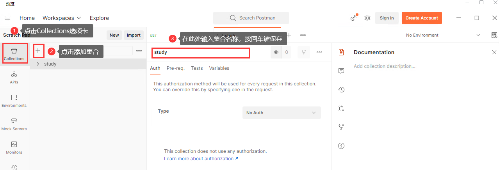
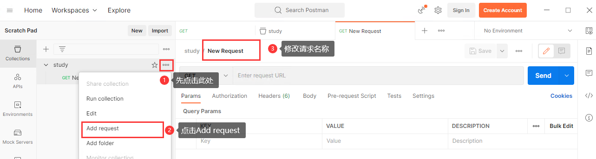

# Postman学习

## postman的简介和安装

Postman 是一个流行的 API 测试和开发工具，可用于设计、测试和调试 RESTful API。它提供了一个易于使用的界面，可让用户轻松创建和发送 HTTP 请求，以及查看和分析响应。

**安装：**

前往 [Postman 官网](https://www.postman.com/downloads/) 下载适合操作系统的 Postman 安装程序，双击安装程序，按照提示进行安装。

**简介：**

Postman 具有以下主要功能：

- 轻松创建请求：Postman 提供了一个易于使用的界面，可让您轻松创建 HTTP 请求。您可以选择请求方法、指定请求头和正文，设置请求参数等。

- 发送请求：使用 Postman，您可以轻松地发送 HTTP 请求并查看响应。它还提供了其他功能，如自动化测试脚本和支持环境变量等。

- 测试和分析响应：Postman 允许您测试和分析 API 响应。您可以使用测试脚本来自动化测试，还可以查看响应的 JSON 格式、头信息和其他详细信息

## Postman基本操作

### 请求与响应

#### 创建请求

- 新建一个集合

- 在新建的集合中，新建一个请求

- 