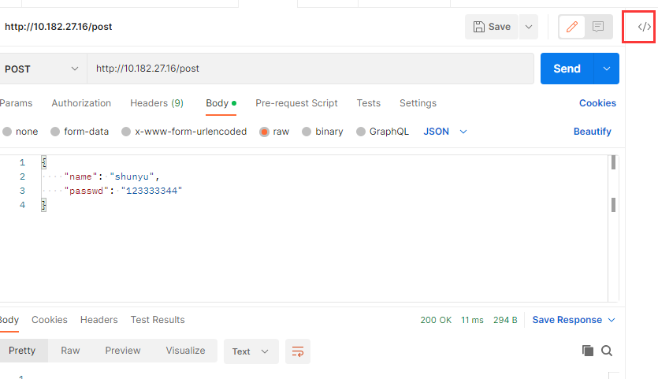
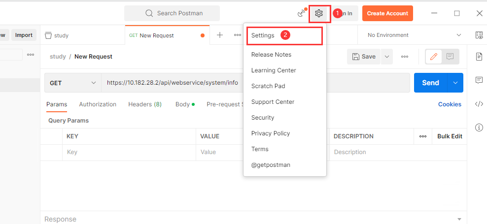
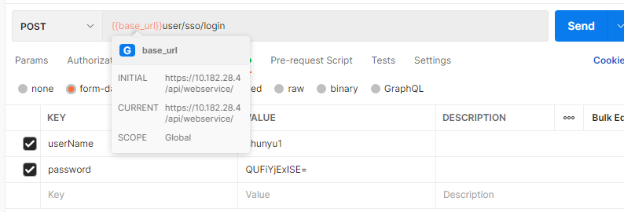

# Postman学习

## postman的简介和安装

Postman 是一个流行的 API 测试和开发工具，可用于设计、测试和调试 RESTful API。它提供了一个易于使用的界面，可让用户轻松创建和发送 HTTP 请求，以及查看和分析响应。

**安装：**

前往 [Postman 官网](https://www.postman.com/downloads/) 下载适合操作系统的 Postman 安装程序，双击安装程序，按照提示进行安装。

**简介：**

Postman 具有以下主要功能：

- 轻松创建请求：Postman 提供了一个易于使用的界面，可让您轻松创建 HTTP 请求。您可以选择请求方法、指定请求头和正文，设置请求参数等。

- 发送请求：使用 Postman，您可以轻松地发送 HTTP 请求并查看响应。它还提供了其他功能，如自动化测试脚本和支持环境变量等。

- 测试和分析响应：Postman 允许您测试和分析 API 响应。您可以使用测试脚本来自动化测试，还可以查看响应的 JSON 格式、头信息和其他详细信息

## Postman基本操作

### 请求与响应

**创建请求**

- 新建一个集合


- 在新建的集合中，新建一个请求


**请求区域介绍**


1. URL输入框：在 URL 输入字段中输入时，Postman 将显示一个下拉列表，其中包含以前的历史记录
2. 请求方法下拉框
3. Params：用于设置查询参数，查看参数可以将数据附加在URL中，通过`?`分隔


4. Headers：可以设置请求头，Postman 会根据请求的选择和设置自动将某些标头添加到请求中
5. Body：请求体，可以设置不同类型的请求体格式
   - 表单数据（form-data）：对应请求头 Content-Type 值为 multipart/form-data。用于在请求中传递键值对，通常用于上传文件和提交 HTML 表单。
   - URL 编码数据（x-www-form-urlencoded）：对应请求头 Content-Type 值为 application/x-www-form-urlencoded。用于在请求中传递键值对，Postman 将自动将键值对编码为 URL 编码格式。
   - 原始文本（raw）：对应请求头 Content-Type 值为文本类型，如 text/plain、application/json、application/xml 等。支持发送文本、JSON、XML 和 HTML 数据。您可以指定数据的 MIME 类型，并在请求体中输入文本。
   - 二进制数据（binary）：对应请求头 Content-Type 值为请求中指定的 MIME 类型，如 image/png、application/pdf 等。用于在请求中上传二进制数据，例如图像或 PDF 文档。
   - GraphQL：对应请求头 Content-Type 值为 application/json。用于向 GraphQL API 发送请求。Postman 提供了专门的 GraphQL 界面，以便轻松构建 GraphQL 请求。
6. Pre-requerst script：允许在发送请求之前执行自定义 JavaScript 代码，该脚本可以对请求进行修改或添加自定义逻辑
7. test：它允许在发送请求之后执行自定义 JavaScript 代码，以验证响应的正确性和完整性。Test 选项卡中的脚本可以使用 Postman 提供的预置变量和函数来访问响应信息，并根据需要执行测试和断言。
8. setting：提供了一些有用的设置选项，如SSL、重定向等

**响应区域介绍**


1. Body：Body是请求响应的主体，Postman提供了3种视图来查看响应主体，分别为Pretty、Raw、Preview。
   - Pretty视图格式化显示JSON或XML响应体，以方便查看。
   - Raw 视图显示的是 HTTP 响应报文的原始文本
   - Preview视图将响应呈现在一个iframe沙箱中，如果API服务端返回一个图像，Postman将自动检测并呈现它。对于二进制响应类型，用户应该选择“发送和下载”，这样可以保存响应到硬盘，然后可以使用适当的查看器查看它。该功能使用户能够灵活地测试音频文件、PDF文件、ZIP文件，以及任何API抛出的内容。
2. Cookies：显示了请求所接收的所有 Cookie
3. Headers：显示了响应头
4. Test result：展示该请求所有测试项的本次运行结果
5. 响应状态信息：响应状态信息包括响应状态码、响应时长和响应体大小


### 发送GET/POST/PUT/DELETE请求

**发送GET请求**

查询参数会以键值对的形式附加到请求 URL 的末尾以`?`分隔，每个键值对之间使用`&`分隔


**发送post请求**

body类型为表单数据时使用from-data


body类型为json数据时，使用raw的json类型，点击Beautify可以格式化字符串


**发送PUT请求**


**发送DELETE请求**


### Cookie

在Postman中，可以使用Cookies来模拟网站上的用户登录状态和保存用户身份验证令牌

**cookie管理器**

发送单点登录请求，点击cookies


**管理 Cookie**窗口显示域列表以及与每个域关联的 cookie


**创建cookie**

要为域添加新 cookie，请选择域下方的**+ 添加 Cookie 。**将创建一个符合[HTTP 状态管理标准](https://datatracker.ietf.org/doc/html/rfc6265#section-4.1)的预生成 cookie 字符串。

```
<cookieName>=<cookieValue>; path=/; domain=.domain.com; HttpOnly; Secure; Expires=Tue, 19 Jan 2038 03:14:07 GMT;
```

- **cookieName** , **cookieValue** : cookie 的名称和存储在其中的值。
- **domain**：邮递员将发送 cookie 的域。
- **Path**：cookie 被限制到的 URL 路径。如果路径是`/`，cookie 将被发送到指定域中的所有请求。
- **HttpOnly**：如果存在，则页面上运行的客户端脚本将无法访问 cookie（例如，`document.cookie`在 JavaScript 中）。cookie 只会添加到发出的请求中的 cookie 标头中。该字段对 Postman 的行为没有影响。
- **Secure**：如果存在，cookie 仅在 URL 开头时发送，`https://`并且不会通过不安全的连接发送。
- **Expires**：cookie 过期且不再由 Postman 发送的时间。

**通过请求发送 cookie**

向已添加 cookie 的域发出请求时，cookie 将自动出现在请求头选项卡中。

因此可以在页面登录智源后，通过谷歌的开发者工具的application中获取cookies，然后填入postman的cookie管理器中，就可以实现不登陆但是可以做一些需要登录的请求


### Postman拦截器

使用Postman拦截器

1. 在 Chrome 网上应用店中下载Postman Interceptor（需要科学上网）

2. 在 Postman 页脚中选择 捕获请求
3. 在Capture requests窗口中，选择Via Interceptor选项卡


4. 点击Capture requests就开始拦截谷歌浏览器的请求，并且保存在study这个collections中了

### 生成代码片段

点击postman界面右上角的</>，可以为请求生成各种语言的代码




### Postman相关设置

输入 Postman 在超时前等待响应的时间（以毫秒为单位）,如果为0，表示永不超时




## Postman进接

### 变量

变量是数据的符号表示，无需在需要的任何地方手动输入值即可访问值。如果在多个地方使用相同的值，使用变量会更方便。Postman 中的变量是键值对。每个变量名代表它的键，所以引用变量名可以访问它的值。

#### 变量类型及作用域

Postman 支持不同范围的变量，从最宽到最窄的顺序，这些范围是：*global*、*collection*、*local*。

- **全局变量**：全局变量在整个工作区中都可用。
- **集合变量**：在集合中的所有请求中都可用
- **局部变量**：是在请求脚本中访问的临时变量。局部变量值的范围仅限于单个请求或收集运行，并且在运行完成后不再可用。如果需要一个值来覆盖所有其他变量范围但不希望该值在执行结束后持续存在，则局部变量是合适的。

> 如果在两个不同的作用域中声明了同名变量，则将使用存储在具有最窄作用域的变量中的值

#### 创建变量

##### 创建全局变量

在左侧边栏中选择environments，然后选择Globals，然后就可以添加全局变量了，全局变量需要保存才能生效


##### 创建集合变量

在左侧边栏选择collections，然后选择一个集合，然后选择variables就可以添加集合变量了


##### 通过脚本创建变量

| 方法                     | 用例                        | 例子                                                         |
| :----------------------- | :-------------------------- | :----------------------------------------------------------- |
| `pm.globals`             | 用于定义全局变量。          | `pm.globals.set("variable_key", "variable_value");`          |
| `pm.collectionVariables` | 用于定义集合变量。          | `pm.collectionVariables.set("variable_key", "variable_value");` |
| `pm.variables`           | 用于定义局部变量。          | `pm.variables.set("variable_key", "variable_value");`        |
| `unset`                  | 您可以使用`unset`删除变量。 | `pm.environment.unset("variable_key");`                      |

#### 使用变量

可以使用双花括号来引用整个 Postman 中的变量，运行请求时，Postman 将解析变量并将其替换为当前值。

```js
{{base_url}}
```



#### 在脚本中使用变量

```js
//在脚本中使用局部变量
pm.variables.get("variable_key");
//在脚本中使用全局变量
pm.globals.get("variable_key");
//在脚本中使用集合变量
pm.collectionVariables.get("variable_key");
```

### 编写脚本

Pre-requerst script：允许在发送请求之前执行自定义 JavaScript 代码，该脚本可以对请求进行修改或添加自定义逻辑
test：它允许在发送请求之后执行自定义 JavaScript 代码，以验证响应的正确性和完整性。Test 选项卡中的脚本可以使用 Postman 提供的预置变量和函数来访问响应信息，并根据需要执行测试和断言。

#### postman中脚本的执行顺序

- 与集合关联的预请求脚本将在集合中的每个请求之前运行。
- 与请求关联的预请求脚本将在发送请求之前执行
- 与请求关联的测试脚本将在请求发送后执行
- 与集合关联的测试脚本将在集合中的每个请求之后运行。

#### 编写预请求脚本


```js
// 将字符串转换为json格式
JSON.parse(str)
// 将json格式转换为字符串
JSON.stringify(json_str)
// 打印内容到控制的中
console.log(old_body)
// 获取请求体中的内容
JSON.parse(pm.request.body)
```

#### 编写测试脚本


```js
// 解析响应正文
pm.response.json();

// 断言响应状态码
pm.test("断言响应状态码是200", () => {
  pm.expect(pm.response.code).to.eql(200);
});

// 断言响应体中包含字符串
pm.test("断言响应体中包含字符串", function () {
   pm.expect(pm.response.text()).to.include("10000");
});

// 断言json指定key的值
pm.test("断言success的值true", function () {
    var jsonData = pm.response.json();
    pm.expect(jsonData.success).to.eql(true);
});
```

https://postman.org.cn/writing-scripts/script-references/postman-sandbox-api-reference/#the-pm-object

#### 动态变量

Postman 使用faker库来生成样本数据，包括随机姓名、地址、电子邮件地址等等，可以多次使用这些预定义变量来为每个请求返回不同的值

| 变量名            | 描述                        |
| ----------------- | --------------------------- |
| $randomUUID       | 一个随机的 36 个字符的 UUID |
| $randomIP         | 随机 IPv4 地址              |
| $randomMACAddress | 随机 MAC 地址               |
| $randomProtocol   | 随机互联网协议              |
| $randomCountry    | 随机国家                    |

https://postman.org.cn/writing-scripts/script-references/variables-list/

### 运行集合


