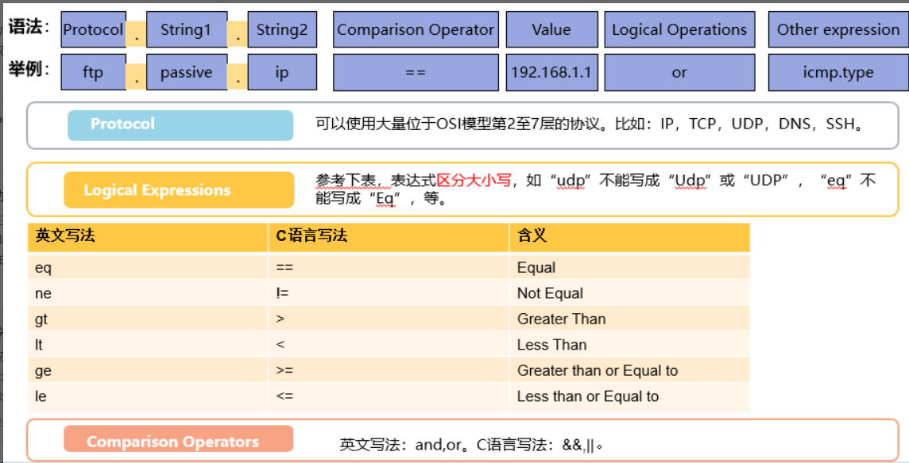

# 抓包和报文回放

### tcpdump

```
-c  在收到指定的数量的分组后，tcpdump就会停止
-e  在输出行打印出数据链路层的头部信息
-i  指定监听的网络接口
-n  不把网络地址转换成名字
-nn 不进行端口名称的转换
-vv 输出详细的报文信息
-w 直接将分组写入文件中，后面跟随文件路径
```


https://blog.csdn.net/ljbcharles/article/details/122256796

[全网最详细的 tcpdump 使用指南 - 王一白 - 博客园 (cnblogs.com)](https://www.cnblogs.com/wongbingming/p/13212306.html)

### wireshark




https://blog.csdn.net/a745233700/article/details/102774703

[网络分析工具——WireShark的使用（超详细）-CSDN博客](https://blog.csdn.net/zzwwhhpp/article/details/113077747)

### tcpreplay

**下载**

```sh
yum install -y tcpreplay
```

**基础使用**

```shell
-i 指定回放接口
--listnics  查看本机有哪些接口
-l, --loop=num


# 基本参数
-q, --quiet: 静默模式，减少输出。
-T, --timer: 选择数据包的定时模式（如 select, ioport, gtod, nano）。
--maxsleep: 设置数据包之间的最大休眠时间（毫秒）。
-v, --verbose: 使用 tcpdump 解码数据包并输出到标准输出。
-A, --decode: 传递给 tcpdump 解码器的参数（需配合 --verbose）。
-K, --preload-pcap: 在发送前将数据包预加载到内存中。
-c, --cachefile: 使用 tcpprep 缓存文件分流（需要 intf2，禁止 dualfile）。
-2, --dualfile: 从网络接口同时重放两个文件（需要 intf2，禁止 cachefile）。
# 网络接口
-i, --intf1: 指定客户端到服务器/主流量输出接口。
-I, --intf2: 指定服务器到客户端/次流量输出接口。
-w, --write: 将流量输出到 pcap 文件（禁止 intf2，可替代 intf1）。
# 数据包选择
--include: 仅发送选定的数据包编号（禁止 exclude）。
--exclude: 发送除选定编号以外的数据包（禁止 include）。
# 循环和速度控制
-l, --loop: 指定循环播放的次数。
--loopdelay-ms: 循环之间的延迟（毫秒，需配合 loop）。
--loopdelay-ns: 循环之间的延迟（纳秒，需配合 loop）。
-L, --limit: 限制发送的数据包数量。
--duration: 限制发送的秒数。
-x, --multiplier: 调整重放速度的倍数。
-p, --pps: 以每秒数据包数重放。
-M, --mbps: 以 Mbps 重放。
-t, --topspeed: 尽可能快地重放数据包。
-o, --oneatatime: 每次用户输入重放一个数据包。
# 其他功能
--unique-ip: 每次循环时修改 IP 地址以生成唯一流（需配合 loop）。
--no-flow-stats: 禁止输出和追踪流量统计。
-P, --pid: 启动时打印 tcpreplay 的 PID。
--stats: 每 X 秒或每次循环打印统计信息。
-W, --suppress-warnings: 禁止打印警告信息。
-V, --version: 打印版本信息。
-h, --less-help: 显示简化使用信息并退出。
-H, --help: 显示详细使用信息并退出。
```

**基本重放**

重放一个 pcap 文件到指定接口：
```bash
tcpreplay --intf1=eth0 capture.pcap
```

**设置重放速度**

以每秒 1000 个数据包的速度重放：
```bash
tcpreplay --intf1=eth0 --pps=1000 capture.pcap
```

**指定循环次数**

将 pcap 文件循环重放 5 次：
```bash
tcpreplay --intf1=eth0 --loop=5 capture.pcap
```

**使用速率倍增器**

以 2 倍速率重放：
```bash
tcpreplay --intf1=eth0 --multiplier=2 capture.pcap
```

**以最大速度重放**

尽可能快地重放数据包：
```bash
tcpreplay --intf1=eth0 --topspeed capture.pcap
```

**预加载到内存**

将数据包预加载到内存中再发送：
```bash
tcpreplay --intf1=eth0 --preload-pcap capture.pcap
```

**解码并输出**

使用 `tcpdump` 解码数据包并输出：
```bash
tcpreplay --intf1=eth0 --verbose --decode="-n" capture.pcap
```

**仅发送特定数据包**

发送特定编号的数据包：
```bash
tcpreplay --intf1=eth0 --include=1,3,5 capture.pcap
```

这些示例可以帮助你快速上手 `tcpreplay`，根据你的需求调整参数即可实现不同的重放场景。

#### 使用tcprewirte

```shell
# 修改IP
tcprewrite --infile=input.pcap --outfile=output.pcap --dstipmap=old_ip:new_ip
tcprewrite --infile=input.pcap --outfile=output.pcap --srcipmap=old_ip:new_ip

# 修改mac
tcprewrite --infile=input.pcap --outfile=output.pcap --enet-dmac=new_mac
tcprewrite --infile=input.pcap --outfile=output.pcap --enet-smac=new_mac

# 修改port
tcprewrite --infile=input.pcap --outfile=output.pcap --dstportmap=old_port:new_port
tcprewrite --infile=input.pcap --outfile=output.pcap --srcportmap=old_port:new_port

# 交换源目的IP地址以及端口号
tcprewrite --infile=input.pcap --outfile=output.pcap --endpoints=swap
```

[Tcpreplay 、tcpprep、tcprewrite 修改报文使用教程-CSDN博客](https://blog.csdn.net/abcdu1/article/details/121126129)

#### tcpreplay 只能使用一个cpu，应该增怎增加回放性能

```
是的，`tcpreplay` 默认情况下只会使用**单个 CPU 核心**，因为它是一个单线程应用程序。这意味着在发送大量数据包时，`tcpreplay` 的性能可能会受到单个 CPU 核心的限制，尤其是在高速率重放（如 10Gbps 或更高）时。

---

### **原因：单线程设计**
`tcpreplay` 的设计是单线程的：
- 数据包的读取、处理（如校验和修复）、发送等任务都在单个线程中完成。
- 这种设计简单且高效，但无法充分利用多核 CPU 的并行计算能力。

---

### **如何优化性能：多核场景的解决方案**

如果需要更高的性能或者想要利用多核 CPU，可以考虑以下方法：

---

#### **方法 1: 使用 `tcpreplay` 的多任务模式（`tcpreplay-edit` + 多实例）**
虽然 `tcpreplay` 本身不支持多线程，但你可以**手动分割 `.pcap` 文件**，让不同的 `tcpreplay` 实例分别在不同的 CPU 核心上运行。

##### **步骤：**
1. **分割 `.pcap` 文件**：
   可以使用 `editcap` 工具（来自 Wireshark 套件）将 `.pcap` 文件分割为多个子文件：
   ```bash
   editcap -c 1000 input.pcap output_part_%d.pcap
   ```
   - `-c 1000`：每个子文件包含 1000 个数据包。
   - `output_part_%d.pcap`：生成多个 `.pcap` 文件，如 `output_part_1.pcap`、`output_part_2.pcap` 等。

2. **运行多个 `tcpreplay` 实例**：
   启动多个 `tcpreplay` 实例，并将每个实例绑定到不同的 CPU 核心。例如：
   ```bash
   taskset -c 0 tcpreplay -i eth0 output_part_1.pcap &
   taskset -c 1 tcpreplay -i eth0 output_part_2.pcap &
   ```

   - `taskset -c 0`：将第一个实例绑定到 CPU 核心 0。
   - `taskset -c 1`：将第二个实例绑定到 CPU 核心 1。

3. **同步发送速率**：
   确保多个实例的发送速率一致（通过 `--pps`、`--mbps` 或 `--rate` 参数）。

---

#### **方法 2: 使用 `tcpreplay` 的 `--netmap` 模式（需要网卡支持）**
如果你的网络接口支持 **netmap**（一种高性能网络框架），可以启用 `--netmap` 模式。`netmap` 模式能够提升 `tcpreplay` 的效率，但仍然是单线程运行，不过由于绕过内核网络栈，性能会显著提升。

##### **命令示例：**
​```bash
tcpreplay --netmap -i netmap:eth0 test.pcap
​```

---

#### **方法 3: 使用更高性能的替代工具**
如果 `tcpreplay` 的单线程性能不能满足需求，可以考虑其他支持多核或高性能的工具，例如：

1. **[MoonGen](https://github.com/emmericp/MoonGen)：**
   - 一个高性能的 Lua 脚本化数据包生成器，基于 `DPDK`。
   - 支持多核 CPU，并可以以线速生成或重放数据包。

2. **[DPDK Traffic Generator](https://www.dpdk.org/)：**
   - 基于 Intel DPDK 的高性能流量生成框架。
   - 支持多核并行处理，专门为高带宽场景设计。

3. **Pktgen-DPDK：**
   - 一个高性能数据包生成和重放工具，支持多核 CPU 和硬件加速。

---

#### **方法 4: 提高单线程性能**
如果你无法使用多核工具，也无法拆分 `.pcap` 文件，可以尝试优化单线程性能：

1. **优化发送速率：**
   - 使用 `--mbps` 或 `--pps` 参数精确控制发送速率，避免 CPU 过载。
   - 示例：
     ```bash
     tcpreplay --mbps=10 -i eth0 test.pcap
     ```

2. **关闭校验和修复：**
   - 如果不需要校验和修复，可以禁用这项功能，以减少 CPU 的负担：
     ```bash
     tcpreplay --no-csum-check -i eth0 test.pcap
     ```

3. **使用更高性能的硬件：**
   - 确保网卡和 CPU 性能足够高，使用支持高速网络的硬件（如 10Gbps/25Gbps 网卡）。

---

### **总结**
- **`tcpreplay` 默认是单线程的，只会使用一个 CPU 核心。**
- 如果需要利用多核 CPU，可以通过以下方式：
  1. **分割 `.pcap` 文件**，运行多个 `tcpreplay` 实例，手动实现多线程效果。
  2. 使用支持高性能网络的工具（如 `MoonGen` 或 `DPDK`）。
  3. 启用 `--netmap` 模式（如果网卡支持）。
  
对于普通场景，分割文件+多实例运行是最简单的解决方法，而对于高性能网络需求，考虑切换到 DPDK 或 MoonGen 等专业工具。
```

### goreplay

- Goreplay 是用 Golang 写的一个 HTTP 实时流量复制工具。功能更强大，支持流量的放大、缩小，频率限制，还支持把请求记录到文件，方便回放和分析，也支持和 ElasticSearch 集成，将流量存入 ES 进行实时分析。
- GoReplay 不是代理，而是监听网络接口上的流量，不需要更改生产基础架构，而是在与服务相同的计算机上运行 GoReplay 守护程序。
- GoReplay 是一个用于捕获和重放 HTTP 流量的工具。以下是一些常用参数的解释：

#### 常用参数

- **`-input-raw`**: 捕获指定端口的流量（需要 sudo 权限）。
  
  ```bash
  gor --input-raw :8080 --output-http http://staging.com
  ```
```
  
- **`-output-http`**: 将请求转发到指定 HTTP 地址。
  ```bash
  gor --input-raw :80 --output-http http://staging.com
```

- **`-http-allow-url`**: 使用正则表达式过滤 URL。
  ```bash
  gor --input-raw :8080 --output-http staging.com --http-allow-url ^www.
  ```

- **`-http-rewrite-url`**: 根据映射重写请求 URL。
  ```bash
  gor --input-raw :8080 --output-http staging.com --http-rewrite-url /v1/user/([^\/]+)/ping:/v2/user/$1/ping
  ```

- **`-http-set-header`**: 为 HTTP 请求注入额外的头。
  
  ```bash
  gor --input-raw :8080 --output-http staging.com --http-set-header 'User-Agent: Gor'
```
  
- **`-output-file`**: 将请求写入文件。
  ```bash
  gor --input-raw :80 --output-file ./requests.gor
  ```

- **`-input-file`**: 从文件读取请求。
  ```bash
  gor --input-file ./requests.gor --output-http staging.com
  ```

- **`-input-file-loop`**: 循环读取文件中的内容
  
- **`-split-output`**: 将流量均匀分配到所有输出。
  
  ```bash
  gor --input-raw :80 --output-http staging1.com --output-http staging2.com --split-output true
```
  
- **`-verbose`**: 设置详细级别，打开调试输出。
  ```bash
  gor --input-raw :80 --output-http staging.com --verbose 1
  ```

#### 过滤和修改

- **`-http-allow-header`**: 过滤符合正则表达式的 HTTP 头。
- **`-http-disallow-header`**: 过滤不符合正则表达式的 HTTP 头。
- **`-http-allow-method`**: 允许的 HTTP 方法白名单。

#### 性能和调试

- **`-http-pprof`**: 启用性能分析。
- **`-stats`**: 打开队列统计输出。

这些选项可以帮助你灵活地捕获和重放 HTTP 流量，同时进行过滤和修改，以便在不同环境中测试应用程序。

[HTTP流量拷贝测试神器GoReplay_goreplay 响应结果对比-CSDN博客](https://blog.csdn.net/cjf_iceking/article/details/121436093)

#### 使用goreplay怎么回放那些和服务端有交互的流量

```
当使用 **GoReplay** 回放报文时，如果需要回放那些和服务端有交互的请求（例如请求需要服务端返回特定的响应，或者基于服务端响应继续发送下一个请求），需要注意以下几点：

---

## **1. 理解 GoReplay 的回放机制**
GoReplay 的回放主要基于捕获的请求数据，而不是直接模拟完整的客户端-服务端交互流程：
- **默认行为**：GoReplay只会重放捕获的流量（通常是 HTTP 请求）到目标服务器，而不会主动等待或处理服务端的响应。
- **有状态交互**：如果捕获的流量是有状态的（比如登录请求和后续的操作请求），需要确保捕获的请求顺序正确，并且服务端的状态能够匹配这些请求。

因此，要正确回放与服务端交互的报文，必须在以下几个方面做额外的准备工作。

---

## **2. 捕获流量时的注意事项**
为了保证回放的流量能够正确模拟客户端与服务端的交互，捕获数据时需要注意以下几点：

### **2.1 捕获完整的会话**
确保捕获数据时，包含了所有与服务端交互的完整请求流（包括可能的登录、认证请求，后续的业务交互请求等）。可以使用以下方式：
- **使用 GoReplay 捕获流量**：
  ```bash
  gor --input-raw :80 --output-file requests.gor
  ```
  - `--input-raw :80`：捕获端口 `80` 上的流量（可以更改为你的服务端口）。
  - `--output-file requests.gor`：将捕获的流量保存到文件中。

- **使用代理工具捕获（如 mitmproxy 或 tcpdump）**：
  如果流量是 HTTPS，可以使用代理工具（如 `mitmproxy`）或流量捕获工具（如 `tcpdump`）解密并保存流量。

---

## **3. 回放流量时的注意事项**
在重放捕获的数据时，为了正确模拟服务端交互，需要以下配置：

### **3.1 确保目标服务与捕获时的环境一致**
- 服务端的状态（如数据库、缓存、认证系统等）应该尽可能与捕获流量时一致。否则，回放的请求可能会失败。
- 如果请求涉及到会话或 token（如 JWT），这些可能需要动态生成或提前准备好。

---

### **3.2 回放流量到目标服务器**
使用 GoReplay 将捕获的流量回放到目标服务器：

#### **基本回放命令**
​```bash
gor --input-file requests.gor --output-http "http://<target-server>:<port>"
​```
- `--input-file`：指定捕获的流量文件。
- `--output-http`：指定目标服务器的地址。

#### **示例**
如果目标服务器运行在 `http://127.0.0.1:8080`，命令如下：
​```bash
gor --input-file requests.gor --output-http "http://127.0.0.1:8080"
​```

---

### **3.3 处理有状态请求**
如果流量依赖于服务端的状态（例如，登录后才能发送其他请求），有以下几种方法：

#### **1. 确保服务端状态匹配**
- **方法**：在重放之前，预先配置服务端的状态，使其与捕获流量时一致（例如，创建相同的用户、会话或 token）。
- **适用场景**：简单的测试环境，状态可以手动设置。

#### **2. 使用响应动态处理**
如果捕获的流量需要依赖服务端的响应（例如，获取动态 token 或 session ID），则需要处理服务端响应并动态调整后续请求。

GoReplay 默认不处理服务端的响应，但可以通过以下方式实现：

##### **使用 `--output-http-track-response` 参数捕获响应**
在回放时，使用 `--output-http-track-response` 参数，让 GoReplay 收集服务端的响应：
​```bash
gor --input-file requests.gor --output-http "http://127.0.0.1:8080" --output-http-track-response
​```

##### **处理响应的插件**
如果服务端返回的响应需要用在后续请求中（如动态 token），可以通过编写插件来处理。GoReplay 支持将流量输出到插件或自定义脚本，例如：

- 输出到一个脚本处理：
  ```bash
  gor --input-file requests.gor --output-http "http://127.0.0.1:8080" --middleware "python your_script.py"
  ```
  - `your_script.py` 是你编写的处理逻辑，可以解析服务端的响应，并动态生成后续请求。

---

### **3.4 模拟多客户端并发请求**
如果需要模拟多个客户端的并发请求，可以使用 `--output-http-workers` 参数增加并发数：
​```bash
gor --input-file requests.gor --output-http "http://127.0.0.1:8080" --output-http-workers 10
​```
- `--output-http-workers 10`：使用 10 个并发工作线程发送请求。

---

## **4. 常见问题及解决方法**

### **4.1 服务端返回 401/403（认证失败）**
- **原因**：捕获的流量可能包含过期的会话 token 或 cookie。
- **解决方法**：
  1. 确保服务端的状态与捕获时一致。
  2. 如果 token 动态生成，使用插件或脚本动态更新请求中的 token。

---

### **4.2 请求顺序不一致**
- **原因**：GoReplay 默认不会保证按捕获顺序重放请求。
- **解决方法**：启用顺序保证：
  ```bash
  gor --input-file requests.gor --output-http "http://127.0.0.1:8080" --input-file-loop false
  ```

---

### **4.3 动态响应依赖**
- **问题**：服务端返回的响应需要在后续请求中使用（例如 CSRF token、会话 ID）。
- **解决方法**：使用插件或脚本处理服务端响应，动态生成请求。

---

## **5. 总结**
- **完整交互的核心**：捕获完整会话、预先保证服务端状态一致。
- **动态处理需求**：结合 `--output-http-track-response` 和插件处理服务端响应。
- **并发与顺序控制**：使用 `--output-http-workers` 控制并发，使用 `--input-file-loop` 确保顺序。

通过这些配置，GoReplay 可以重放那些与服务端有交互的报文，从而更好地模拟真实环境中的请求流量。
```

#### goreplay控制发送速度

```
在使用 GoReplay 回放 HTTP 请求时，您可以通过以下参数控制发送请求的速度。这些参数允许您精确模拟不同的回放速率，例如固定速率、实时速率或加速速率。

---

## **控制 HTTP 请求发送速度的参数**

### **1. `--input-raw-track-response`**
GoReplay 提供了多种方式来调整发送速率，具体选项如下：

---

#### **1.1 实时回放：`--input-raw-real-time`**
如果您希望以 **捕获时的真实时间间隔**来回放流量，可以使用 `--input-raw-real-time` 参数。

##### **示例：**
​```bash
gor --input-file requests.gor --output-http "http://127.0.0.1:8080" --input-raw-real-time
​```

- **效果**：按照捕获流量时的时间间隔发送请求。
- **适用场景**：需要精确模拟生产环境的请求序列和间隔。

---

#### **1.2 固定速率回放：`--input-raw` + `--output-http-workers`**
如果您希望以固定速率发送请求，可以通过 `--output-http-workers` 参数设置并发工作线程数来间接控制速率。

##### **示例：**
​```bash
gor --input-file requests.gor --output-http "http://127.0.0.1:8080" --output-http-workers 10
​```

- **效果**：使用 10 个并发线程发送请求。
- **适用场景**：需要模拟一定量的并发 HTTP 请求。

> **注意**：此方法不直接控制每秒发送的请求数，而是通过增加并发线程来提高总的发送速率。

---

#### **1.3 按捕获时的时间间隔加速回放：`--input-raw-playback-speed`**
如果您希望按捕获时的时间间隔加速或减速发送请求，可以使用 `--input-raw-playback-speed` 参数。

##### **示例：**
​```bash
gor --input-file requests.gor --output-http "http://127.0.0.1:8080" --input-raw-playback-speed 2
​```

- **参数说明**：
  - `--input-raw-playback-speed 2`：以捕获速率的 2 倍速度回放流量。
  - `--input-raw-playback-speed 0.5`：以捕获速率的 0.5 倍速度回放流量（放慢一半）。

- **适用场景**：需要模拟更快或更慢的流量回放场景。

---

#### **1.4 限制每秒发送请求数：`--output-http-ratelimit`**
如果希望精确限制每秒发送的请求数，可以使用 `--output-http-ratelimit` 参数。

##### **示例：**
​```bash
gor --input-file requests.gor --output-http "http://127.0.0.1:8080" --output-http-ratelimit 100
​```

- **参数说明**：
  - `--output-http-ratelimit 100`：限制每秒最多发送 100 个 HTTP 请求。

- **适用场景**：需要精确模拟固定的请求速率。

---

### **2. 多参数组合使用**
在一些场景下，您可能需要同时控制速率、并发和时间间隔。例如：
- 按照捕获时间的真实间隔发送请求，但限制并发线程数。
- 以固定速率发送请求，并使用多个工作线程。

以下是一些组合使用的示例：

---

#### **2.1 实时回放并限制速率**
模拟捕获时的真实时间间隔，但限制每秒最多发送 50 个请求：

​```bash
gor --input-file requests.gor --output-http "http://127.0.0.1:8080" --input-raw-real-time --output-http-ratelimit 50
​```

---

#### **2.2 加速回放并限制并发**
以捕获时间间隔的 2 倍速度回放流量，同时限制并发线程数为 5：

​```bash
gor --input-file requests.gor --output-http "http://127.0.0.1:8080" --input-raw-playback-speed 2 --output-http-workers 5
​```

---

#### **2.3 固定每秒请求数并允许高并发**
模拟每秒发送 200 个请求，允许最多使用 20 个并发线程：

​```bash
gor --input-file requests.gor --output-http "http://127.0.0.1:8080" --output-http-ratelimit 200 --output-http-workers 20
​```

---

## **常见问题及解决方法**

### **1. 请求速率过高导致服务端崩溃**
- **原因**：速率设置过高，超过了服务端的处理能力。
- **解决方法**：
  1. 降低请求速率：`--output-http-ratelimit`。
  2. 减少并发线程数：`--output-http-workers`。

---

### **2. 请求间隔不符合预期**
- **原因**：未设置 `--input-raw-real-time` 或未正确使用时间间隔控制参数。
- **解决方法**：
  1. 使用 `--input-raw-real-time` 模拟真实时间间隔。
  2. 使用 `--input-raw-playback-speed` 调整播放速度。

---

### **3. 请求速率不够快**
- **原因**：并发线程数不足或速率限制过低。
- **解决方法**：
  1. 增加并发线程数：`--output-http-workers`。
  2. 提高速率限制：`--output-http-ratelimit`。

---

## **总结**
在 GoReplay 中，可以通过以下参数控制发送 HTTP 请求的速度：
1. `--input-raw-real-time`：模拟捕获时的真实时间间隔。
2. `--output-http-ratelimit`：限制每秒请求数。
3. `--input-raw-playback-speed`：加速或减速回放。
4. `--output-http-workers`：控制并发线程数。

根据测试需求，组合使用这些参数可以精确控制请求发送的速率和间隔。例如：
​```bash
gor --input-file requests.gor --output-http "http://127.0.0.1:8080" --output-http-ratelimit 100 --output-http-workers 10
​```

通过这些参数，您可以模拟各种流量模式，从而更好地测试目标服务的性能和稳定性。
```

