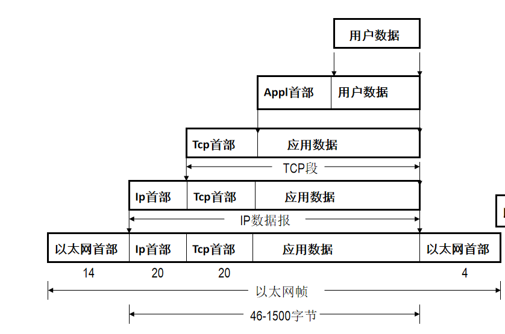

# 第一章 概述

[3.1 HTTP 常见面试题 | 小林coding (xiaolincoding.com)](https://xiaolincoding.com/network/2_http/http_interview.html)

## 1.1 OSI七层协议：

应用层：网络应用，通过应用进程的交互提供网络服务

表示层：格式转换，数据的加密解密

会话层：建立、维持和终止会话

传输层：提供进程之间的数据传输服务

网络层：提供主机之间的数据传输服务，解决分组在多个网络上的传输（路由）的问题

数据链路层：解决分组在一个网络上或者一段链路上的传输问题，接受物理层的比特率形成帧交付上层，并有差错控制提供可靠传输

物理层：屏蔽传输媒介的差异、为数据链路层提供透明的比特流传输

## 1.2 封装和解封装

封装：发送端在传输信息的过程中每经过一层就需要加上这一层的首部或者尾部

解封装：接收方在接收信息时每经过一层就去掉这层的首部或者尾部，在解析后交付到相应的上层

## 1.3  C/S、B/S和P2P模式

C/S：（客户机/服务器模式）分为客户机和服务器两层：第一层是在客户机系统上结合了表示与业务逻辑，是用户表示层；第二层是通过网络结合了数据库服务器，是数据库层。用户使用时一定要下载客户端。

优点：

1、由于客户端和服务器直接相连，点对点的模式使得更安全，响应速度更快且流量更少；

2、客户端有一套完整应用程序，可以为服务器分担一些工作；

3、客户端操作界面可以随意排列，充分满足客户的需要，展现特点与个性。

缺点：

1、客户方面：需要安装客户端应用，后期更新也需要重新安装，既占用内存又消耗流量；

2、服务方：需要针对用户不同的型号的设备开发不同版本的客户端软件，升级维护更加的麻烦，用户变多时服务器压力变大。

B/S架构：浏览器/服务器架构有三层，第一层表现层：也就是浏览器，主要完成用户和后台的交互及最终查询结果的输出功能。第二层逻辑层：也就是服务器，主要是利用服务器完成客户端的应用逻辑功能。第三层数据层：也就是数据服务器，主要是接受客户端请求后独立进行各种运算。B/S系统统一了客户端，无需特殊安装，拥有Web浏览器即可；它将系统功能实现的核心部分集中到服务器上，简化了系统的开发、维护和使用。可以在服务器上安装数据库，然后浏览器通过mysql等数据库来进行数据的交互。

优点：无需安装客户端，只需浏览器就可以，开发界面相对简单，方便扩展，更新维护时只需要升级服务器；

缺点：用户量增多时，响应速度会下降，甚至崩溃

B/S架构和C/S架构的区别是什么-常见问题-PHP中文网

P2P架构：是两个或多个客户端不经过服务器而直接通信，不区分客户端和服务器。

优点：去中心化不需要服务器节约成本，没有单点故障的问题，可扩展性强

缺点：难以管理

---

# 第二章 数据链路层

## 2.1 以太网帧格式

- 基本帧的大小为64-1518个字节；由于数据在信道中的传输有延时，如果帧太小容易误检测为没有冲突

- 类型字段：用于确定后面的头部类型，ipv4为0x0800，ipv6为0x08DD，ARP为0x0806

- 帧尾：使用循环冗余检验（CRC）来检验差错，检验出来有错误就一定有错误，没有检测出来不代表没有错误

- MAC地址：16进制MAC地址中的第二个数，为奇数，表示组播；为偶数，表示单播；全F为广播

- 前导码：用来使接收端在接收MAC帧时能够迅速调整频率，它和发送端相同。前同步码为7个字节，1和0交替。

- 定界符：帧的起始符，为1个字节。前6位1和0交替，最后的两个连续的1

- 透明传输：帧使用首部和尾部进行定界，如果帧的数据部分含有和首部尾部相同的内容，那么帧的开始和结束位置就会被错误的判定。需要在数据部分出现首部尾部相同的内容前面插入转义字符。如果数据部分出现转义字符，那么就在转义字符前面再加个转义字符。

## 2.2 PPP协议

ppp协议是点到点(一根链路两端只有两个接口)链路层协议，主要用于在全双工的同异步链路上进行点到点的数据传输。

## 2.3 冲突域和广播域

冲突域：同一时间内只能有一个节点发送信息的范围。在物理层，可以通过交换机、网桥和路由器隔离冲突域；通过集线器和中继器在扩大冲突域

广播域：如果站点发出一个广播信号，所有能接收收到这个信号的设备范围称为一个广播域。在数据链路层，可以通过路由器和三层交换机隔离广播域，或者通过设置VLAN隔离广播域；可以通过交换机或者网桥扩大广播域

## 2.4 CSMA/CD

CSMA/CD（多点接入载波监听/冲突检测）：载波监听就是检测信道上有没有其他的设备正在传输数据；碰撞检测就是一边传输数据一边监听信道，当监听到冲突之后就会立即停止传输信息，并通过二进制指数退避算法来确定重传时机。如果经过了一个往返时间2t的争用期还没有发生冲突就不会发生冲突了。

二进制指数退避算法：

1. 从离散的集合[0,1,2,3,……，2^k-1]中随机选择一个数记为r，重传推后的时间就是r倍的争用期，k为重传的次数

1. 当重传次数不超过10时，参数k的值等于重传次数，当重传次数超过10，k就不在增大一直等于10。

1. 当重传16次后仍然不成功时，则丢弃该帧，并向高层报告

## 2.5 集线器和交换机以及转发流程

集线器：工作在物理层，逐比特转发；有对衰减的信号再生并且放大信号，扩大网络传输距离的功能，并且可以将不同介质的网络连接在一起；但是再生信号的同时也增加了时延，当网络中的流量负荷很重时，可能因为缓冲区的存储空间不够而发生溢出导致丢帧的现象；在线路上传输的过程中会导致信号衰减，当衰减到一定程度时可能会导致信号失真。

交换机：工作在数据链路层；作用：1、通过MAC地址寻址2、自学习和维护转发表3、通过转发表进行存储转发

转发过程：PC_A  PC_B

1. 当PC_A的MAC地址不在转发表中时，转发表记录PC_A的MAC地址和相应的端口号；

1. 当PC_B的MAC地址不在转发表中时（若有则直接转发），交换机把PC_A发送的帧从所有的其他端口中发出，只有MAC地址和自己相匹配的主机也就是PC_B会接收此数据，其他不匹配的主机直接丢弃

## 2.6 VLAN

VLAN（虚拟局域网）：是一种将局域网内的设备划分成为与物理位置无关的逻辑组的技术。

VLAN标记：前2个字节取固定值0x8100，标记VLAN Tag；后面两个字节的前三个字节表示优先级，第四位固定为0，最后12个比特为VLAN ID 0-4095，但是实际只能取1到4094

PVID:端口上的缺省VLAN ID

访问链接（Access Link）：指的是“只属于一个VLAN，且仅向该VLAN转发数据帧”的端口

接收帧时

- 当没有Tag，接收该帧并打上该接口的PVID的Tag

- 如果有Tag，比较该帧的VLAN ID和该接口的PVID是否相同，相同时接收该帧，不同时丢弃该帧

发送帧时

- 如果该帧的VLAN ID与接口的PVID相同，则去掉该帧的Tag，并将其从接口发出；如果不相同时禁止从该口发出

汇聚链接(Trunk Link)：指的是能够转发多个不同VLAN的通信的端口，默认PVID的值为1

接收帧时

- 当没有Tag时，接收该帧并打上该接口的PVID的Tag

- 当有Tag时，如果该端口允许该VLAN ID的帧通过，则接收该帧，否则丢弃

发送帧时

- 当该帧的VLAN ID和该接口的PVID相同时，则去掉Tag在发送，如果不同则不处理直接发送

Hybrid-link:接口也能够允许多个VLAN帧通过并且还可以指定哪些VLAN数据帧被剥离标签

接收帧时：

- 当没有Tag，接收该帧并打上该接口的PVID的Tag

- 如果有Tag，查看该帧的Tag是否在该接口允许通过的Tag表中，如果在，则允许进入，如果不在，则丢弃

发送帧时

- 首先查看该接口的untag表，如果该帧的tag在untag接口中，则剥离该帧的Tag，并发出

- 如果不在untag表中，查看该帧的Tag是否在该接口的Tag表中，如果在，则发出，不在则丢弃

VLAN的转发原理：每个VLAN都有自己的MAC地址转发表

1、根据接收到的以太网帧的源MAC地址和VLAN-ID信息添加或者刷新MAC地址

2、根据目的MAC＋VLAN-ID查找MAC地址表项

- 如果没有匹配项，那么在VLAN－ID对应的VLAN中广播

- 如果有匹配项，那么在直接转发到相应的端口

VLAN 基础知识 - 知乎 (zhihu.com)

## 2.7 环路

环路产生的原因：为了解决网络中的单点故障的问题，需要向网络中提供冗余链路

影响：1、广播风暴；２、重复数据帧；３、MAC地址表的不稳定

解决方法：STP（最小生成树协议）

利用生成树算法、在以太网络中，创建一个以某台交换机的某个端口为根的生成树，自动地在逻辑上阻塞一个或多个冗余端口，避免环路。

消除环路：通过阻断冗余链路来消除网络中可能存在的环路。

链路备份：当活动路径发生故障时， 激活备份链路， 及时恢复网络连通性。

---

# 第三章 网络层

## 3.1 网络层提供的两种服务——虚电路服务和数据报服务

## 3.2 IPv4头部

- 版本号：ipv4为4，ipv6为6

- 头部长度：以1当4个字节，首部最小为20个字节因此这个字段的最小值为5；ipv4的头部被限制为最大60个字节

- 服务类型TOS：

老版本：前三位为优先级从000到111优先级依次提升；位4置1表示最小延时；位5置1表示最大吞吐量；位6置1表示最高可靠性；位7置1表示最小费用；位8无意义强制置0；

新版本：前6位称为DS（区分服务字段）后两位为ECN（拥塞标识字段）

    参考链接：https://blog.csdn.net/qq_45877524/article/details/105003498

- 总长度：通过这个字段可以判断IP数据报的数据部分的开始以及长度，最大为65535字节

- 标识、标志、位偏移来描述分片

标识：唯一地标识主机发送的每一个数据报，其初始值是随机的，每发送一个数据报其值就加1，同一个数据报的所有分片都具有相同的标识值。

标志：位1保留，位2表禁止分片，若设置了此位，IP模块将不对数据报进行分片，在此情况下若IP数据报超过MTU，IP模块将丢弃数据报并返回一个ICMP差错报文；位3标识更多分片，置1表示后面还有分片，置0表示这是最后一个分片。

位偏移：分片相对原始IP数据报数据部分的偏移。实际的偏移值为该值左移3位后得到的，所以除了最后一个IP数据报分片外，每个IP分片的数据部分的长度都必须是8的整数倍

- 生存时间：数据报到达目的地之前允许经过的路由器跳数。TTL值被发送端设置，常设置为64。数据报在转发过程中每经过一个路由该值就被路由器减1.当TTL值为0时，路由器就将该数据包丢弃，并向源端发送一个ICMP差错报文。TTL可以防止数据报陷入路由循环

- 协议：表示数据报的有效载荷的部分的数据类型；如17为UDP，6为TCP，1为ICMP，2为IGMP，89为OSPF

- 头部校验和：仅仅检查IP数据报的头部

- 填充字段：确保首部长度为4字节的倍数

- 可选字段

## 3.3 IP地址分类

- A类地址的私有地址是：10.0.0.0~10.255.255.255

- B类地址的私有地址是：172.16.0.0~172.31.255.255

- C类地址的私有地址是：192.168.0.0~192.168.255.255

- 本地网络中的主机地址（仅作为源IP使用）：0.0.0.0

- 环回地址：127.0.0.0/8

- 受限广播地址：255.255.255.255

参考资料：https://blog.csdn.net/qq_38410730/article/details/80980749

## 3.4 ARP

ARP：实现IP地址到MAC地址的映射

- OP字段:1为ARP请求，2为ARP应答,3为RARP请求，4为RARP应答

- 目的硬件地址：在ARP请求中，还不知道对方主机的目的MAC地址,此处为0

ARP原理：PC1和PC2在同一网段中,PC1要给PC2发送数据报

- 1.PC1查询自己的ARP告诉缓存，查看是否有PC2的IP所对应的MAC地址

- 如果有,则直接转发;如果没有,则发送ARP请求广播：源IP为自己的IP,目的IP为PC2的IP,源MAC为自己的MAC地址,目的MAC为FF-FF-FF-FF-FF-FF

- 同一网络中的其他的主机收到PC1发送的ARP请求，发现IP地址不是自己的直接丢弃;PC2收到后,将PC1的IP和MAC记录到自己的ARP缓存中并向PC1发送ARP响应(单播),告知自己的MAC地址

- PC1收到PC2的ARP响应报文，将其IP和MAC地址添加到自己的ARP缓存中

对不存在的主机进行ARP请求：连续发送三个ARP请求报文,时间间隔和应用相关,ICMP和UDP的间隔时间为5秒,TCP为10秒

免费ARP

作用:1.进行地址冲突检测

 2.更新或者添加同一网段中的其他主机的ARP缓存;主机会通过广播的形式将该请求报文发送给同一网段其他主机,其他主机根据ARP广播更新自己的ARP缓存

- 主机发送ARP请求报文，源和目的IP都为自己的IP地址,源MAC为自己的MAC,目的MAC为FF-FF-FF-FF-FF-FF

- 如果主机收到了ARP应答,则表明IP地址冲突,需要重新配置IP地址

ARP单播：有时候ARP请求的报文指定了目的IP的MAC地址，而且他的目的硬件地址也为对应的MAC地址

因为每隔一段时间,后台进程会考虑移除ARP表中的数据,在移除之前,会发送一条ARP地址解析包,如果在短时间内没有得到回复就删除这个表项.

如果生存时间到了就删除此表项,那么下次请求就需要重新发送广播帧进行请求,会打扰到同一广播域中的其他站点,因此在删除表项前发送一条请求报文来确认一下,如果没有收到回复则证明这个表项中的IP和MAC的对应已经不正确了．

## 3.5 路由表和转发表:

路由表:存储了所有的路由信息,只要路由器上有新生成的路由，就会被存储到路由表中。

Destination:目的网络地址

Gateway:下一跳地址

Genmask:子网掩码

Metric:优先级

Iface:本地接口的名字，分组从哪个接口转发

Flags:U该路由可用;G下一跳地址是路由器;H该路由是到一个主机

转发表:存储了路由表中的最优路由信息,是真正指导数据转发的表,属于路由表的子集

路由优先级:stoneOS和思科,直连为0,静态路由为1,OSPF为110,RIP为120

## 3.6 路由选择协议

RIP：距离矢量路由选择协议,是分布式的，迭代收敛的

- 路由器到直连的网络的距离定义为1

- 到非直连的网络的距离为所经过的路由器数加1

工作过程:

- 路由器在刚开始工作时只知道和自己直连的网络的距离为1

- 每个路由器和相邻路由器周期性的交换并更新路由,使AS内的每个路由器知道自己到达本AS内网络的最短距离和下一跳

路由更新规则:

- 发现了新的网络,添加到路由表

- 目的网络存在,下一跳不相同,新路由权重更好,更新路由

- 目的网络存在,下一跳不相同,新老路由权重一样,添加新路由,作为负载均衡使用

- 目的网络存在,下一跳不相同,老路由权重更好,不更新

- 目的网络存在,下一跳相同,最新权重,更新

特点：好消息传的快，坏消息传得慢

例:A－－－－－B－－－－－C

- 一开始A和B直连,B和C直连,B的路由表中到A的跳数为1,C的路由表中到B的跳数为1,到A的跳数为2,下一跳为B    然后突然A主机关闭

- 由于A180s没有和B交换路由信息,B中的路由表到A的距离为不可达

- 而B和C交换路由信息时得到C到A只需要两条,因此会更新路由表,B到A的路由,为3跳,下一跳为C;

- 然后C和B又一次交换路由信息时,会更新路由表的最新信息,C到A的路由,为4跳,下一跳为B

- 如此反复多次,才会使B和C到A的路由均为16跳,不可达

使用RIP的自治系统中最大的子网数量为25，最大的跳数为16，适用于较小的自治系统。

邻居之间每隔30ｓ或在改变路由或对方请求的情况下交换一次信息，如果超过180ｓ没收到信息则认为此邻居不可达，跳数设置为16。邻居之间交换信息通过UDP实现。

OSPF协议：链路状态路由选择,通告信息通过泛洪的方式传遍整个自治区域，在IP数据报上直接传送OSPF通告

OSPF采用SPF算法计算路由,从算法上保证不会产生路由环路

OSPF之间通过Hello分组来维护和建立邻居关系,hello分组封装在IP数据报中,发往组播地址224.0.0.5,发送周期为10s,40秒未收到邻居的hello分组则认为改邻居路由不可达

层次性OSPF：分为骨干和本地

每个节点仅仅知道本地的链路信息，通往其他区域的节点通过区域边界路由器得知。

区域边界路由器: “汇总（聚集）”到自己区域内网络的距离, 向其它区域边界路由器通告。

骨干路由器：仅仅在骨干区域运行OSPF协议。

OSPF的更新效率更高.收敛速度更快,规模更大

迪杰斯特拉算法：Dijkstra算法基本思想就是每次找到距离源点最近的一个顶点，然后以该顶点为中心进行扩散，最后得到源点到其余所有点的最短路径。

1、将所有顶点分为两部分：已知最短路程的顶点集合P和未知最短路径的顶点集合Q。开始，集合P中只有源点一个顶点。我们用book[i]数组来记录哪些点在集合P中。例如对于某个顶点i，如果book[i]=1，则表示这个顶点在集合P中，如果book[i]=0则表示这个顶点在集合Q中。

2、设置源点s到自己的最短路径为0，即dis=0，若存在源点有能直接到达的顶点i，则把dis[i]设置为e[s][i]。同时把所有其他(源点不能直接到达的)顶点的最短路径设为∞。

3、在集合Q的所有顶点中选择一个离源点s最近的顶点u(即dis[u]最小)加入到集合P中。并考察所有以点u为起点的出边，对每一条边进行松弛操作。例如存在一条从u到v的边，那么可以通过将边u->v添加到尾部来拓展一条从s到v的路径，这条路径的长度是dis[u]+e[u][v]。如果这个值比目前已知的dis[v]的值要小，我们可以用新值来替代dis[v]中的值，否则忽略。

重复step3，如果集合Q为空，则算法结束。最终dis数组中的值就是源点到所有顶点的最短路径。

BGP协议：外部网关协议

eBGP: 从相邻的ASes那里获得子网可达信息

iBGP: 将获得的子网可达信息传遍到AS内部的所有路由器

BGP对等体之间使用TCP传送数据

BGP的目的只是找一条能够到达目的网络且比较好的网络(不能兜圈子),而并非找到一条最佳路由

## 3.7 DHCP

动态主机配置协议:为网络中的设备自动配置IP和其他如子网掩码,DNS服务器IP,默认网关等信息

使用UDP传送源端口为68，目的端口为67

DHCP报文

- OP字段(8位):标识报文的操作类型,1为请求,2为应答

- htype(8位):标识dhcp的MAC地址的类型,通常为以太网为6

- HLEN(8位):用于保存消息传输过程中的中继次数,消息发送方将其设置为0,在每次中继时递增

- 事务ID(32位):客户机选择的一个随机数,用于应答和请求的匹配

- 秒数(16位):表示客户端使用地址所经过的时间

- 标志(16位):第0位为0表示采用单播的方式,第1位表示采用广播的方式

- 客户机IP:如果已知请求者的IP,则填写请求者的IP,否则为0

- 你的IP:由服务器填写,向请求者提供服务器IP

- 中继代理IP:由DHCP中继器填写,客户端发送请求报文后经过的第一个DHCP的IP地址,如果没有则为0

- 客户机硬件地址(128):保存客户机的唯一标识,客户端的MAC地址

- 服务器主机名(64):服务器名称,只有在offer和ack报文中才会有,其他报文中显示0

- 启动文件名(128):服务器为客户端指定的启动配置文件名称以及路径信息

- options:子网掩码,路由器DNS的IP地址,请求的IP以及租约时间等

DHCP中继:可以实现在不同子网和物理网段之间处理和转发DHCP信息的功能。如果DHCP客户机与DHCP服务器在同一个物理网段，则客户机可以正确地获得动态分配的ip地址。如果不在同一个物理网段，广播不能穿过路由器，DHCP不能跨网段操作，则需要DHCP中继代理。

## 3.8 IPv6

IPv6首部

- version(4):版本号固定为6

- Traffic Class(8):通信量,前6位表示优先级,后两位显示拥塞程度

- Flow Label(20):流标识,标识这个数据包属于源节点和目标节点之间的一个特定数据包序列

- Payload Length(16):负载长度,不包括IPv6的首部长度,包括扩展首部和数据长度最大64KB

- Next Header(8):指出下一个扩展首部的类型，如果没有扩展首部的话，这个字段指的是传输层的协议类型

- Hop Limit(8):跳数限制,和IPv4中的TTL类似,没经过一个节点就减1,为0时丢弃

- IPv6的首部固定为40个字节

- IPv6定义的首部字段少,而且首部大小固定,有利于加快路由器处理报文的速度

IPv6地址表示方法

- 首选格式:Pv6的128位地址是按照每16位划分为一段，每段被转换为一个4位十六进制数，并用冒号隔开。2001:0410:0000:0001:0000:0000:0000:45ff/64

- 压缩格式:连续多段0时可以使用::进行压缩

- 每段的前导0必须省略,中间或者后面的不可省略

- 一个IPv6地址中最多使用一个::,::只能使用在最多段0的地方,如果多个段的0的数目相同,则顺序靠前的被替换为::

- a到f使用小写

IPv6地址生成EUI-64格式    例:00-50-3e-e4-4c-00

- 在48位的MAC地址的正中间插入FFFE     0050:3eff:fee4:4c00

- 将插入后的MAC地址的第7位取反    0250:3eff:fee4:4c00

- 最后加上fe80::       fe80::0250:3eff:fee4:4c00

IPv6地址分类:IPv6分为单播、组播和任播

- 单播地址：

- 未指定地址       ::/128   该地址仅用于DAD

- 环回地址         ::1/128 

- 本地链路地址     fe80::/10

- 唯一本地地址     fc00::/7

- 全球单播地址   

- 任播地址  当单播地址被分配给多于一个接口时，该单播地址转化为任播地址；任播地址只能作为目的地址使用；目标地址是任播地址的数据包将发送给其中路由意义上最近的一个网络接口，接收方只需要是一组接口中的一个即可。

- 组播地址  ff00::/8属于组播地址

| 地址类型 | IPv6表示 | 说明 |
| - | - | - |
| 所有节点多播地址 | FF02::1 | 所有节点加入该多播地址组，用于： 路由器发送RA消息； 节点响应DAD报文； 节点主动通告NA报文 |
| 所有路由器多播地址 | FF02::2 | 所有路由器加入该多播地址组，用于节点向路由器发送RS消息来请求RA |
| 被请求节点多播地址 | FF02::1:FFXX:XXXX | 每个单播地址生成一个该多播地址并加入该多播组，低24bit为单播地址的低24bit。用于邻居发现机制 |

NDP邻居发现协议：主要功能有无状态自动配置（简化版的DHCP）；路由器发现、前缀发现、参数发现；重复地址检测（DAD），相当于IPv4的免费ARP；地址解析，相当于IPv4的ARP；邻居不可达检测（NUD）；路由器重定向。

## 3.9 ICMP

### 3.9.1 ICMP主要功能

1.确认IP包是否成功送达目标地址。

2.通知在发送过程当中IP包被废弃的具体原因。

### 3.9.2　ICMP报文封装

- 类型和代码：用来表示报文的具体含义

- 检验和：ICMP的校验和字段将覆盖整个ICMP报文

### 3.9.3 报文分类

ICMP报文一般分为差错报文和信息类报文，一般情况下，传入的信息类请求将被系统自动处理；差错类报文将传递给用户进程或传输层协议

黄色高亮的为IPv6报文    在IPv6中类型0-127为差错报文128-255为信息类报文

| 类型 | 代码 | 规范名称 | 用途 | 类型 | 代码 | 规范名称 | 用途 |
| - | - | - | - | - | - | - | - |
| 0 | 0 | 回显应答 | 回显应答（Ping Reply），返回数据 | 128 | 0 | 回显请求 | PING请求，可能包含数据 |
| 8 | 0 | 回显请求 | 回显请求（Ping Request），数据可选 | 129 | 0 | 回显应答 | PING应答，返回数据 |
| 3 | 1 | 目的主机不可达 | 主机已知，但不可达 | 133 | 0 | 路由器请求（RS) | IPv6 RS和移动IPv6选项 |
| 3 | 3 | 目的端口不可达 | 未知的/不可用的传输端口 | 134 | 0 | 路由器通告（RA) | IPv6 RA和移动IPv6选项 |
| 3 | 4 | 需要分片但不允许分片 | 需要进行分片但被DF位禁止了，被PMTUD使用 | 135 | 0 | 邻居请求（NS) | IPv6邻居发现（请求） |
| 5 | 1 | 主机重定向 | 指示一个可选的路由器（主机） | 136 | 0 | 邻居通告（NA) | IPv6邻居发现（通告） |
| 8 | 0 | 回显请求 | 回显请求（Ping Request），数据可选 | 137 | 0 | 重定向报文 | 使用另一个下一跳路由器 |
| 11 | 0 | 传输期间TTL超时 | 跳数限制/TTL超时 | 1 | 0 |  没有到目的地的路由 |  路由不存在 |
| 12 | 0 | 指针指示差错 | 字节偏移量（指针）指示第一个问题字段 | 1 | 2 |  超出源地址范围 |  目的范围超出源地址范围 |
| 3 | 0 |  传输中超出跳数限制 |  跳数限制字段递减为0 | 1 | 3 |  地址不可达 |  代码0-2不合适时使用 |
| 4 | 0 |  找到错误的头部字段 |  一般的头部处理错误 | 1 | 4 |  端口不可达 |  没有传输层实体在监听端口 |
| 4 | 1 |  无法识别的下一个头部 |  未知的下一个头部字段值 | 2 | 0 |  数据包太大（PTB） |  需要分片 |
| 4 | 2 |  无法识别的IPv6选项 |  未知的逐条或目的地选项 |  |  |  |  |

ICMP差错报文中必须包含IP头部以及原始数据报的前8个字节（目的是为了获取IP头部中的协议字段以及端口号，最终得知是哪个应用进程）

1. 源点抑制：数据包集中到达某一路由器后，数据包因为来不及被处理，有可能被丢弃的情况。这时候，向送信方发送的是ICMP 源点抑制报文，用来使送行方减慢发送速度。

2. 改变路由：指路由器向送信方计算机指示路径改变这个功能。计算机根据自己的路由信息(路由表)来决定传送目标。不知道发给谁好的时候，就将数据包发给设为默认网关的路由器。被指定为默认网关的路由器接收到数据包，发现将数据包发给局域网内的其它路由器会比较快的时候，将这一信息通过ICMP 通知发送方。

ping用来测试两台主机之间的连通性 

traceroute用来跟踪一个分组从源点到终点的路径。Traceroute程序通过向目标发送UDP数据报来实现：首先发送TTL=1的UDP数据报，然后将TTL字段每次加1，以确定路径中的每个路由器。
每个路由器在TTL超时丢弃UDP数据报时都返回一个“ICMP TTL超时”报文，而最终目的主机则产生一个“ICMP端口不可达”报文

## 3.10 NAT

## 第四章 传输层

## 第四章 应用层

---

TCP的头部：

4位头部长度：标识该TCP头部有多少个32bit字（4字节）。因为4位最大能标识15，所以TCP头部最长是60字节，最小为20个字节。

6位标志位包含如下几项：

URG标志：表示紧急指针是否有效。

ACK标志：表示确认号是否有效。

PSH标志：提示接收端应用程序应该立即从TCP接收缓冲区中读走数据，为接收后续数据腾		 出空间。

RST标志：表示要求对方重新建立连接。

SYN标志：表示请求建立一个连接。

FIN标志：表示通知对方本端要关闭连接了。

16位窗口大小：是TCP流量控制的一个手段。它告诉对方自己的TCP接收缓冲区还能容纳多少字节的数据，这样对方就可以控制发送数据的速度。

16位校验和：由发送端填充，接收端对TCP报文段执行CRC算法以检验TCP报文段在传输过程中是否损坏。包括TCP头部，也包括数据部分，这也是TCP可靠传输的一个重要保障。

16位紧急指针：是一个正的偏移量。它和序号字段的值相加表示最后一个紧急数据的下一字节的序号。

UDP的头部：

TCP和UDP的伪首部：

伪首部是为了增加校验和的检错能力：通过伪首部的目的IP地址来检查TCP报文是否收错了、通过伪首部的传输层协议号来检查传输层协议是否选对了。例如同时修改目的IP和IP首部校验和，这样将导致错误的接收方接收到该数据包，因此在TCP的伪首部加上IP地址，可以防止错收报文，因为路由器一般不会修改TCP层的信息

TCP和UDP的区别：

1、TCP是面向连接的，UDP是无连接；

2、对系统资源的要求（TCP较多首部20最少个字节，UDP少首部最少8个字节）；

3、TCP是字节流的传输模式与UDP是数据报的模式 ；

4、TCP保证数据不出错、不丢失、不重复、不乱序并由流量控制拥塞控制，UDP只是尽最大努力交付，没有任何保证；

5、UDP程序结构较简单；

TCP的三次握手：

为什么要三次握手：

为了防止服务器端开启一些无用的连接增加服务器开销。如果只有两次握手，当接收方的确认在网络中丢失时，接收方会认为连接已经建立，而发送方则会超时重传；当发送方的连接建立报文在网络中延时到达发送方时，发送方会发送新的请求报文建立连接，而当超时的报文到达接收方时，接收方就会建立无用的连接

TCP的四次挥手：

为什么握手是三次挥手要四次：

释放连接时，接受方突然收到主动方客户端释放连接的请求时并不能立即释放连接，因为还有必要的数据需要处理，所以服务器先返回ACK确认收到报文，经过CLOSE-WAIT阶段准备好释放连接之后，才能返回FIN释放连接报文。

为什么第四次挥手要等待2MSL的时间：

当客户端发出最后的ACK确认报文时，并不能确定服务器端能够收到该段报文。所以客户端在发送完ACK确认报文之后，会设置一个时长为2MSL的计时器。MSL指的是：一段TCP报文在传输过程中的最大生命周期。2MSL即是服务器端发出为FIN报文和客户端发出的ACK确认报文所能保持有效的最大时长。服务器端在1MSL内没有收到客户端发出的ACK确认报文，就会再次向客户端发出FIN报文；如果客户端在2MSL内，再次收到了来自服务器端的FIN报文，说明服务器端由于各种原因没有接收到客户端发出的ACK确认报文。客户端再次向服务器端发出ACK确认报文，计时器重置，重新开始2MSL的计时；否则客户端在2MSL内没有再次收到来自服务器端的FIN报文，说明服务器端正常接收了ACK确认报文，客户端可以进入CLOSED阶段，完成“四次挥手”。

TCP的可靠传输是怎么实现的

可靠传输协议：停止等待协议，回退N帧协议，选择重传协议；

TCP的可靠传输（序号、确认号、快速重传）是累计确认的：如果TCP发送了对某个序号N的确认，则表明在N之前的所有字节流都已经被正确接收。但是另一方面，TCP又不会像GBN协议那样简单丢弃失序到达的报文段，而是会将它们缓存起来，但是这些被缓存的报文段不会逐个被确认。当发生超时时，TCP只会重传发生超时的那一个报文段。TCP还允许接收方选择性的确认失序到达的分组，而不是累积的对最后一个确认最后一个正确到达的分组，

TCP的拥塞控制

拥塞控制算法：1、慢启动2、拥塞避免3、快重传4、快恢复

TCP的流量控制：

通过滑动窗口实现：在TCP中，连接双都为该连接设置了接收缓存，当报文段被连接的一端接收时，它会进入该接收缓存，被接收的数据并不一定立即被提交给应用程序。因为应用可能由于各种而没能及时读取缓存中的数据。如果发送方发送的数据太快，而应用没有及时读取被缓存的数据，缓存就会变满，此时为了防止缓存溢出，就要丢弃报文段，显然丢弃已经正确接收的报文段是对网络资源的浪费。TCP提供了流量控制功能，来防止发送方发送过快而导致接收方缓存溢出的情形出现。发送方会用接收方通告的窗口大小更新本地的窗口大小N的值。

TCP长连接短连接区别、怎么保持长连接以及什么是TCP的保活：

短连接：一次数据交换后就释放连接 

优点是：管理起来比较简单，存在的连接都是有用的连接，不需要额外的控制手段

长连接：一次数据交换后它们之间的连接并不会主动关闭，后续的读写操作会继续使用这个连接。服务端通过TCP的保活功能检测客户端的状态，选择是否断开连接。

参考链接：https://www.cnblogs.com/liuyong/archive/2011/07/01/2095487.html

IP是什么

IP是TCP‘/IP协议族中的核心协议。所有UDP、TCP、ICMP和IGMP数据都是通过IP数据报传输。IP提供了一种尽力而为、无连接的数据报交付服务。

1.尽力而为：IP数据报在传送到目的地的时候，有可能会丢弃一部分流量（这一点由IPv4与IPv6中的DS字段和ECN两者决定）。

2.无连接：意味着IP不维护网络单元(即路由器)中数据报相关的任何链接状态信息,每个数据报独立于其他数据报来处理。这也意味着IP数据报可不按顺序交付。

 

DNS解析：主要作用为：实现域名到ip地址的转换；

次要作用为：别名和标准域名之间的转换；负载均衡；

网页输入一个URL发生了什么：

大致步骤1、域名转IP地址（通过DNS）

1. 三次握手建立TCP链接

1. 浏览器向服务器发送HTTP请求

1. 服务端处理并相应HTTP请求

1. 四次挥手关闭TCP连接

1. 浏览器解析并渲染资源

详细解析：https://www.cnblogs.com/yuanzhiguo/p/8119470.html

如果一个网站突然访问不了,会是什么原因?

HTTP的首部：

请求行：方法参数  URI  协议版本   响应行：协议版本  HTTP状态码  解释信息  

首部行：

主体：

HTTP1.0和1.1的区别：

1长连接：HTTP1.1支持长连接和请求的流水线处理，在一个TCP连接上可以传送多个HTTP请求和响应，减少了建立和关闭连接的消耗和延迟，在HTTP1.1中默认开启长连接keep-alive，一定程度上弥补了HTTP1.0每次请求都要创建连接的缺点。HTTP1.0需要使用keep-alive参数来告知服务器端要建立一个长连接。

2 节约带宽：HTTP1.0中存在一些浪费带宽的现象，例如客户端只是需要某个对象的一部分，而服务器却将整个对象送过来了，并且不支持断点续传功能。HTTP1.1支持只发送header信息（不带任何body信息），如果服务器认为客户端有权限请求服务器，则返回100，客户端接收到100才开始把请求body发送到服务器；如果返回401，客户端就可以不用发送请求body了节约了带宽。

3 HOST域：在HTTP1.0中认为每台服务器都绑定一个唯一的IP地址，因此，请求消息中的URL并没有传递主机名，HTTP1.0没有host域。随着虚拟主机技术的发展，在一台物理服务器上可以存在多个虚拟主机，并且它们共享一个IP地址。HTTP1.1的请求消息和响应消息都支持host域，且请求消息中如果没有host域会报告一个错误（400 Bad Request）。

4缓存处理：在HTTP1.0中主要使用header里的If-Modified-Since,Expires来做为缓存判断的标准，HTTP1.1则引入了更多的缓存控制策略例如Entity tag，If-Unmodified-Since, If-Match, If-None-Match等更多可供选择的缓存头来控制缓存策略。

5错误通知的管理：在HTTP1.1中新增了24个错误状态响应码，如409（Conflict）表示请求的资源与资源的当前状态发生冲突；410（Gone）表示服务器上的某个资源被永久性的删除。

 

HTTP1.1和HTTP1.2的区别：

1 多路复用：HTTP2.0使用了多路复用的技术，做到同一个连接并发处理多个请求，而且并发请求的数量比HTTP1.1大了好几个数量级。HTTP1.1也可以多建立几个TCP连接，来支持处理更多并发的请求，但是创建TCP连接本身也是有开销的。

2 头部数据压缩：在HTTP1.1中，HTTP请求和响应都是由状态行、请求/响应头部、消息主体三部分组成。一般而言，消息主体都会经过gzip压缩，或者本身传输的就是压缩过后的二进制文件，但状态行和头部却没有经过任何压缩，直接以纯文本传输。随着Web功能越来越复杂，每个页面产生的请求数也越来越多，导致消耗在头部的流量越来越多，尤其是每次都要传输UserAgent、Cookie这类不会频繁变动的内容，完全是一种浪费。 HTTP1.1不支持header数据的压缩，HTTP2.0使用HPACK算法对header的数据进行压缩，这样数据体积小了，在网络上传输就会更快。

3 服务器推送：服务端推送是一种在客户端请求之前发送数据的机制。网页使用了许多资源：HTML、样式表、脚本、图片等等。在HTTP1.1中这些资源每一个都必须明确地请求。这是一个很慢的过程。浏览器从获取HTML开始，然后在它解析和评估页面的时候，增量地获取更多的资源。因为服务器必须等待浏览器做每一个请求，网络经常是空闲的和未充分使用的。为了改善延迟，HTTP2.0引入了server push，它允许服务端推送资源给浏览器，在浏览器明确地请求之前，免得客户端再次创建连接发送请求到服务器端获取。这样客户端可以直接从本地加载这些资源，不用再通过网络。

4新的二进制格式：HTTP1.x的解析是基于文本。基于文本协议的格式解析存在天然缺陷，文本的表现形式有多样性，要做到健壮性考虑的场景必然很多，二进制则不同，只认0和1的组合。基于这种考虑HTTP2.0的协议解析决定采用二进制格式，实现方便且健壮。

参考链接：https://www.cnblogs.com/heluan/p/8620312.html

HTTP和HTTPS?

HTTPS采用的是对称加密和非对称加密混合的方式，采用非对称加密传输对称加密的密钥，用对称加密的密钥给传输的数据加密。

1、https协议需要到ca申请证书，需要一定费用。

2、http和https使用的是完全不同的连接方式，用的端口也不一样，前者是80，后者是443。

3、http的连接很简单，是无状态的，信息是明文传输；HTTPS协议是由SSL+HTTP协议构建的可进行加密传输、身份认证的加密传输协议，比http协议安全。

Get和Post的区别：

1、GET是没有副作用的，不会改变服务器数据，POST数据会被重新提交（浏览器应该告知用户数据会被重新提交）。

2、GET历史参数保留在浏览器历史中。POST参数不会保存在浏览器历史中。

3、GET对数据长度有限制，当发送数据时，GET 方法向 URL 添加数据；URL 的长度是受限制的（URL 的最大长度是 2048 个字符）。POST无限制。GET只允许 ASCII 字符。POST没有限制。也允许二进制数据。与

4、POST 相比，GET 的安全性较差，因为所发送的数据是 URL 的一部分。在发送密码或其他敏感信息时绝不要使用 GET ！POST 比 GET 更安全，因为参数不会被保存在浏览器历史或 web 服务器日志中。GET的数据在 URL 中对所有人都是可见的。POST的数据不会显示在 URL 中。

参考链接：https://www.zhihu.com/question/28586791

HTTP常用方法：

GET：获取资源

POST：传输实体主体

PUT：传输文件

DELETE：删除文件

HEAD：获取报文首部

TRACE：追踪路径

OPTIONS：询问支持的方法

HTTP常用状态码：

1XX：信息性状态码，接受的请求正在处理

2XX：成功状态码，请求正常处理完毕

200：表示客户端的请求被服务器正常处理

204：表示请求成功处理，但是没有任何实体内容需要返回

206：表示客户端进行了范围请求，而服务器成功处理了这个请求

3XX：重定向状态码，需要附加操作以完成请求

301：永久性重定向

302：临时性重定向

303：临时性重定向，并表示客户端应该使用GET方法

304：表示服务器资源未改变，客户端可以使用未过期的缓存

4XX：客户端错误状态码，服务器无法处理请求

400：客户端请求报文中有语法错误

401：表示请求需要通过HTTP认证或者认证失败

403：请求被服务器拒绝

404：服务器上没有请求的资源

5XX：服务器错误状态码，服务器处理请求错误

500：表示服务器在执行请求时发生了错误

503：表示服务器暂时处于超负荷工作或者停机维护

